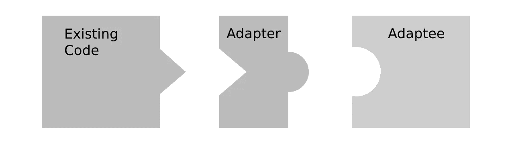
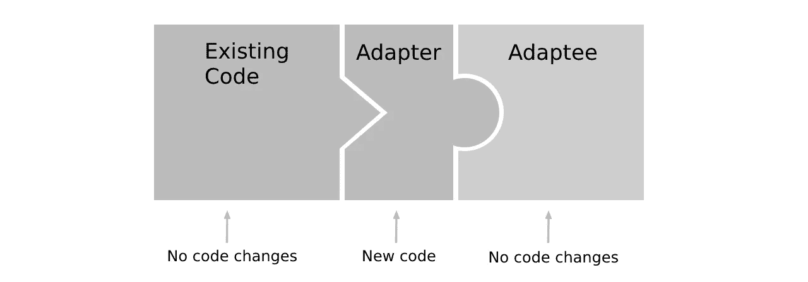
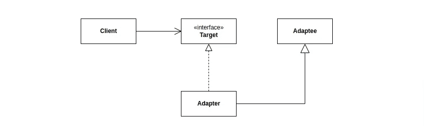

# 适配器模式——处理不兼容的接口！

> 原文：<https://medium.com/geekculture/adapter-pattern-tackling-incompatible-interfaces-dadd34335e1?source=collection_archive---------13----------------------->

P.C. [https://cutt.ly/NPbqWeb](https://cutt.ly/NPbqWeb)

今天我们将讨论适配器设计模式。这是最常用的软件设计模式之一。我们将探索何时使用这种模式，以及它如何帮助我们处理具有不兼容接口的类和对象。我们将从适配器模式可能解决的问题开始撰写本文。

## 问题是

假设我们有一个现有的 web 应用程序，其中的客户端代码需要一个 vehicle 对象。如果我们向客户端代码提供一个车辆对象，那么代码可以启动引擎并设置车辆的速度。让我们来看看这样一个客户端代码。

在我们的例子中，客户机代码是一个简单的函数。但是请记住，它可能是一个控制器方法或模块的任何类方法。

让我们试着发动一辆车。假设我们在现有的 web 应用程序中编写了不同种类的车辆类。例如，`MotorBike`类就是其中之一。让我们来看看`MotorBike`类的实现细节:

由`MotorBike`类实现的`VehicleInterface`接口如下所示:

现在我们将尝试通过客户端代码启动`MotorBike`。查看以下内容:

如果我们运行上面的脚本，我们会得到以下输出:

因此，摩托车已经启动，并以每小时 100 公里的速度行驶。

一切都好。

但是突然，我们从 web 应用程序的项目经理那里听说，我们需要在客户机代码中使用一个新的供应商类`RoadBike`，这样，从现在开始，客户机代码也支持自行车对象。此外，新的 vendor 类实现了一个不同的接口。下面来看看`RoadBike`类:

并且`BicycleInterface`界面看起来如下所示:

我们明白了。`BicycleInterface`不同于`VehicleInterface`，它有一个名为`pedal()`的不同方法。否则，`RoadBike`就是自行车，所以它没有像`MotorBike`那样的引擎。

我们该怎么办？

项目经理还说我们不能修改现有的客户代码。因为那样我们会打破[开合原理](/@unclexo/ocp-the-open-closed-principle-33eab31c7b92)。因为`RoadBike`类有一个不同的接口，所以我们不能在上面的客户端代码中直接使用它。所以这是个问题。

解决方法是什么？

解决方案是我们需要一个中间人——一个可以帮助我们解决问题的类。一个可以将`RoadBike`类或其接口(或者`RoadBike`类能做什么)改编到现有客户端代码中的类。一个可以转换`RoadBike`类接口的类，这样`RoadBike`类可以在客户端代码中代替`MotorBike`类使用。这意味着我们需要一个适配器类。这就是适配器模式发挥作用的地方。让我们用图像来理解它:

在我们的上下文中，*现有代码*块可能代表客户端代码。所以，我们的`start()`功能。并且*适配者*可以代表`RoadBike`类。

看看上图中的积木。两者形状不同。他们彼此不相配。因为它们具有不同的形状/界面。所以我们需要一个适配器来匹配它们。请参见以下图片:

*新代码*可能代表适配器类。它使现有代码和适配器匹配。

所以我们现在可以理解我们需要一个中间人。因此，一个适配器类可以使现有的代码和新的供应商类连接在一起。我们将创建适配器类来解决这个问题。但是在此之前，我们将看到适配器模式的定义。

## 定义

适配器模式是一种软件设计模式。它被四人组(g of)归类为结构化设计模式。因为它有助于构建或模块化您的代码。让我们看看 GoF 在他们的书中给出的定义:

> 将一个类的接口转换成客户期望的另一个接口。适配器允许类一起工作，否则由于不兼容的接口而无法工作。

适配器模式让类一起工作。因此，它有助于`RoadBike`和`MotorBike`类协同工作。这意味着`RoadBike`类将在`MototBike`工作的地方工作。但是怎么做呢？将`RoadBike`类的接口转换为`MotorBike`类已经实现的接口。何时这样做？当我们的委托人期望。

因为正如项目经理所说，我们的客户代码`start()`函数期待从`RoadBike`类创建的对象。但是`RoadBike`类与`VehicleInterface`不兼容。所以我们需要应用适配器模式来解决这个问题。

*需要注意的是，这里的界面不仅仅指语言功能。它也可以是一个具体的类。* *接口可能意味着一个类的行为或结构，或者一个类能做什么。*

如果我们将适配器模式应用于这个问题，那么就会以客户机代码所期望的方式改变`RoadBike`类的接口。为此，我们需要一个适配器类。

## 调整中间人

是时候实现适配器类了。让我们创建一个类，作为现有代码和新供应商类之间的中间人，使它们一起工作。定义适配器类有两种方法:类适配器和对象适配器。首先，我们将看到如何实现一个对象适配器。

**对象适配器**:对象适配器使用对象组合来实现适配器类。对象组合是一种对象关联。因此，我们将一个对象关联到我们正在处理的类的方式。

UML for Object Adapter

这里的*客户端*就是我们的`start()`函数。*目标*是我们的`VehicleInterface`，而*适配者*是我们新的供应商类——即`RoadBike`类。

在对象组合中，我们在适配器类中使用适配器对象(新的供应商类)的一个实例。因此，我们将在适配器类中使用`RoadBike`类的一个实例。然后我们将方法调用委托给从`RoadBike`类创建的对象，以符合`VehicleInterface`。检查以下适配器类:

到目前为止，`RoadBikeAdapter`类正在实现`VehicleInterface`，所以我们可以在我们的客户端代码中使用这个类。见下文:

请记住，我们本可以使用[对象聚合](https://stackoverflow.com/questions/885937/what-is-the-difference-between-association-aggregation-and-composition)而不是对象组合来实现对象适配器。对象聚合是另一种对象关联。我将在本文的最后添加一个使用聚合的适配器类示例。

**类适配器**:使用继承来实现适配器类。

UML for Class Adapter

要使用继承创建适配器类，我们需要从适配器中继承。我们已经知道 adaptee 是`RoadBike`类。让我们通过扩展`RoadBike`类来创建适配器类:

很简单吧？是的，它是。让我们在客户端代码中使用它。它的输出和以前一样:

不建议使用继承来实现适配器类，而是建议遵循软件设计原则— [支持组合胜过继承](https://en.wikipedia.org/wiki/Composition_over_inheritance)。因为继承发生在编译时，而对象合成发生在运行时。在运行时，我们可以根据一个参数来决定使用哪个类，这意味着我们有选择的余地。但是使用了继承之后，我们只需要坚持一个子类。

否则，这就是一个使用继承的适配器模式的简单例子。**如果有多个适配器怎么办**。那么我们将不能使用继承来创建类适配器。因为像 PHP，JAVA，C#等语言。不支持多重继承。但是通过支持多重继承的语言，例如 Python、C++等，这是可能的。

使用对象聚合的对象适配器类示例:

然后，客户端代码将如下所示:

你注意到什么了吗？`BicycleAdapter`类现在符合“*程序到接口，而不是实现”*的原则。看它的构造器是把`BicycleInterface`接口作为参数，充当多态参数。由于这个参数，它可以接受从实现了`BicycleInterface`接口的类中创建的任何自行车对象。这里也应用了多态性。

同样`BicycleAdapter`类也符合 [*开闭原则*](/@unclexo/ocp-the-open-closed-principle-33eab31c7b92) *。*如何？注意，如果你想传递除了`RoadBike`对象之外的任何自行车对象，你不必修改`BicycleAdapter`类。

就是这样。

在 Medium、 [Github](https://github.com/unclexo) 、 [Twitter](https://twitter.com/unclexo) 或 [LinkedIn](https://www.linkedin.com/in/unclexo) 上关注我。

## 参考:

1.  [头先设计图案](https://www.amazon.com/Head-First-Design-Patterns-Brain-Friendly-ebook/dp/B00AA36RZY)
2.  [敏捷软件开发、原则、模式和实践](https://www.amazon.com/Software-Development-Principles-Patterns-Practices/dp/0135974445)
3.  [设计模式:可重用面向对象软件的元素](https://www.amazon.com/Design-Patterns-Elements-Reusable-Object-Oriented/dp/0201633612)