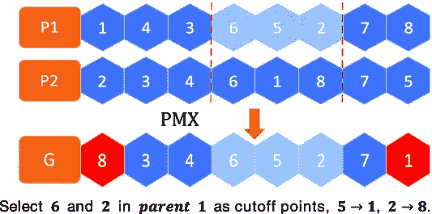
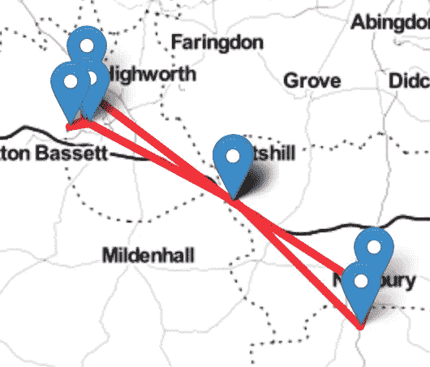
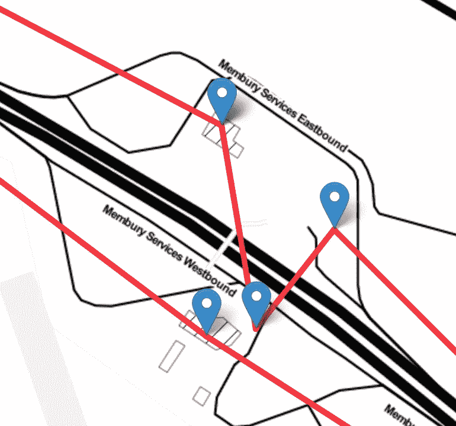
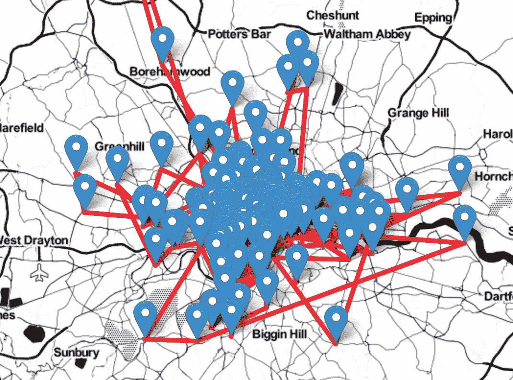

# 采用遗传算法工具解决限制性问题

> 原文：<https://medium.com/geekculture/adapting-genetic-algorithm-packages-for-the-travelling-salesman-problem-ecbdf6c9b99c?source=collection_archive---------4----------------------->

Photo by [Nolan Issac](https://unsplash.com/@nolanissac?utm_source=medium&utm_medium=referral) on [Unsplash](https://unsplash.com?utm_source=medium&utm_medium=referral)

遗传算法是生物学和计算机科学的惊人交叉。很久以来我一直想写它，现在终于到了！所以，请欣赏《旅行咖啡饮用者》——这是我用来找到去伦敦每一家星巴克的最快路线的解决方案的编码演示！

这个项目的完整代码在我的 GitHub 页面上的一个笔记本里。文末链接。

# 介绍

## 问题陈述

旅行商问题(TSP)已经在数学中探索了很长时间。TSP 最简单的形式(本项目中解决的版本)很可能是在 18 世纪首次提出的，完整的定义如下:

> “一个旅行推销员访问 n 个城市并返回其家乡城市的最短路线是什么，每个城市只经过一次？”—拜伦，2006 年

所以在一个更现代的问题中:

> “一个咖啡狂热者参观 165 家星巴克咖啡馆并返回他家咖啡馆的最短路线是什么，只需在每家咖啡馆品尝一次？”—刘易斯，2022 年

## 探测

使用的数据来自 Kaggle，并在本文末尾提供了链接，幸运的是，这些数据都是开源的！数据显示，英国国家代码范围内共有 975 家星巴克咖啡馆。其中大多数在伦敦(165):

Source: Author. Starbucks Cafés across the UK

现在，我们怎样才能在尽可能短的距离内到达每一家咖啡馆呢？在这种规模下，对每个可能的解决方案进行手动计算需要很长时间(165 个阶乘可能的解决方案！).因此，我们可以优化并使用遗传算法。

用户 Vijini Mallawaarachchi 在文章结尾的链接中精彩地解释了遗传算法。然而，我们所寻求做的是将自然选择和进化的过程应用到一组可能的解决方案中，更多关于这方面的内容在方法论中。

然而，一般的遗传算法并不适合满足 TSP 的约束，因此并不总是合适的解决方案。这篇文章表明，遗传算法可以解决像 TSP 这样的限制性问题。但首先，重要的是要了解为什么 TSP 如此严格，以及遗传算法可能出错的地方。

## 制约因素

TSP 的解决方案必须具备:

*   旅行者在同一家咖啡馆开始和结束他们的旅程
*   旅行者不会重访任何中间咖啡馆，因此解决方案中的每一家咖啡馆都必须是独一无二的
*   游客参观了所有 165 + 1(返回)= 166 家咖啡馆

遗传算法的开箱即用实现将真正模拟生物过程，而不适合用于限制性问题。这意味着突变是随机的(因此可能导致上面的复制断点 2)，溶液之间的交换也是随机的(因此可能是断点 1)，缺失也是基因可能被完全去除的可能突变(断点 3)。那么，如何为 TSP 改变和发展它们呢？

# 方法学

在构建遗传算法时，可以利用现有的包，如 NumPy 和 PyGAD。PyGAD 是一个专门用 Python 编写的遗传算法包。它真的很有用，并且有许多用例非常侧重于训练神经网络。这意味着它还没有完全适应解决 TSP。然而，当你构建一个遗传算法实例时，它有非常直观的定制选项和参数。下面将对其进行探讨，以使其更适合限制性 TSP。

## 构建遗传算法

遗传算法由一定数量的部分组成:

1.  最初的人口
2.  健身功能
3.  交叉操作
4.  变异手术

在解决限制性 TSP 的遗传算法的这种解决方案的情况下，这些成分将是:

1.  以编程方式生成的解决方案池，以随机的商店顺序开始并结束于给定的商店
2.  确定解决方案中每个商店之间距离的函数
3.  一个模仿自然过程中繁殖的函数，其中两个非常适合的解决方案的一部分被传递给子代-使用支持限制的部分匹配交叉算子
4.  随机改变每个溶液中的一个元素以模拟自然过程中的突变的函数——一种再次支持限制的反演

也有父母选择，但这是由 PyGAD 照顾。现在，重要的是要确保我们的生物学也达到标准，我们可以开始用更短更精确的句子替换上面的一些长句子:

***基因*** *—给定解决方案中要访问的商店*

***染色体*** *—一组商店串起来做一个解*

***群体*** *—染色体池*

使用 PyGAD 的文档作为来源，下面的有用流程图给出了应用软件包的方法:

Source: PyGAD Docs (link in References). Flow Chart of PyGAD implementation

## 履行

现在说说代码。这个项目有很多代码，所以这里不一一列举。特别是遗传算法的代码和操作。最重要的是自定义群体生成器、适应度函数、交叉算子和变异算子的应用。以及解决方案验证。

首要的事情首先需要产生人口。获取随机值的最简单方法是利用 Python 中的 *random* 。因此，根据这些数据，会生成一个商店列表。包含每个存储的散列(字典)和存储位置的一些经度/纬度信息，以及 Python 中随机包提供的一些随机选择可用于构建染色体:

值得注意的是，第一个和最后一个基因被设置为 0，表示旅行者的返回。

现在是健身功能。为了确定哪些染色体将进入下一代并繁殖，需要一个适应值。最适合的将会通过。在这种情况下，解决方案的适合性是指旅行者在到达线路终点之前必须走的距离有多长或多短。因此，让喝咖啡的人在伦敦北部和南部来回奔波的解决方案不太合适。这里的工作利用 GeoPy 并测量直线距离:

这就是事情变得真正有趣的地方。PyGad 中的开箱即用遗传算法带有几个交叉操作符。然而，这些都不适合 TSP！所有的交叉操作都会导致无效解。因此，有两种选择，要么照常运行并生成不正确的值，但应用一种重新匹配染色体的变异来验证解决方案。或者开发不会导致无效解的自定义交叉方法。该项目使用选项二，并应用部分匹配交叉(PMX)方法。

交叉背后的原因是将非常好的解决方案组合在一起，努力形成两个更好的子解决方案。PMX 通过以下方式做到这一点:

1.  在父代 1 中定义一系列基因
2.  把这些基因传给孩子
3.  找到父代 2 **中不在子代**中的第一个基因
4.  如果这个基因这个基因的位置已经在子代中被填充，那么与父代 1 匹配以查看它是什么基因
5.  迭代，直到找到子代从父代 2 中缺失的每个基因的位置
6.  将父代 2 作为父代 1 重复该过程

下图来自《生物学》上一篇基于 PMX 交叉的论文:

Image: Sun, Zhao, Zhu (2021) link in references. PMX Crossover illustrated

因此，这一过程定义了一系列连续的基因，这些基因从处于完全相同位置的父代遗传给子代。然后用来自父母二的安全位置的剩余基因填充孩子染色体的剩余部分。为了产生第二个孩子，父母只需交换，连续基因的“运行”取自父母二，父母一用于填补缺口。代码实现分为以下两个功能:

设计的最后一个影响函数是变异函数。对于 TSP，也没有合适的开箱即用的变异函数。所以选择是构建一个或者构建一个定制的变异来重新验证一个解决方案。第一种选择更有利，因为它更符合遗传算法的概念，涉及的干预也更少。所用的突变是一种倒位，其中随机长度的基因序列被确定，然后反转，因此[…，1，2，4，…]将变成[…，4，2，1，…]。代码实现比交叉更简单:

现在遗传算法 *ga_instance* 可以初始化并运行如下:

需要注意的关键是自定义函数的实现。以及一些其他参数，即:

*   num_generations:运行初始化、选择、繁殖和变异过程的迭代次数
*   sol_per_pop:每代解决方案总数
*   num_parents:将基于适合度排名繁殖的父代数量(此处该值保持相当高，以确保解决方案池中的多样性)
*   keep_parents:在每一代中保留两个最合适的父代(精英主义)，这样它们仍然可以被认为是合适的解决方案，直到它们被排名更高并被选择

## 结果

分析遗传算法的结果是使用预先构建的 PyGAD 包非常有用的地方。只需几个简单的函数调用，就可以轻松获得结果:

为了以更简单的格式显示结果，最初仅在 10 家咖啡馆中训练一个版本的算法。找到的最佳解决方案如下所示:

Toy Solution with 10 Stores

起初，这看起来并不太聪明，但放大到中间部分，就可以清楚地看到解决方案的优化程度。由于不可能有重复区段，该算法已在列车轨道的不同侧找到路径，以最小化距离，即使在这种低水平:

Example of optimisation

现在是关键时刻。所有 165 家店。这张地图要混乱得多:

还有一些进一步的优化似乎是可能的，例如在图的右边，一些更短的路线是可能的。然而，考虑到问题的规模，这似乎是一个非常有效和优化的解决方案。从数字上看，经过 25 代优化后，总行驶距离为 590 英里(或 990 公里！).对于 165 杯咖啡来说还不错！

# 讨论

## PyGAD 遗传算法方法的优势

1.  无需构建样板遗传算法代码来寻找解决方案，选择亲代并在评估适应度时循环通过代。
2.  完整的模拟将需要用户测试每一个可能的解决方案，但遗传算法应用程序意味着在每一代中只考虑最佳选项。
3.  任何继承该分析的人都可以使用 PyGAD 的所有现有文档！

## 局限性和发展

1.  还有其他尚未测试的交叉和变异操作符，它们可能更适合寻找最优解。
2.  GeoPy 中测量的距离是直线距离，可以使用 API 来获得实际的旅行时间，如谷歌地图。
3.  遗传算法仍然需要考虑许多选项，因此随着世代的扩展会变得更慢，PyGAD 有一个 PyTorch 扩展，我希望在将来研究和应用它。
4.  为了直接扩展这项工作，更多代数、多种突变类型和更多多样性增强技术的测试也将是有益的。

感谢您阅读这篇文章，我希望您喜欢这篇关于更集中的技术的更长的格式。请让我知道你是否有机会在你自己的研究中试验遗传算法，以及进展如何！

# 参考

## 资源:

代码:

 [## GitHub-josephlewisjgl/travelling coffee drinker:使用 PyGAD 的遗传算法在

### PyGAD 遗传算法在旅行商问题中的应用。寻找去每家星巴克的最短路线…

github.com](https://github.com/josephlewisjgl/TravellingCoffeeDrinker) 

数据:

 [## 星巴克全球位置 2021 版

### 运营中的每家星巴克店的名称、所有权类型和位置

www.kaggle.com](https://www.kaggle.com/datasets/kukuroo3/starbucks-locations-worldwide-2021-version) 

## 参考资料:

比伦。2006.旅行推销员问题的起源:

 [## 旅行推销员问题:说起来容易；众所周知很难解决

### 这篇论文的目的是概述旅行商问题的历史，并展示它是如何…

digitalcommons.liberty.edu](https://digitalcommons.liberty.edu/honors/188/) 

PyGAD:

 [## PyGAD

### PyGAD 是一个开源 Python 库，用于构建遗传算法和优化机器学习算法…

pygad.readthedocs.io](https://pygad.readthedocs.io/en/latest/index.html) 

孙，赵，朱(2021):

[https://www . researchgate . net/figure/The-process-of-PMX-crossover _ fig 5 _ 348798738](https://www.researchgate.net/figure/The-process-of-PMX-crossover_fig5_348798738)

遗传算法演练:

 [## 遗传算法简介—包括示例代码

### 遗传算法是一种受查尔斯·达尔文的自然进化理论启发的搜索启发式算法。这个…

towardsdatascience.com](https://towardsdatascience.com/introduction-to-genetic-algorithms-including-example-code-e396e98d8bf3)