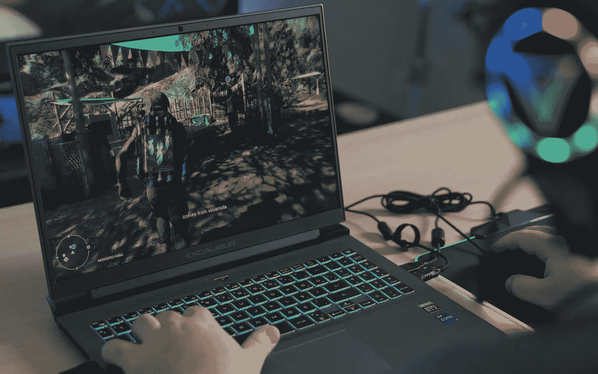

# AdaptiveSync 挑战 PC 上的 G-Sync 和 FreeSync

> 原文：<https://medium.com/geekculture/adaptivesync-to-challenge-g-sync-and-freesync-on-pcs-333a07158939?source=collection_archive---------16----------------------->

## VESA 将 Hz 与 FPS 同步的标准成为官方标准，但 nVidia 和 AMD 是否也在其中？

PC gamers already enjoy the benefits of three different Hz/FPS “sync” technologies and they now get to have a fourth one at their disposal. (Image: Onur Binay, Unsplash)

就旨在平滑视频游戏中帧速率的技术而言，与主机游戏玩家相比，PC 游戏玩家的选择余地更大:虽然后者通常不得不使用可变刷新率(VRR)，但…