# 亚行命令注释

> 原文：<https://medium.com/geekculture/adb-commands-note-dd38d5223f02?source=collection_archive---------28----------------------->

Android Debug Bridge 是 PC 和 Android 手机之间的一条通道。Android Studio 背后的很多命令都是由 ADB 执行的。我将介绍一些 ADB 命令，以便您了解它的功能。我写这篇文章是因为一些旧的👵亚行的命令已经不起作用了😱。我不得不一个一个地尝试来唤起我们的记忆。

# — ===菜单=== —

**💡 1.** [**要求**](#afb7) **📱 2.** [**进入仿真器或设备**](#4525) **📋 3.** [**抓取 Logcat**](#ab53) **📀 4.** [**文件 IO |备份**](#d7e1) **🏄 5.** [**截图|网址|图片库**](#3587) **📲 6.** [**系统命令**](#54bc) **🕎 7。** [**安卓 11 前无线调试**](#03d6)

# 💡 1.需求… → [菜单](#92bc)

请安装这些软件:

*   **Android Studio 4** —一部分一部分的收集组件，可以省去你很多工作。
*   **AVD** —安卓模拟器

> 安卓工作室

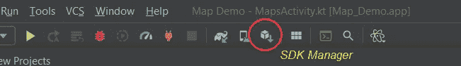

让我们点击立方体。

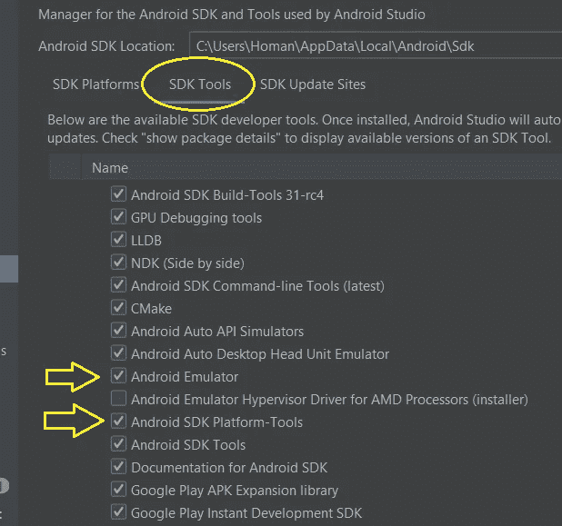

如果两个箭头指向的点都被选中，请转到下一步。

> 添加路径:

您需要在 Windows 命令行界面运行 ADB。所以您需要将其命令插入到环境路径中。

```
C:\Users\**YOUR_NAME**\AppData\Local\Android\Sdk\platform-tools\
```

举个例子，

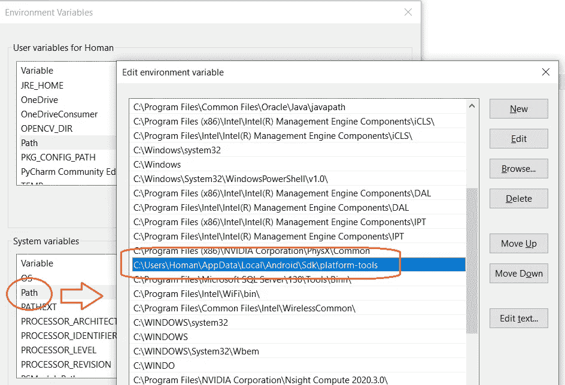

让我们检查一下。打开 CMD:

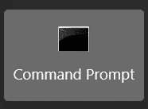

```
adb --version
```

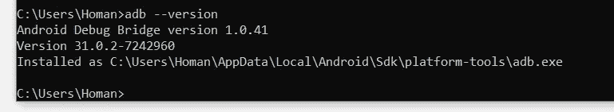

# 📱 2.进入仿真器或设备…… → [菜单](#92bc)

> 安卓工作室


AVD

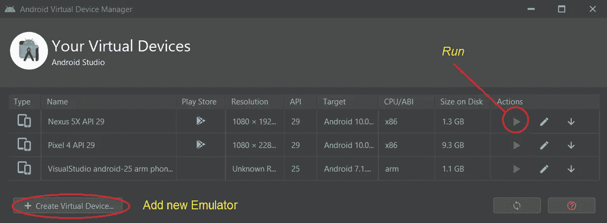

如果您有空白列表，请单击“创建虚拟设备”。
找到你的一个 AVD，点击运行按钮。

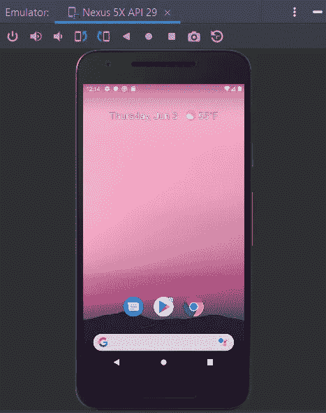

> 末端的


> Windows CLI/CMD

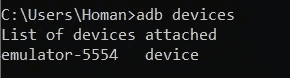

CLI/CMD 比终端有更好的视野。

> ADB:列出设备

```
adb devices
```

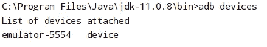

现在，您也可以将手机连接到这台计算机。

再跑，

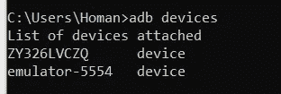

添加另一个 AVD:

```
C:\Users\Homan>adb devices
List of devices attached
ZY326LVCZQ      device
emulator-5554   device
emulator-5556   device
```

> ADB → "-s ":连接到设备

多设备连接的预设系统。所以 shell 命令会出现这个错误。

```
C:\Users\Homan>adb shell
**adb.exe: more than one device/emulator**
```

您需要在其他指令之前指定设备。

```
C:\Users\Homan>adb -s **ZY326LVCZQ** shell
ocean:/ $ 
```

再一次，

```
**adb -s DEVICE_NAME command**
```

当你进入手机壳的时候，你只是把它当作一台 Linux 机器。

> Linux 命令:

仅目录:

```
ls -d * 
```

具体列表:

```
ls -l
```

列表文件大小:

```
ls -s
```

递归列出子目录:

```
ls -R
```

查找文件:

```
find . -name FILE_NAME
```

# 📋 3.抓取日志目录… → [菜单](#92bc)

对于多台设备:

我将用代码中的一些 Logcat 命令打开并运行一个项目。

> Logcat:抓取全部→ ***:V**

```
adb -s emulator-5556 **logcat *:V**
```

我有一个很长的列表，它会自动更新。

> 同色→ **-v 色**

```
adb -s emulator-5556 logcat *:V **-v color**
```

> Logcat:按过滤器搜索:**标签:{V/D/I/W/E} *:S**

*   `V` — **详细**(最低优先级)
*   `D` — **调试**
*   `I`——**信息**
*   `W` — **警告**
*   `E` — **错误**
*   `F`——**致命**
*   `S` — **无声**(最高优先级，不打印任何内容)

> 例子

这是我的日志标签:MLOG。我已经得到许可了。

```
**const val** *TAG* = **"MLOG"
fun lgd(s:String) = Log.d(*TAG*, s)***// app permission* private val reqMultiplePermissions = registerForActivityResult(
    ActivityResultContracts.RequestMultiplePermissions()
) { permissions ->
    permissions.entries.*forEach* {
        ***lgd*("mainAct: Permission: ${it.key} = ${it.value}")**
        if (!it.value) {
            *// toast
            msg*(this, "Permission: ${it.key} denied!", 1)
            finish()
        }
    }
}
```

运行应用程序后，我可以在 CMD 中获取我的标签。

```
adb -s emulator-5556 logcat **MLOG:D *:S -d**
```

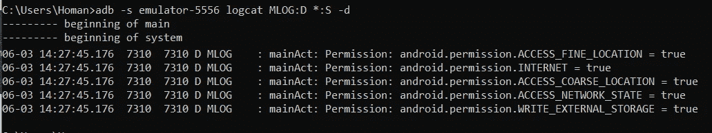

“ **-d** ”会将日志转储到屏幕上，直到现在。

> 导出(Windows/MAC/Linux):**-d>your _ file**

我可以将日志导出到文本文件中。您必须使用“ **-d** ”选项进行导出。

```
adb -s emulator-5556 logcat MLOG:D *:S **-d** **> mlog.txt**
```

> 清除所有内容:-c

```
adb -s emulator-5556 logcat -c
```

> 仅收音机:-b 收音机

```
adb -s emulator-5556 logcat **-b radio** -d
```

> 错误报告

```
>**adb -s emulator-5554 bugreport**
```

# 📀 4.文件 IO |备份… → [菜单](#92bc)

> 复制文件或目录

我的目录里有两个文件:

```
D:\Android\test\MapDemo\app\build\outputs\apk\debug>dir
 Volume in drive D is 512 Gigabyte
 Volume Serial Number is BE4E-1582Directory of D:\Android\test\MapDemo\app\build\outputs\apk\debug05/19/2021  11:52 PM    <DIR>          .
05/19/2021  11:52 PM    <DIR>          ..
05/30/2021  10:26 AM         7,589,765 **app-debug.apk**
05/30/2021  10:26 AM               324 **output-metadata.json**
               2 File(s)      7,590,089 bytes
               2 Dir(s)  141,708,402,688 bytes free
```

> 本地→远程:**按下**

```
>**adb -s emulator-5556 push output-metadata.json /mnt/sdcard/tmp**
output-metadata.json: 1 file pushed, 0 skipped. 0.2 MB/s (324 bytes in 0.001s)
```

让我们检查一下:

```
>**adb -s emulator-5556 shell ls -l /mnt/sdcard/tmp**
total 392
-rw-rw---- 1 root sdcard_rw 386980 2021-06-03 15:20 mlog.txt
-rw-rw---- 1 root sdcard_rw    324 2021-05-30 10:26 **output-metadata.json**
```

👍很好！

> 远程→本地:**拉**

```
>**adb -s emulator-5556 pull /mnt/sdcard/tmp .**
/mnt/sdcard/tmp/: 2 files pulled, 0 skipped. 8.5 MB/s (387304 bytes in 0.043s)
```

让我们检查一下:

```
D:\Android\test\MapDemo\app\build\outputs\apk\debug>dir
 Volume in drive D is 512 Gigabyte
 Volume Serial Number is BE4E-1582Directory of D:\Android\test\MapDemo\app\build\outputs\apk\debug06/03/2021  04:48 PM    <DIR>          .
06/03/2021  04:48 PM    <DIR>          ..
05/30/2021  10:26 AM         7,589,765 app-debug.apk
05/30/2021  10:26 AM               324 output-metadata.json
06/03/2021  04:48 PM    <DIR>          **tmp**
               2 File(s)      7,590,089 bytes
               3 Dir(s)  141,707,948,032 bytes free
```

👍很好！

> 备份设置和应用

```
>adb -s emulator-5554 backup -apk -all -f backup.ab
WARNING: adb backup is deprecated and may be removed in a future release
Now unlock your device and confirm the backup operation...
```

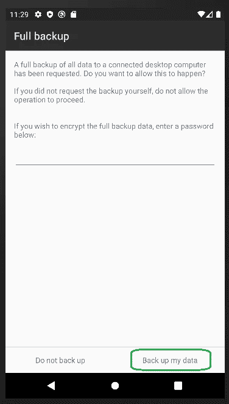

它有大约一分钟的超时。

```
>dir *.ab
 Volume in drive D is 512 Gigabyte
 Volume Serial Number is BE4E-1582Directory of D:\Android\test\MapDemo\app\build\outputs\apk\debug**06/03/2021  11:32 PM         6,115,506 backup.ab**
               1 File(s)      6,115,506 bytes
               0 Dir(s)  142,200,012,800 bytes free
```

> 备份设置、应用和共享存储

```
>**adb -s emulator-5554 backup -apk -shared -all -f backup.ab**
```

尺寸:

```
>dir *.ab
 Volume in drive D is 512 Gigabyte
 Volume Serial Number is BE4E-1582Directory of D:\Android\test\MapDemo\app\build\outputs\apk\debug**06/03/2021  11:35 PM         6,854,985 backup.ab**
               1 File(s)      6,854,985 bytes
               0 Dir(s)  142,199,263,232 bytes free
```

更大！

> 仅备份非系统应用

```
>**adb -s emulator-5554 backup -apk -nosystem -all -f backup.ab**
```

> 恢复以前的备份

```
>**adb -s emulator-5554 restore backup.ab**
WARNING: adb restore is deprecated and may be removed in a future release
Now unlock your device and confirm the restore operation.
```

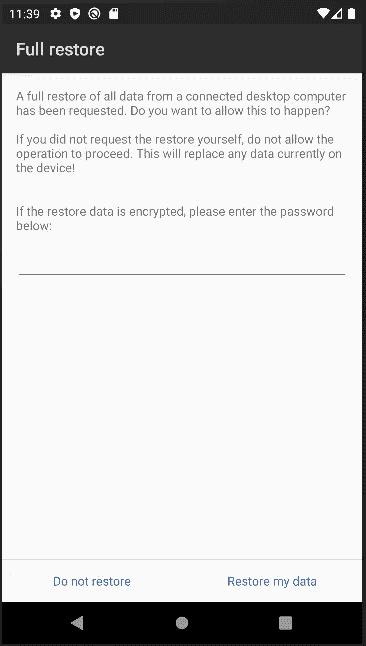

# 🏄 5.截图|网址|图片库…… → [菜单](#92bc)

> 屏幕上显示程序运行的图片

我正在运行地图演示。

```
>**adb -s emulator-5554 shell screencap -p /sdcard/screencap.png**
```

接下来，您需要下载文件。

```
>**adb -s emulator-5554 pull /sdcard/screencap.png**
/sdcard/screencap.png: 1 file pulled, 0 skipped. 114.6 MB/s (739708 bytes in 0.006s)
```

让我们看看。

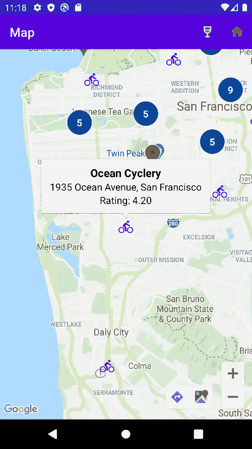

> 打开一个 URL

```
>**adb -s emulator-5554 shell am start -a android.intent.action.VIEW -d** [**https://www.youtube.com**](https://www.youtube.com)
Starting: Intent { act=android.intent.action.VIEW dat=[https://www.youtube.com/](https://www.youtube.com/)... }
```


> 打开图像库

```
>**adb -s emulator-5554 shell am start -t image/* -a android.intent.action.VIEW**
Starting: Intent { act=android.intent.action.VIEW typ=image/* }
```

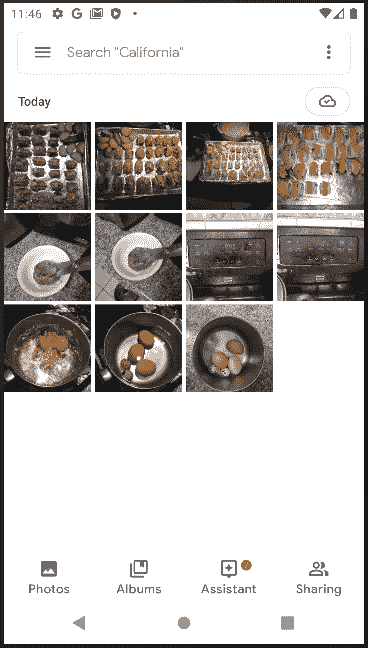

# 📲 6.系统命令… → [菜单](#92bc)

> 安装 APK →安装-t 文件名

```
>**adb -s emulator-5556 install -t app-debug.apk**
Performing Streamed Install
Success
```

> 重启→重启

```
>**adb -s emulator-5556 reboot**
```


> 杀死服务器→杀死服务器

```
>**adb kill-server**>adb devices
* daemon not running; starting now at tcp:5037
* daemon started successfully
List of devices attached
```

> 启动服务器→启动服务器

```
>**adb start-server**>adb devices
List of devices attached
ZY326LVCZQ      device
emulator-5554   offline
emulator-5556   device
```

> 直接调用 USB 设备:-d

```
>**adb -d** shell ls
```

它与相同

```
>adb **-s PHONE_NAME** shell ls
```

但是它要快得多。

> 解决离线问题

```
D:\Android\test\MapDemo\app\build\outputs\apk\debug>adb devices
List of devices attached
ZY326LVCZQ      device
**emulator-5554   offline**
```

关闭**仿真器-5554。**

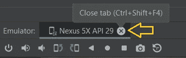

在 AVD 管理器中:擦除数据

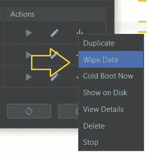

再次运行相同的 AVD。我们来测试一下。

```
>adb devices
List of devices attached
ZY326LVCZQ      device
**emulator-5554   device**
```

> 获取序列号

```
>**adb -s emulator-5554 get-serialno**
emulator-5554
```

> 列出 TCP 连接

```
>**adb -s emulator-5554 shell netstat**
Active Internet connections (w/o servers)
Proto Recv-Q Send-Q Local Address           Foreign Address         State
tcp      710      0 10.0.2.16:49426         142.250.138.95:https    CLOSE_WAIT
tcp        1      0 10.0.2.16:45254         123.35.104.34.bc.g:http CLOSE_WAIT
tcp        1      0 10.0.2.16:42070         74.125.103.39:http      CLOSE_WAIT
tcp        1      0 10.0.2.16:60892         yb-in-f101.1e100.n:http CLOSE_WAIT
tcp6       0      0 ::ffff:10.0.2.16:56838  yw-in-f188.1e100.n:5228 ESTABLISHED
tcp6       1      0 ::ffff:10.0.2.16:49522  dfw25s41-in-f14.1:https CLOSE_WAIT
tcp6       1      0 ::ffff:10.0.2.16:49524  dfw25s41-in-f14.1:https CLOSE_WAIT
...
```

> 电池状态

```
>**adb -s emulator-5554 shell dumpsys battery**
Current Battery Service state:
  AC powered: false
  USB powered: false
  Wireless powered: false
  Max charging current: 0
  Max charging voltage: 0
  Charge counter: 10000
  status: 4
  health: 2
  present: true
  level: 100
  scale: 100
  voltage: 5000
  temperature: 250
  technology: Li-ion
```

> 电话功能

```
>**adb -s emulator-5554 shell pm list features**
feature:reqGlEsVersion=0x30000
feature:android.hardware.audio.output
feature:android.hardware.camera
feature:android.hardware.camera.any
feature:android.hardware.camera.ar
feature:android.hardware.camera.autofocus
feature:android.hardware.camera.capability.manual_post_processing
feature:android.hardware.camera.capability.manual_sensor
feature:android.hardware.camera.front
feature:android.hardware.camera.level.full
feature:android.hardware.faketouch
feature:android.hardware.fingerprint
feature:android.hardware.location
```

> 服务列表

```
>**adb -s emulator-5554 shell service list**
Found 165 services:
0 ions: [com.android.internal.telephony.IOns]
1 gsiservice: []
2 rcs: [com.android.ims.internal.IRcsService]
3 secure_element: [android.se.omapi.ISecureElementService]
4 carrier_config: [com.android.internal.telephony.ICarrierConfigLoader]
5 phone: [com.android.internal.telephony.ITelephony]
```

> CPU 进程

```
>**adb -s emulator-5554 shell ps**
USER           PID  PPID     VSZ    RSS WCHAN            ADDR S NAME
root             1     0   31740   2512 0                   0 S init
root             2     0       0      0 0                   0 S [kthreadd]
root             4     2       0      0 0                   0 I [kworker/0:0H]
root             6     2       0      0 0                   0 I [mm_percpu_wq]
root             7     2       0      0 0                   0 S [ksoftirqd/0]
root             8     2       0      0 0                   0 I [rcu_preempt]
root             9     2       0      0 0                   0 I [rcu_sched]
```

> 屏幕大小

```
>**adb -s emulator-5554 shell wm size**
Physical size: 1080x1920
```

# 🕎 7.Android 11 之前的无线调试…… → [菜单](#92bc)

通过 USB 数据线连接手机+打开手机的 WiFi

> 获取 WiFi IP 地址

```
>**adb -d shell ip -o a | grep 192.168**28: wlan0    inet **192.168.1.75**/24 brd 192.168.1.255 scope global wlan0\       valid_lft forever preferred_lft forever
```

或者你可以搜索短语“ **wlan0** ”，如果你在免费 WiFi 区域工作。

> 设置远程设备的 TCP 端口

```
>**adb -d tcpip 5559**
restarting in TCP mode port: 5559
```

> 用 IP+端口连接设备

```
>**adb connect 192.168.1.75:5559**
connected to 192.168.1.75:5559
```

检查结果:

```
>adb devices
List of devices attached
ZY326LVCZQ      device
**192.168.1.75:5559       device**
emulator-5554   device
```

你喜欢我的亚洲开发银行收藏吗？

# 🐒:拍手…拍手…