# 向 React/Typescript 项目添加依赖注入

> 原文：<https://medium.com/geekculture/add-dependency-injection-to-a-react-typescript-project-fbc34110d4d6?source=collection_archive---------9----------------------->

Photo by [James Harrison](https://unsplash.com/@jstrippa?utm_source=medium&utm_medium=referral) on [Unsplash](https://unsplash.com?utm_source=medium&utm_medium=referral)

我成为专业开发人员已经有一段时间了，主要从事后端开发并使用。NET 框架的大部分时间。这是我开始修补的地方，也是我获得军衔的地方。几年前微软发布了。NET Core，一个与以往不可思议的轻薄对应物。NET 完整框架。它只包含运行一个程序的基本必需品，并把包含必需的软件包留给了软件的作者。用软件写的。NET Core 也可以在任何操作系统上运行，您不必再受限于 Windows 来运行您的。NET 应用程序。这些都是非常酷的东西，但我最喜欢的是包含了依赖注入，这是控制反转的一个实际应用，在这里你让框架为你管理你的依赖(服务，存储等)。).你不再需要在你的软件中“新建”一个类的实例，取而代之的是，你向 DI 容器注册了这个依赖关系，只要框架发现需要这个依赖关系，它就会为你注入这个依赖关系。

这些年来，我越来越喜欢这一点，因为它将您的实现逻辑从您的依赖项中分离出来，使得独立于它们可能具有的依赖项来测试您的代码变得更加容易，因为您可以非常容易地注册一个模拟依赖项。只需修改一行代码就可以切换出一个依赖项，这样就万事大吉了。你根本不用碰你的应用逻辑！不用说，当我开始为一家公司工作时，我错过了这一点，我的任务之一是在 React/TypeScript 中从头创建一个新的前端。所以我决定自己融入一些这种行为，并与你分享我是如何做到的。令人惊讶的是，它只需要很少的代码就能运行起来！

## 服务定位器

我的前端需要的依赖项是所有服务，它们遵循一个接口并执行对我的一个或多个 React 组件有用的特定任务。我想把从这些组件获取服务实例的责任拿走，只使用一个定制的 React 钩子来请求他们需要的服务，基于一个抽象。所以我创建了一个服务定位器来处理这个问题以及注册依赖关系。

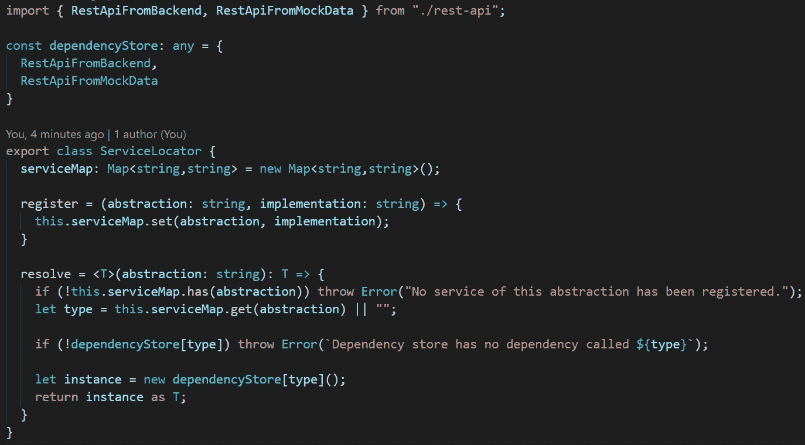

让我们先浏览一下 **ServiceLocator** 类。这是一个非常小的类，只有一个属性和两个函数。我一会儿会谈到导入和 **dependencyStore** 中的值，但是现在你需要知道的是，当组件请求它们的抽象时，这些是定位器将提供的实际服务。

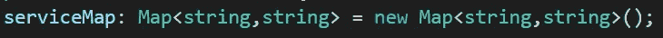

鉴于 TypeScript 实际上只是一堆编译成 JavaScript 的语法糖，一旦代码编译完成，就没有真正的接口或类型，所以需要一些技巧来注册一个服务，以便可以通过它的接口找到它。这个 **serviceMap** 基本上将抽象名称映射到类的名称，当请求抽象时，应该实例化并返回该类。

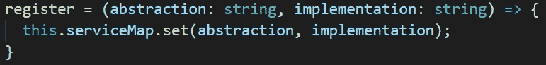

一个简单的函数，只是向 **serviceMap** 添加一个条目，将抽象映射到实现。

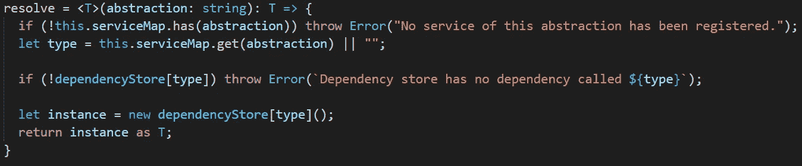

这就是奇迹发生的地方。 **resolve** 函数将一个泛型类型参数(请求的抽象类型)和这个抽象的字符串表示作为参数。从我们的 **serviceMap** 中获取实现名称需要字符串版本。如你所见，我首先检查了 **serviceMap** 是否列出了给定的抽象。如果是的话，我获取实现名并将其存储在**类型的**变量中。再检查一下，看看 **dependencyStore** 中是否有这个名称的依赖项，如果有，我动态地创建该类的一个实例并返回它，将它转换成作为参数提供的抽象。

我答应过要回到**依赖商店**。这里列出的类来自我的 rest-api.ts:

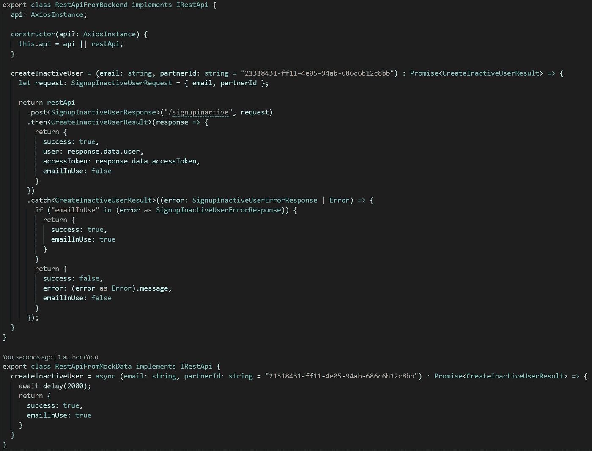

它包含了两个实现相同接口的类，相同的抽象:

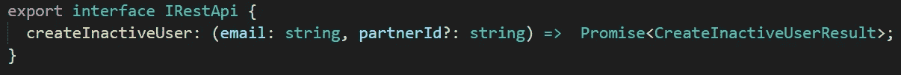

现在我们的服务定位器已经处理好了，让我们转到 React 的上下文 API，并使用上下文钩子使这个定位器对我们所有的组件可用。

## 解耦器提供商

为了确保我的 React 应用程序中的所有组件都可以访问定位器，我将把我的整个应用程序包装在一个 DecouplerProvider 元素中，我称之为这个元素，因为它将我的应用程序与其依赖项分离，并充当它的上下文提供者，上下文就是定位器。这是我的**解耦器提供商。tsx** :

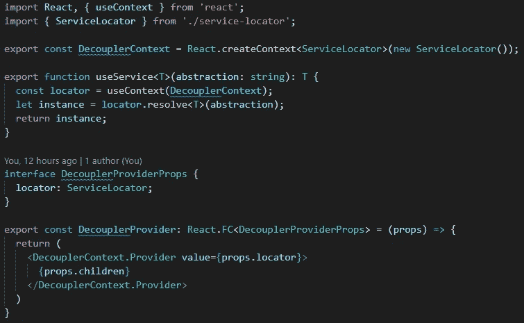

同样没有很多代码。让我们看一看，并浏览一下那里有什么。

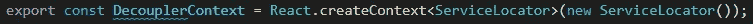

我使用 React 的 **createContext()** 方法来创建上下文。我们需要它作为钩子和我们将要返回的元素。正如您所看到的，我显式地添加了 ServiceLocator 类型，因为我真的喜欢在输入时显式。这就是为什么我首先喜欢 TypeScript。

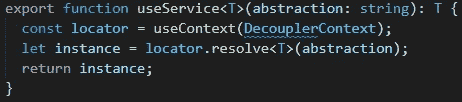

这是我们提供给组件的 React 钩子。稍后，您将看到任何组件请求依赖项是多么容易。这个 **useService** 钩子接受一个泛型类型参数，使用 **useContext** 钩子和 **DecouplerContext** 来获取我们全局可用的定位器，并使用提供的类型调用它的 resolve 方法。然后，它将实例返回给调用者，非常简单。

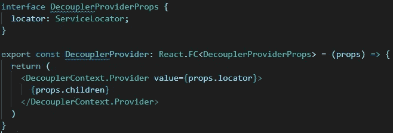

这是您的标准功能反应组件。我非常喜欢结合 React 钩子的功能组件方法。这里唯一特别的是我为道具创建的显式接口，以及我返回的元素。我们之前创建的 **DecouplerContext** 有一个 **Provider** 属性，我们可以用它来创建一个元素。它接受一个值，该值必须是我们在创建上下文时提供的类型的实例，在本例中是一个 **ServiceLocator** 。

这就是我们的解耦器！现在让我们把所有东西绑在一起。

## 布线

现在我们已经有了注册和解析依赖项所需的东西，让我们看看如何使用它们。首先，我们的 **App.tsx** :

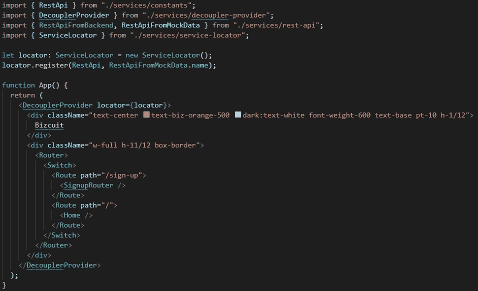

There are more imports above this, but those were omitted for brevity

这里有两件事要注意，所以你知道该怎么做。

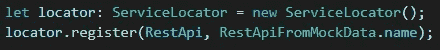

在初始化我们的应用程序之前，我们创建了一个 **ServiceLocator** 并注册了一个依赖项。我的公司有一个名为 **RestAPI** 的服务，但是在我实际去和后端通信之前，我想测试一下我的前端是否可以正确地处理这些调用和它们的返回值。所以现在我注册了我的 **RestApiFromMockData** ，它只是以我的前端所期望的形式发回一些本地数据。因为我们在这里必须使用字符串，所以我在抽象中使用了一个常量，因为我将在多个地方使用这个相同的值，而在代码库中散布神奇的字符串是你不想做的事情。我在一个 **constants.ts** 文件中定义了它:

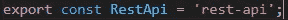

第二个字符串是依赖项的名称，在本例中是 **RestApiFromMockData** 类。我使用 name 属性，因为这将确保我总是得到正确的拼写，并且它应该总是完美地映射到我们前面看到的 **dependencyStore** 中的同一个类。

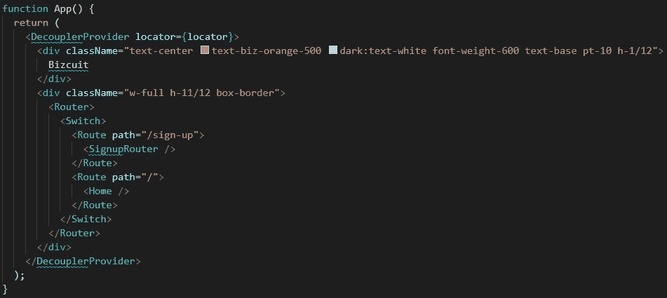

在这里，我们只需将应用程序返回的内容包装在我们创建的 **DecouplerProvider** 组件中，并将定位器传递给它。以上是对 **App.tsx** 的介绍，现在让我们转到一个想要获得依赖关系的组件，在我的例子中是 **step-1-email.tsx** ，我想要在有人提供电子邮件地址时创建一个非活动用户:

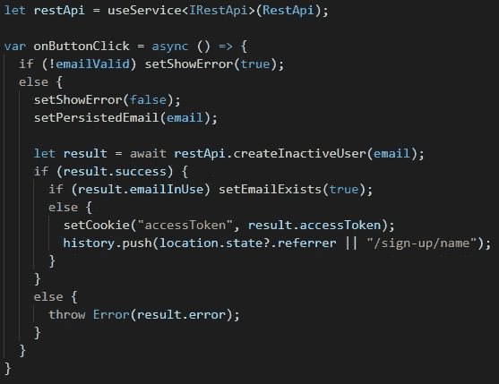

Rest of the code omitted for brevity

我们使用之前定义的 **useService** 钩子，以及抽象类型( **IRestApi** )和抽象名称( **RestApi** 常量)来获取我们注册的依赖项。在 **onButtonClick** 方法中，我们使用我们获得的依赖来执行在 **IRestApi** 接口上定义的动作。这就是这个组件应该感兴趣的:抽象，而不是实现。这种逻辑和依赖的解耦使生活变得更加容易。想象一下，如果我们在任何需要的地方都创建一个 RestApiFromMockData 对象，并且在本地测试之后，你现在想要与你后端的 RestApi 进行通信。你必须检查每一个组件，将 **RestApiFromMockData** 改为**restapifrombend**。使用这种服务定位器方法，这变得像更改一样简单

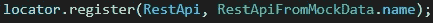

到

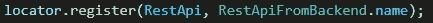

就这样了。您的应用程序保持不变，但是所有需要一个 **IRestApi** 的组件现在将接收一个 **RestApiFromBackend** 的实例并继续工作。

## 包裹

当涉及到依赖管理时，依赖注入是一个很大的帮助，这就是我如何在 React/TypeScript 中实现它的。我绝不是打字专家，我想有相当多的人是打字专家。对于那些我想问的人，请评论我在这里的方法中可以做得更好的任何事情，或者从类型脚本的角度来看，是否有更聪明的方法来实现这一点。例如，我想在不添加太多代码的情况下，为 **dependencyStore** 去掉 **any** 类型。

无论如何，感谢你的阅读，我希望这能帮到你！