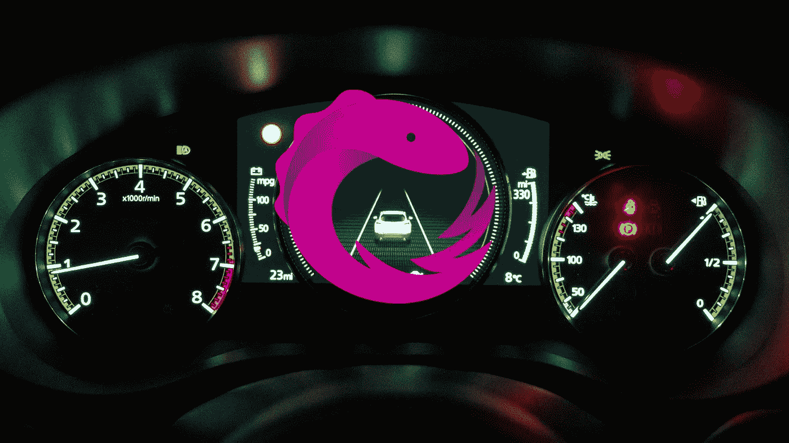

# 使用 RxJS WebSocketSubject 为您的 Web 应用程序添加实时功能

> 原文：<https://medium.com/geekculture/add-real-time-capability-to-your-web-app-with-rxjs-websocketsubject-5624470887aa?source=collection_archive---------3----------------------->

## 使用 RxJS WebSocketSubject，从服务器流式传输实时数据就像几行代码一样简单。

WebSocket 出现在 HTML5 上已经有一段时间了，它可以在所有现代浏览器上使用。