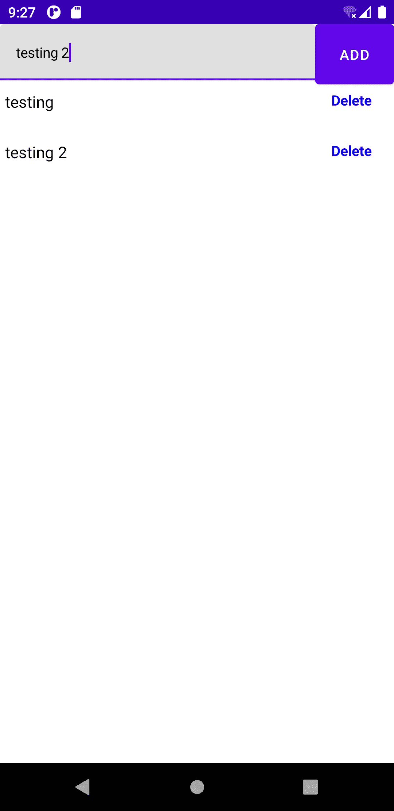

# 在 LazyColumn List(又名 Recyclerview)中添加/删除 Jetpack 撰写

> 原文：<https://medium.com/geekculture/add-remove-in-lazycolumn-list-aka-recyclerview-jetpack-compose-7c4a2464fc9f?source=collection_archive---------6----------------------->

[https://learn.vonage.com/blog/2021/06/15/a-better-way-of-creating-android-views-with-jetpackcompose/](https://learn.vonage.com/blog/2021/06/15/a-better-way-of-creating-android-views-with-jetpackcompose/)

嘿，android 开发者们，正如你们所知，jetpack compose 正在快速发展，许多公司都在利用它来设计他们的 Android 应用。创建列表是 jetpack compose 非常重要的主题，因为在每个应用程序中，我们都需要创建列表，无论是垂直的还是水平的。正如我们所知，在 jetpack compose 之前，我们需要使用 recycle view 小部件来创建列表，在 recycle view 中，我们需要设置其项目 xml、布局管理器、适配器来显示列表中的内容，但在 jetpack compose 中，我们不需要创建项目 xml、布局管理器及其单独的适配器。

有两种类型的内置函数用于在 jetpack compose 中创建列表

1- **LazyColumn** 这将创建垂直列表

2- **LazyRow** 这将创建横向列表

*   等等，如果我们不需要创建适配器，那么我们如何通知我们的列表关于数据插入、删除或更新？

别担心，不是创建简单的可变列表，你需要创建*<【数据类型】>()*

*下面是从 lazycolumn 简单插入和删除的代码。*

**

*output of the above program lazyColumn*