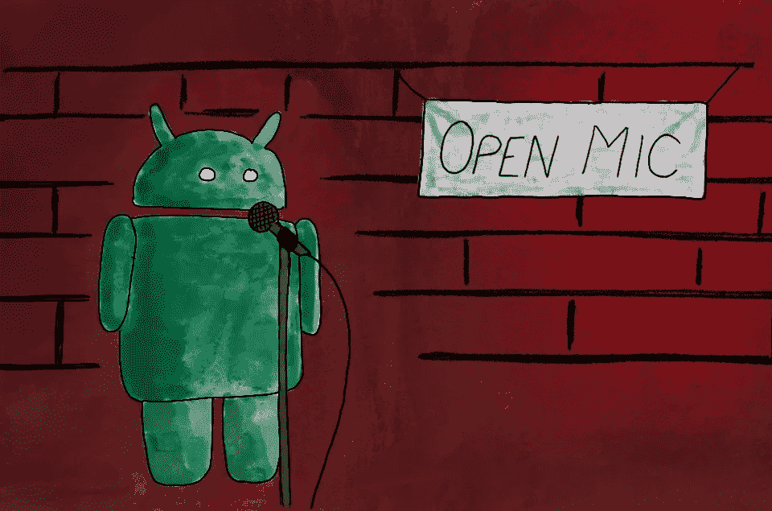

# 向 Android 应用程序添加语音命令

> 原文：<https://medium.com/geekculture/add-voice-commands-to-android-apps-80157c0d5bcc?source=collection_archive---------20----------------------->

> “好吧，谷歌，带我回家。”
> 
> *“嘿 Siri，放点音乐吧。”*

如果你以前在移动设备上使用过语音命令，你会尝试类似的东西；手机捆绑的语音助手一天比一天好，可以帮你做很多事情。但是一旦你进入了一个应用程序，它们能帮助你吗？他们能帮助你在每个应用的 UI 设计的迷宫中导航吗？一旦你打开应用程序，他们能帮助你使用语音完成任务吗？

> *等一下。app 里面*的语音*是什么意思？*

是的——你有没有想过是否可以在应用程序中添加语音命令？想象一下，只要对着应用说话就能完成任务，而不是像我们在科幻电影中看到的那样，试图通过触摸在用户界面上蠕动。

今天，我们将通过一款 Android 应用来实现这一目标。

不，我不会要求你花费大量的时间和金钱来建立一些基于深度学习的自动语音识别系统作为先决条件。相反，我们将利用 Android 中免费提供的 *SpeechRecognizer* 类来完成这个项目。

不过，如果你对构建自己的 ASR 感兴趣，可以参考我们关于构建自己的转录器的[博客。‍](https://www.slanglabs.in/blog/how-to-build-python-transcriber-using-mozilla-deepspeech)

为了这个实验，我们将创建一个新的 Android Studio 项目。

要让我们的应用程序响应语音命令，需要遵循五个步骤，

1.  设置音频权限。
2.  创建将作为麦克风触发器的 UI 元素。
3.  初始化并设置 *SpeechRecognizer* 实例。
4.  创建一个受支持的话语列表，作为我们应用程序中语音命令的域。
5.  根据用户发出的语音命令执行应用程序中的操作。

# 设置音频权限

我们将需要通过在我们的应用程序的 AndroidManifest.xml 文件中添加以下行来声明音频权限要求。

让我们把麦克风触发器放在 MainActivity.java 上。在我们的应用程序开始监听用户输入之前，我们需要运行权限检查，如果 ASR 权限没有被授予，请请求用户允许访问麦克风。

**注意:**您可以选择在应用启动时或运行时，当用户试图通过点击指定的 UI 元素与您的应用对话时，请求音频许可。这里我们会询问应用程序启动时的音频权限。

为了知道用户是批准还是拒绝我们的权限请求，我们需要在 MainActivity 中覆盖*onRequestPermissionsResult()*函数。

# 为麦克风触发器添加 UI 元素

下一步是添加一个麦克风按钮，也就是触发器。每当用户点击触发器，我们将开始一个新的音频会话。在这个实验中，让我们将麦克风的图像作为触发图标。我们将图像资源添加到项目中，然后将 *ImageView* 添加到 *activity_main.xml* 。我们还将添加一个*文本视图*来显示用户说话时检测到的话语。

我们还将在触发图标上添加一个点击监听器来启动和停止音频会话。

# 设置 SpeechRecognizer 实例

现在开始激动人心的事情。使用 SpeechRecognizer 实例，我们将能够监听用户的命令并在我们的应用程序中执行操作。

向 MainActivity 添加一个名为 *mSpeechRecognizer* 的 SpeechRecognizer 的全局实例，并添加一个函数来初始化它。

我们还将添加一个*识别监听器*到 *mSpeechRecognizer，*，这将使我们能够在音频会话的每个阶段得到通知。我们感兴趣的两个回调是 *onPartialResults()* 和 *onResults()* 。我们将在稍后填补这些回调。您可以忽略其他的回调，我们在这个实验中不需要它们。

在开始音频会话之前，我们还需要定义一个音频识别意图，该意图将被传递给 *mSpeechRecognizer* 。

*EXTRA_LANGUAGE_MODEL* 是*ACTION _ RECOGNIZE _ SPEECH*必需的附加物。我们还将 *EXTRA_PARTIAL_RESULTS* 设置为 true，以便在用户通过 *onPartialResults()* 回调开始说话时得到部分语音结果的通知。

EXTRA_LANGUAGE 是可选的，它为语音识别设置区域设置。此外，还有一些其他可选的附加功能，您可以在这里查看。

现在让我们在触发器图标的点击处理程序中处理音频会话。

一旦音频会话开始，用户开始讲话，我们将在回调中得到部分和完整结果的通知。让我们来定义这些回调。

# 创建应用支持的操作列表

让我们定义应用程序可以执行的几个动作，并在一个数组中添加所有这些动作的语句。当然，这取决于应用程序；例如，一个电子商务应用程序会有一套不同于消息应用程序的操作。

我们将根据这个实验的一个电子商务应用程序来定义操作。我们的用户命令语句看起来会像这样。

# 根据用户语音命令执行操作

现在，我们已经有了支持的命令列表和应用程序中端到端的工作语音识别功能，让我们定义负责执行用户命令的 *handleCommand()* 函数。

根据我们从用户那里收到的命令，我们将触发不同的应用程序动作。出于本实验的目的，我们将只更新 MainActivity 上的 UI，通知用户操作成功。如果我们在静态命令列表中找不到用户话语，我们会告诉他们不支持他们请求的操作。

就是这样！我们的示例应用程序现在是一个支持语音的应用程序，它将使用户能够基于语音命令执行操作。

希望这能对你有所帮助，如果你决定尝试语音，请在下面的评论中告诉我们。

虽然上述步骤有助于您编写自己的应用程序内语音命令，但它们仍然限制了您可以使用它做的事情的数量和它提供的灵活性。例如，如果用户发出的命令稍有不同，它就不会工作。这也没有优化为在需要时与用户对话以收集任何附加信息。设备上的语音识别是一种通用的 ASR。它针对更广泛的识别进行了优化，如果你想提高对你的应用程序重要的单词的准确性，这是不可能的。此外，用户界面和 UX 仍然需要建立一个额外的默认文本框在功能上非常有限。

这就是我们在 Slang 建立的一个名为 [Slang CONVA](https://www.slanglabs.in) 的平台将帮助你添加复杂的应用内语音助手，而无需显式处理所有音频方面并解析命令以理解其背后的意图。其全栈预建的语音助手为各种域提供开箱即用的支持，包括处理多种语言。

查看我们的[关于构建定制应用内语音助手](https://www.slanglabs.in/blog/complexities-in-building-a-custom-in-app-voice-assistants)的博客，了解更多细节。