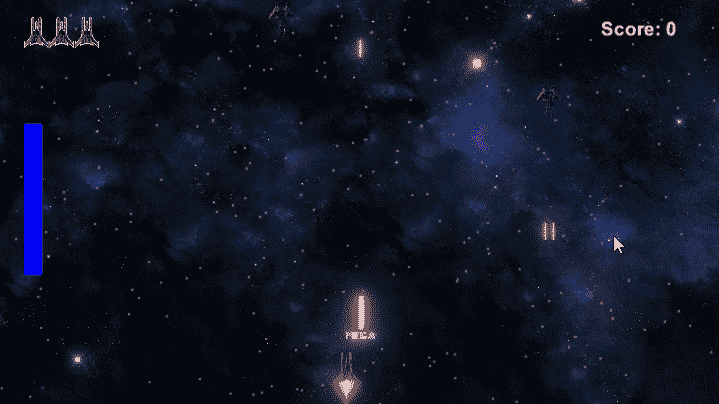
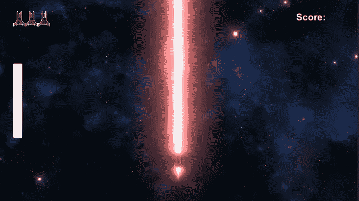
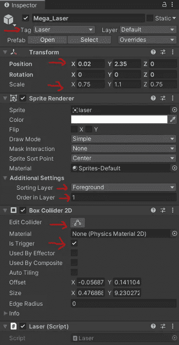
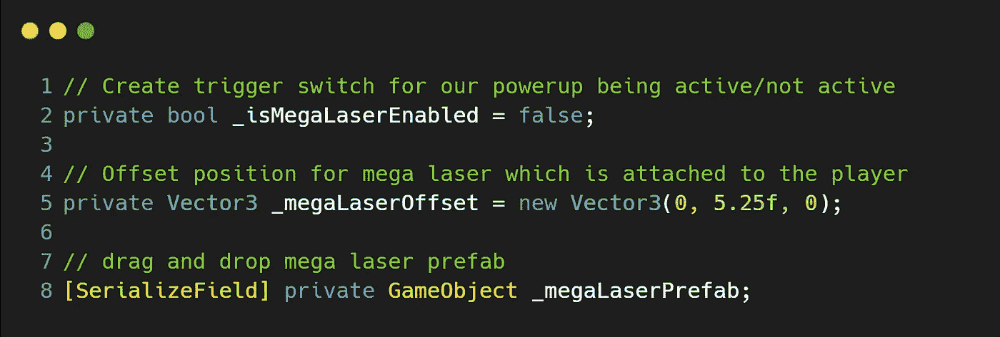
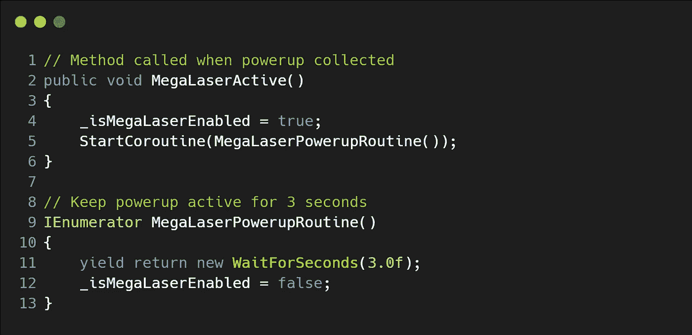
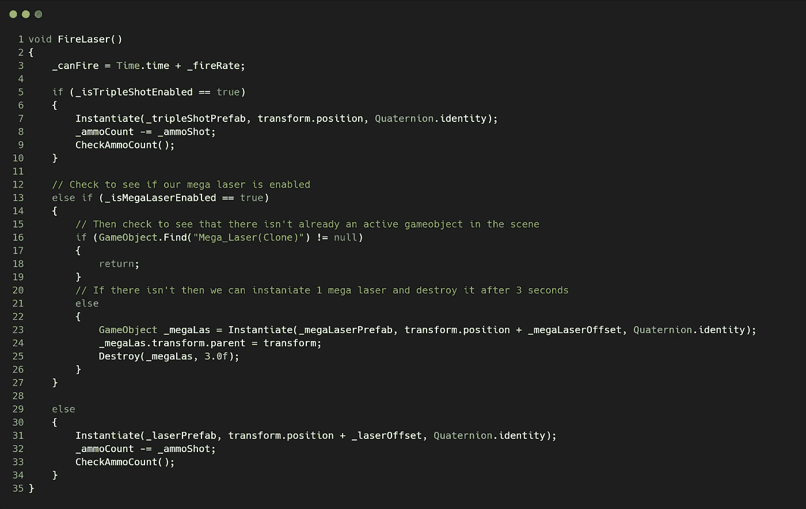
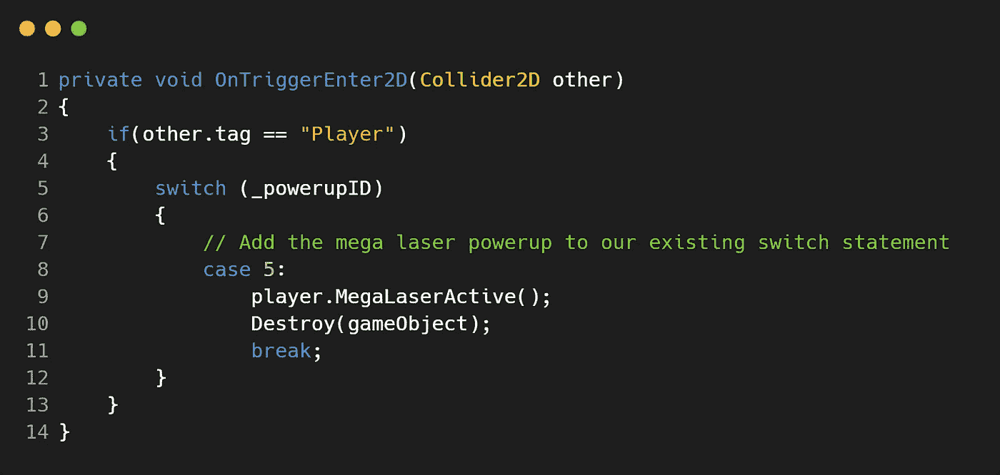
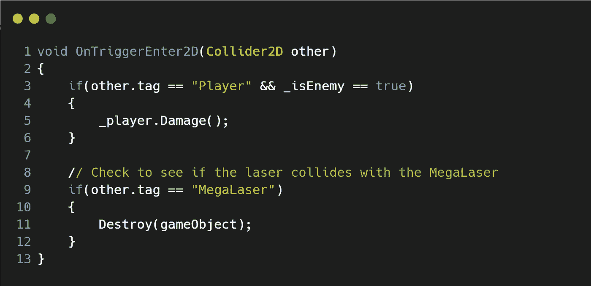

# 在 Unity 中为我们的 2D 银河射击游戏增加一个超级激光能量！

> 原文：<https://medium.com/geekculture/adding-a-mega-laser-powerup-to-our-2d-galaxy-shooter-in-unity-b1e46a911a07?source=collection_archive---------51----------------------->

**目标**:实现一个新的**武器**类型(**巨型激光**)，一旦**玩家**收集到**能量**就可以使用。

我们最近实现了新的**弹药补充**和**生命补充** **能量提升**，现在是时候给**玩家**另一件**武器**了，它是一个**巨型激光**的形式，将会对**敌人**造成毁灭性打击！！让我们深入了解一下…

## 创建通电

由于我们已经浏览过几次了，所以我们已经跳到这些文章中的一篇来帮助你了:
[*https://Christopher hilton 88 . medium . com/creating-a-health-collectable-for-our-2d-galaxy-shooter-in-unity-1ec 6 c 88 abbfc*](https://christopherhilton88.medium.com/creating-a-health-collectable-for-our-2d-galaxy-shooter-in-unity-1ec6c88abbfc)[*https://Christopher hilton 88 . medium . com/introducing-an-ammo-refill-power up-into*](https://christopherhilton88.medium.com/introducing-an-ammo-refill-powerup-into-our-2d-galaxy-shooter-in-unity-3c8378db0589)

## 创造巨型激光武器预制体

让我们拿我们现有的**激光**精灵，对它做一些改动，把它变成一个巨型**激光**。让我们看一下最终产品，这样我们就知道我们在朝着什么方向努力了:

将**激光**精灵图像拖动到**层次**窗口，重命名为“ ***Mega_Laser*** ”。现在让我们来看看组件:

1.  让我们将**标签**改为“**激光**”。
2.  在**变换**组件中，让我们将**位置**和**比例**更改为我们喜欢的尺寸。
3.  在 **Sprite 渲染器**组件中，将排序层设置为“**前景**”，并将层中的顺序设置为“ **1** ”。
4.  **添加箱式碰撞器 2D** —确保勾选“**是触发器**”，并围绕精灵调整**箱式碰撞器**。
5.  别忘了把这个游戏对象拖到**预置 powerup** 文件夹里。

## 让我们添加代码

与其他加电类似，让我们对现有代码做一些补充。让我们开始在' ***玩家*** '脚本中添加:

1.  **触发开关**为我们的**巨型激光器**被**激活/不激活。**
2.  一个**偏移**为**巨型激光器摆好**的姿势，这样光束就来自船的前方。
3.  一个**序列化的游戏对象**用于我们的**巨型激光预置**，我们可以将它拖放到**检查器中。**

接下来，让我们创建一个调用我们的**协程** **MegaLaserActive()** 的方法，当然，让我们创建我们的**协程**，它将处理定时器**MegaLaserPowerupRoutine():**

现在，让我们进入我们的 **FireLaser()** 方法，并在现有代码中添加一个 **else if** 语句，该语句将检查***_ isMegaLaserEnabled***是否为 **true** ，如果是，那么我们接下来将检查在**场景**中是否已经有**大型激光游戏对象**的**实例**除此之外，我们还要将新的**游戏对象 *_megaLas*** 的**变换设置为**父** ( **玩家**)，这样**激光**就附着在**玩家**身上，并随着**玩家**四处移动。******

在我们的' ***Powerups*** '脚本中，让我们将下一个 **powerup** 添加到现有方法**OnTriggerEnter2D()switch**语句中:

我们现在有了我们的**巨型激光**开始运行，并在可用的 **3** 秒内摧毁它触及的敌人。但是，我们有一个小问题，那就是，当敌人向我们发射激光时，不能摧毁敌人的激光。你知道有多少**大型激光器**无法摧毁那些微型**激光器**？对，所以让我们在我们的' ***激光*** '脚本中快速解决这个问题。在 **OnTriggerEnter2D()** 方法中，让我们添加一个额外的 **if** 语句，该语句检查另一个标记是否为“ **MegaLaser** ”:

