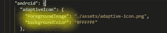
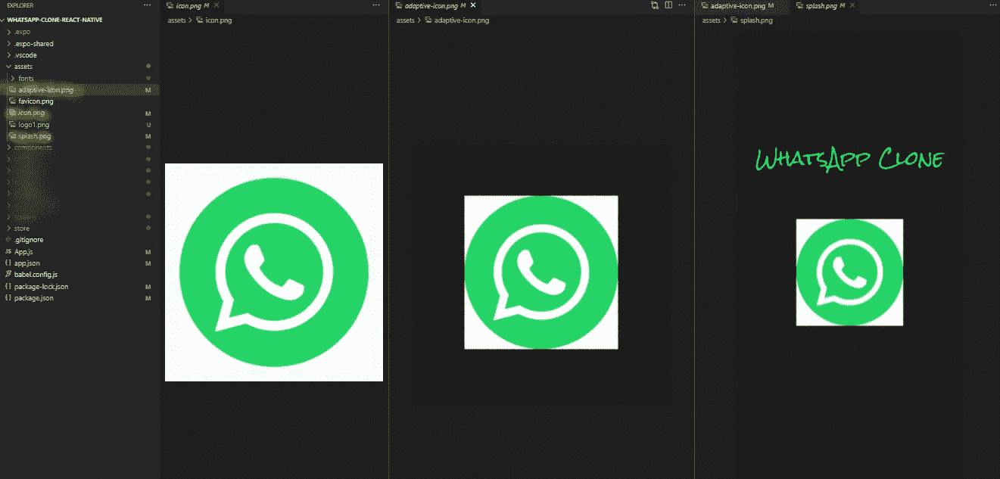
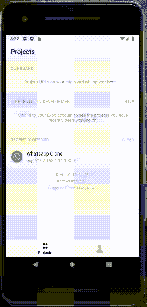

# 在 5 分钟内为世博会应用程序添加闪屏和图标

> 原文：<https://medium.com/geekculture/adding-a-splash-screen-and-icons-to-a-expo-app-in-5-minutes-157b389dac12?source=collection_archive---------1----------------------->

即使是最小的细节也关系到一个应用的成功

Image By [Austin Distel](https://unsplash.com/@austindistel) on [Unsplash](https://unsplash.com/)

# 什么是闪屏和配置说明

你做了一个很棒的应用程序，当然，为什么不正确地发布它呢？但是如果你打开你的 expo 应用，看到 Expo 提供的默认无聊*闪屏*，你…………“等等，首先什么是闪屏？”

> 看到上面的图片，你可能已经知道我在说什么了。基本上，当我们启动一个应用程序时，它需要一些时间来运行或加载字体/资源，应用程序不会立即可用。所以，闪屏基本上是用户在应用程序加载状态下看到的屏幕。

## 设备尺寸呢？

没问题，世博会让我们有了保障。
“对于 Ios 设备，我们可以选择`1242`像素宽和`2436`像素高——这是 iPhone 8 Plus(最宽的 iPhone)的宽度和 iPhone X(最高的 iPhone)的高度。但在 Android 的情况下，屏幕尺寸随着市场上大量不同的设备而变化很大。解决这一问题的一个策略是查看最常见的分辨率并围绕其进行设计— [您可以在这里看到设备及其分辨率的列表](https://material.io/resources/devices/)。你可以看到这份[世博会文件](https://docs.expo.dev/guides/splash-screens/)，我已经复制了上面的信息😁😁

## 配置闪屏

您可以在`app.json`文件中配置您的闪屏，并从下面的世博会指南中阅读所有属性:
`[**splash.image**](https://docs.expo.dev/guides/splash-screens/#splashimage)` (注:闪屏图像有**无**背景)`[**splash.backgroundColo**](https://docs.expo.dev/guides/splash-screens/#splashbackgroundcolor)**r**``[**splash.resizeMode**](https://docs.expo.dev/guides/splash-screens/#splashresizemode)`

# 什么是图标和配置说明

当您发布应用程序时，应用程序图标是人们在 AppStore/Play 商店以及用户主屏幕上看到的内容。

## 图标大小:

正如博览会建议的那样，我们可以在 android 和 ios 设备上使用 1024x1024。还要确保图标必须是正方形的，即 1023x1024 的图标无效。

## 为 android 配置图标

在 Android 中，我们要做一些额外的配置，而不仅仅是在`app.json`中指定图标。你可以在这里了解所有这些设置以及我们为什么需要它们。基本上，您需要提供两个独立的层:

*   `android.adaptiveIcon.foregroundImage`(一般为`assets/adaptive-icon.png`)
*   `android.adaptiveIcon.backgroundImage`

再次检查这两层[这里](https://docs.expo.dev/guides/app-icons/#android)。

# 创建图标和闪屏

我将为 WhatsApp 克隆项目添加图标和闪屏。创建图标可以使用“Canva”、“AdobeXD”等。但我是按照世博会文件中的说明，用 Figma 模板创建的。如果你想知道如何在这里创建图标，请看这个视频。但是下面👇是我和 Figma 一起创作的图标。

My above-created Icon in [Figma](https://www.figma.com/file/8X0imjzODqOT7WILFpPaDA/Expo-App-Icon-%26-Splash-(Community)?node-id=1%3A1357)

另外，[如果你不想去 Figma，请在这里下载图标。](https://drive.google.com/drive/folders/1X1htNrVEctFOnyxX5gi3Y1AFirzNf_VL?usp=sharing)

# 替换文件并检查整个 App.json 文件

所以，下载资产后，只需进入你的项目`assets`文件夹，替换掉我高亮显示的 3 个文件。你下载的文件会自动命名为特定的名称，所以不用担心！如果你愿意，可以删除旧文件。你也可以删除`assets/fsvicon.png`文件，因为它是用于网络的，而我们的应用程序不是用于网络的。

还有，下面👇整个`App.json`文件是否包含上述所有配置:

App.json with changed Icons

# 最终输出

FInal OutPut

所以，向右简单！….这就是你在应用程序中添加图标和闪屏的简单方法。如果您需要发布或构建 Expo 应用程序的教程，请发表评论。希望你喜欢这篇文章，直到那时

*保持安全；保持健康*

## 谢谢你