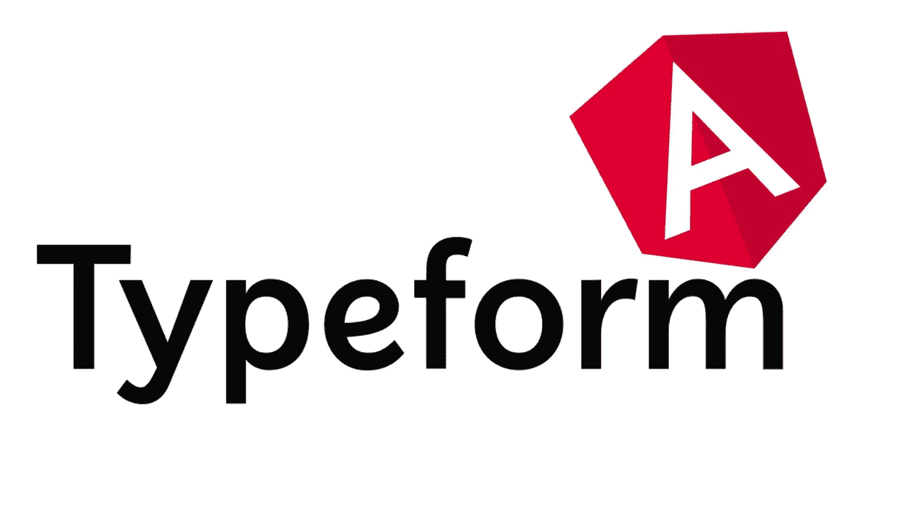
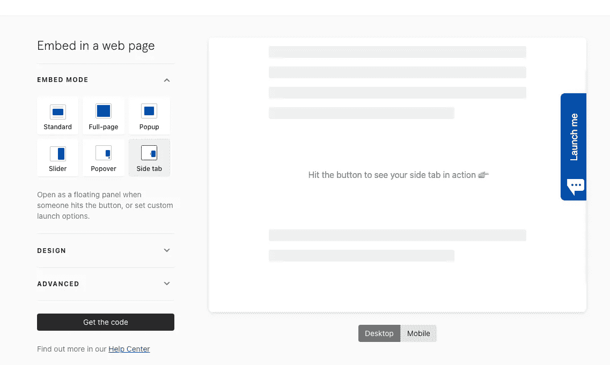
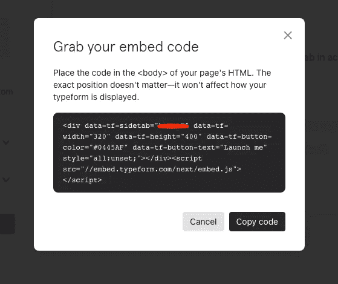
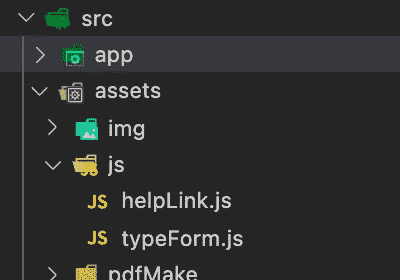
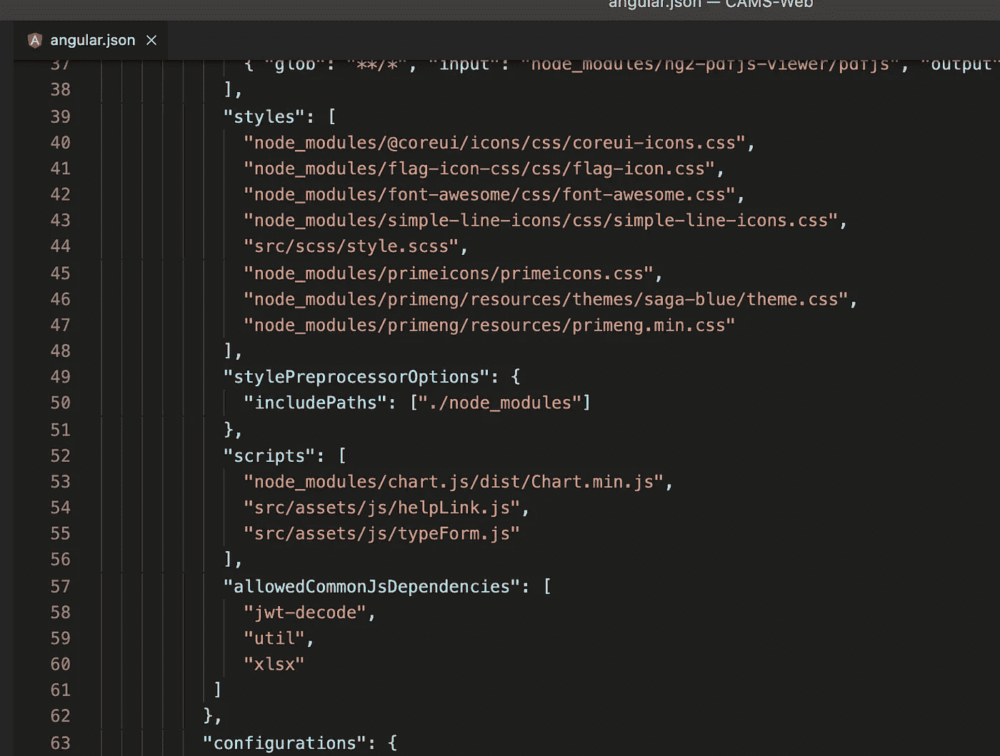
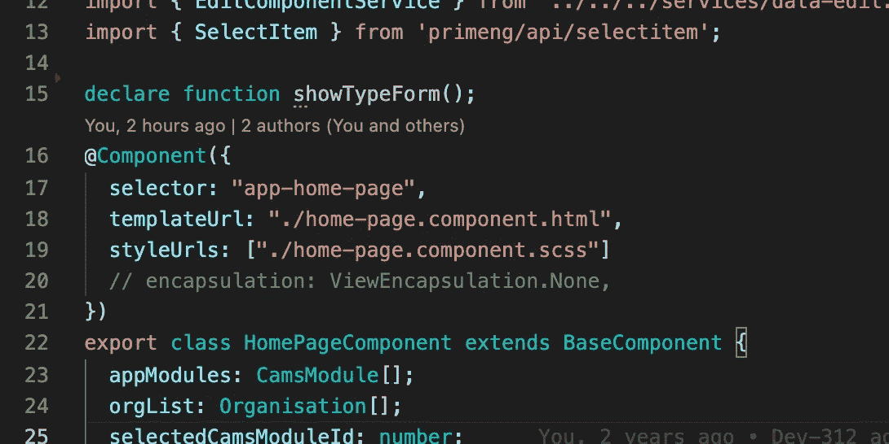
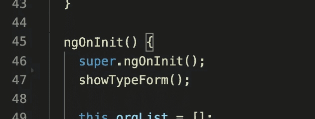

# 向 Angular 添加嵌入“Typeform”代码。

> 原文：<https://medium.com/geekculture/adding-embedded-type-form-code-to-angular-ce176601a748?source=collection_archive---------6----------------------->

本博客将分享我们可以将[类型表单](https://www.typeform.com/)调查的嵌入代码添加到 Angular 中的方法，而无需任何库安装，因为我们不能将该代码直接添加到 Angular HTML 文件中。

我面临的问题是将这个[字体](https://www.typeform.com/)嵌入代码添加到 angular 中，它没有显示我想要的按钮或调查，也没有显示任何东西。搜索了许多方法，但这些都没有给出我想要的确切输出。

这就是我所做的，

这是我将从 [Typeform](https://www.typeform.com/) 网站获得的嵌入代码，添加到我的 angular 项目中

这些是我将要添加到我的表单中的设置，以便在网页的一侧显示它。这是我点击“获取代码”按钮得到的代码，

Image1 (You will see your Type Form id in the red color area)

因为我们不能直接将这段代码粘贴到 Angular 项目中，所以我们需要单独使用一个 JS 文件，并调用那个函数来加载这个小部件，如下所示。

1.  *您需要在 assets 文件夹或保存 JS 文件的文件夹中创建一个 JS 文件。*

2 .*需要在该文件中创建一个函数来调用，以便在我们的 web 应用程序中创建这个小部件。*

如上代码部分。需要创建一个“script”元素，并需要添加脚本链接(图中的第 3 行:Code1 ),该链接来自我们之前获得的嵌入代码(图:Image1)。

之后，需要创建一个“div”元素来添加我们在嵌入代码的“div”标签中的相关属性(图:图 1)。

在第 5 行(图:代码 1)中，我自己添加了一个 ID 作为标识符，如果你愿意，你可以忽略它。

在第 6 行(图:Code1)正如我提到的，您需要添加在嵌入代码中获得的表单 ID(图:Image1)。所有其他属性都与您在嵌入代码中获得的属性相同，您需要用我展示的代码(图:Code1)替换这些属性，或者如果有更多属性，您也需要添加这些属性以获得相关的输出。

3.*将 JS 文件路径添加到您的项目的“****angular . JSON****”文件中的“项目”->-【ng】->-【build】->【Scripts】部分，如下图第 55 行截图。*

*(需要重新构建或保存项目以影响更改)*

4.在 component.ts 文件中声明您在新的 JS 文件中创建的函数，在这里您需要显示这个小部件( [Typeform](https://www.typeform.com/) 按钮)，如下图第 15 行所示

然后，只要您需要显示带有您选择的设置的[类型表单](https://www.typeform.com/)小部件，就调用该函数。

在这里，你将会看到[字体](https://www.typeform.com/)小部件，带有你在获得嵌入代码时添加的设置。

谢谢你，祝你编码愉快。