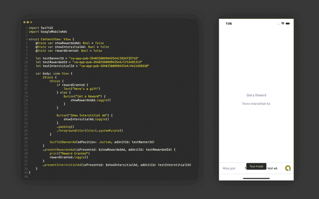

# 在 iOS 14.5 中将谷歌移动广告(Admob)添加到您的 SwiftUI 应用中

> 原文：<https://medium.com/geekculture/adding-google-mobile-ads-admob-to-your-swiftui-app-in-ios-14-5-5073a2b99cf9?source=collection_archive---------5----------------------->

## 将 Google Mobile Ads SDK 的 v8 添加到 SwiftUI 应用程序并为 iOS 14.5 做准备的指南。

# 介绍

随着越来越多的应用程序使用 SwiftUI 构建，我想提供一种简单的方法将 Admob 集成到您的应用程序中。在本指南中，你将确切地了解一切是如何工作的。如果你想直接将代码拖放到你的应用程序中，那也是可行的！([https://github.com/patrickhaertel/SwiftUIMobileAds](https://github.com/patrickhaertel/SwiftUIMobileAds)

我曾计划将它作为 Cocoapod 发布，这样集成起来会更容易，但是我遇到了一些问题。如果这些问题得到解决，请查看前面提到的 GitHub 链接以获得安装说明。

看看这个，看看它与 SwiftUI 的集成有多好:



# 我们开始吧

## 设置 Google 移动广告 SDK

为 Admob 准备您的应用程序并不是一个小步骤，但我会带您完成它。请务必在这里参考谷歌的官方文档[。](https://developers.google.com/admob/ios/quick-start)

在您的 Admob 仪表板中创建新应用程序。请保存您的应用标识符，因为您稍后会用到它。

使用 Cocoapods 导入 SDK

```
pod 'Google-Mobile-Ads-SDK'
```

在这里按指定[更新你的 info.plist 文件。你需要提供**skadnetworkkitems**，这样即使你的用户在 iOS 14.5 中没有选择应用追踪，你仍然可以向他们显示相关广告。除了那些键，你还需要设置你的 **App 传输安全**设置，如下所示。](https://developers.google.com/admob/ios/quick-start)

```
<key>NSAppTransportSecurity</key> 
<dict>     
    <key>NSAllowsArbitraryLoads</key>
    <true/>
    <key>NSAllowsArbitraryLoadsForMedia</key>
    <true/>
    <key>NSAllowsArbitraryLoadsInWebContent</key>
    <true/>
</dict>
```

这样一来，我们终于可以开始编码了。你需要做的第一件事是初始化谷歌移动广告 SDK。因为我们正在为 SwiftUI 构建，所以我将使用 SwiftUI 生命周期。如果您喜欢应用程序代理，您可以在**ApplicationDidFinishLaunchWithOptions**中完成此操作。

厉害！SDK 现在已经初始化。我们剩下的就是制作视图。

## 横幅广告(自适应)

我们可以从为 BannerAd 创建一个 **UIViewController** 开始。

要在 SwiftUI 中使用您新创建的 **UIViewController** ，您需要创建一个**uiviewcontrollerpresentable**。

现在，您的横幅广告是一个 SwiftUI 视图，但我们仍需要进行一些设置，以便您可以将其添加到您的应用程序中。让我们创建一个名为 **SwiftUIBannerAd** 的新 SwiftUI 视图。此视图将管理您的广告的位置和框架。

就是这样！您可以将您的广告添加到您的应用程序中。我建议你把它放在 a **ZStack** 的最高级别。(参考开头的例子)

测试您的广告时，请确保将 **adUnitId** 设置为横幅测试广告单元 Id:

```
ca-app-pub-3940256099942544/2934735716
```

你可能已经注意到我使用**通知中心**和 **UIApplication** 来获取安全区域和方向。虽然你可以使用 **GeometryReader** 来做到这一点，但我不建议将其用于生产应用。在测试我自己的 SwiftUI 应用程序 [WidgeTube](http://www.widgetubeapp.com) 时，我发现 **GeometryReader** 对于生产来说根本不可靠。太多时候，它是 SwiftUI 的属性图崩溃的根源。虽然有些人已经找到了避免这种情况的方法，但是通过试验视图堆栈的顺序，我决定最好完全避免使用 **GeometryReader** 。

## 间隙广告

首先，我们需要创建一个**interstilladobject**。这个对象将处理你的应用程序中的插播广告的加载。

我们现在将使用这个对象来创建一个**interstilladview**。这个视图将会是一个 UIViewControllerRepresentable 以及一个 GADFullScreenContentDelegate。

稍后，我们将创建全屏修改器来呈现这个视图。现在，我们将留下我们所拥有的，并创建奖励广告(如果你没有创建奖励广告，跳到全屏修改器)。

测试时，使用间隙测试 ad 单元 id:

```
ca-app-pub-3940256099942544/4411468910
```

## 奖励广告

制作有回报的广告几乎和插播广告一样。唯一的区别是，对于奖励广告，我们需要创建一个函数，当奖励被授予时，该函数将运行。

就像插播广告一样，我们需要创建一个**rewarded object**来处理广告的加载。

现在，我们将使用这个对象来创建 **RewardedAdView** 。

现在我们有了自己的视图，我们需要一种简单的方法在应用程序中展示它们。为此，我们将创建一个类似于**的自定义修改器。sheet()** 修改器。

测试时，使用奖励的测试广告单元 id:

```
ca-app-pub-3940256099942544/1712485313
```

## 全屏修改器

让我们从创建将由修改器创建的视图开始。

现在，我们需要做的最后一件事是添加修饰符本身。


恭喜，就是这样！现在，您可以轻松地将 Admob/Google 移动广告集成到您的 SwiftUI 应用程序中，如下所示。

# 信用

灵感来自迈克尔·巴尼的这篇文章。

我在创建我的应用程序 [WidgeTube](http://www.widgetubeapp.com) 时学会了如何做这件事。