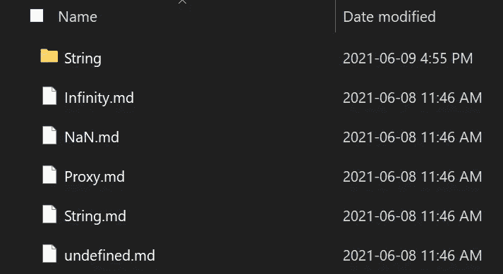

# 在 NextJS 中使用 Markdown Frontmatter 添加元数据

> 原文：<https://medium.com/geekculture/adding-metadata-using-markdown-frontmatter-in-nextjs-8dd4cb66efa3?source=collection_archive---------27----------------------->

## 有时，您需要将页面上的内容与生成页面所需的信息分开。

[Accompanying video](https://youtu.be/_eRJe7dojys)


我最近做了一个组件来显示 reference.bayanbennett.com 最近的更新。我第一次尝试做这件事的方法绝对是错误的。这篇文章的目的是帮助其他人避免这个错误。

# Git 不跟踪文件时间戳



如果网站在本地提供服务，使用文件被修改的时间是可行的，但是如果在每次构建时使用的 CI/CD 都是从 git 中提取的，则不可行。有些服务使用缓存，但这不是确定修改时间的可靠来源。

如果 git 不存储文件时间戳，它可以存储在哪里？有许多不同的选择，包括转移到数据库。我选择了最简单的，减价的前台服务。在我的网站上生成页面的降价文件不会经常更新。如果有必要，我最终可以添加一个预提交钩子来更新修改时间。

# 什么是 Markdown Frontmatter？

Markdown frontmatter 是 YAML/TOML 格式的 Markdown 文件头部的隔离部分。这里有一个 YAML 格式的降价前沿问题的例子:

```
---
title: What Is Markdown Frontmatter
created: 2021-06-11T18:00:06.401Z
---Here's the content.
```

这个想法是，frontmatter 将被解析并从 markdown 文件的其余部分中分离出来。

# 使用“备注-正面问题”进行解析➕“备注-解析-正面问题”

为了解析前面的问题，我使用了 UnifiedJS 工具家族的两个库:`[remark-frontmatter](https://github.com/remarkjs/remark-frontmatter)`和`[remark-parse-frontmatter](https://github.com/phuctm97/remark-parse-frontmatter)`。这两个库都是必需的，并且做不同的事情:

*   `remark-frontmatter`将分离出锋物质作为`yaml`或`toml`节点。
*   `remark-parse-frontmatter`会将`yaml` / `toml`解析成一个对象。

一旦处理完毕，frontmatter 将在传递给处理器的 vFile 上的`.data.frontmatter`中可用。

```
*import* unified *from* "unified";
*import* remarkParse *from* "remark-parse";
*import* remarkFrontmatter *from* "remark-frontmatter";
*import* remarkParseFrontmatter *from* "remark-parse-frontmatter";
*import* vfile *from* "vfile";*const* unifiedRemarkProcessor = unified()
  .use(remarkParse)
  .use(remarkFrontmatter)
  .use(remarkParseFrontmatter);const markdown = vfile(`
---
title: test
---
`;*const* hast = *await* processor.run(
  processor.parse(markdown),
  markdown
);console.log(markdown.data.frontmatter);
```

*注意:这个帖子/视频有一个元问题——以下部分应该放在一个单独的帖子/视频中。我努力在将来记住这一点。*

# “反应-降价”的问题

`react-markdown`库运行良好，但没有充分利用 NextJS 的服务器端渲染(SSR)。是的，React 被呈现为静态 HTML，然后在页面呈现时被水合，但是一半的处理可以在构建时一次完成。目标是让浏览器处理更少的数据，并减少水合所需的时间。

# 解构“反应-降价”

我潜入`react-markdown`库看看它是如何工作的，我找到了`[react-markdown.js](https://github.com/remarkjs/react-markdown/blob/main/src/react-markdown.js)`文件，观察他们如何设置他们的统一处理器。我可以复制并粘贴处理器，但是有一个函数是这个库不可或缺的，它做一些额外的处理，并将 React 组件映射到[超文本抽象语法树(HAST)](https://github.com/syntax-tree/hast) 节点。

```
*const* reactMarkdown = hastChildrenToReact(
  { options: { components }, schema: html, listDepth: 0 },
  hast
);
```

我没有复制这个函数，而是保留了`react-markdown`库，只是导入了`hastChildrenToReact`函数及其依赖项。

我的最终处理器看起来像这样:

```
*const* processor = *unified*()
  .use(remarkParse)
  .use(remarkFrontmatter)
  .use(remarkParseFrontmatter)
  .use(remarkRehype, { allowDangerousHtml: *true* })
  .use(rehypeSlug)
  .use(rehypeAutolinkHeadings, { behavior: "wrap" });
```

现在，当 NextJS 构建页面时，他们运行这个处理器，只将 HAST 和解析的 frontmatter 转发到页面进行水合。

# 使用降价前沿问题

从`getStaticProps`通过 frontmatter 和 hast 后，可以通过页面道具访问。

```
*export const getStaticProps*: *GetStaticProps*<
  *JavaScriptPageTemplateProps*,
  *PathResult* > = *async* ({ params }) => {
  /* ... */

  *const* hast = (*await* processor.run(
    processor.parse(markdown),
    markdown
  )) *as Root*;

  *const* { frontmatter } = markdown.data *as* { frontmatter: *Frontmatter* };

  *return* {
    props: {
      hast,
      frontmatter,
      /* ... */
    },
  };
};*const JavaScriptPageTemplate*: *VoidFunctionComponent*<*JavaScriptPageTemplateProps*> =
  ({ hast, frontmatter, /* ... */ }) => {
    *const* reactMarkdown = hastChildrenToReact(
      { options: { components }, schema: html, listDepth: 0 },
      hast
    );

    *const* { tags, title } = frontmatter;

    *return* (
      <>
        <Head>
          <title>
            {title}
          </title>
        </Head>
        <Typography *variant*="h1" *align*="center">
          {title}
        </Typography>
        {reactMarkdown}
        <footer>
          <Typography>Tags: </Typography>
          {tags.map((tag) => (
            <Chip *key*={tag} *label*={tag} />
          ))}
        </footer>
      </>
    );
  };

*export default JavaScriptPageTemplate*;
```

# TL；速度三角形定位法(dead reckoning)

我使用 markdown frontmatter 格式在我的 markdown 文件中嵌入了一些元数据。解析完这些数据后，我将它包含在我的 NextJS 页面中。我还通过在构建时处理一些降价处理来优化水合时间。

*最初来自:*

[https://www . bayanbennett . com/posts/adding-metadata-using-markdown-front matter-in-nextjs](https://www.bayanbennett.com/posts/adding-metadata-using-markdown-frontmatter-in-nextjs)


thumbnail