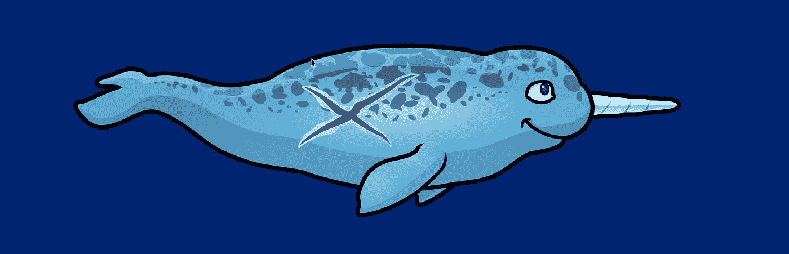

# 给玩家增加更多的伤害视觉效果

> 原文：<https://medium.com/geekculture/adding-more-damage-visuals-to-the-player-ea34bc5d01de?source=collection_archive---------35----------------------->

当我继续讲述我的独角鲸海洋冒险故事时，这位小游泳者不幸的是，每当他受到伤害时，他的外观都会有一个小小的更新。我已经有了两个玩家伤害的动画，但是我想要另一个在玩家身上逗留并代表生命总数的视觉效果，就像它在 UI 中一样。