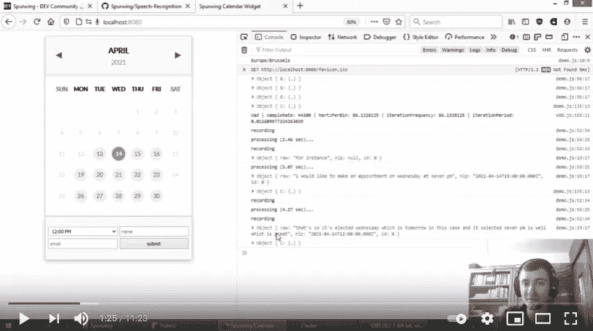
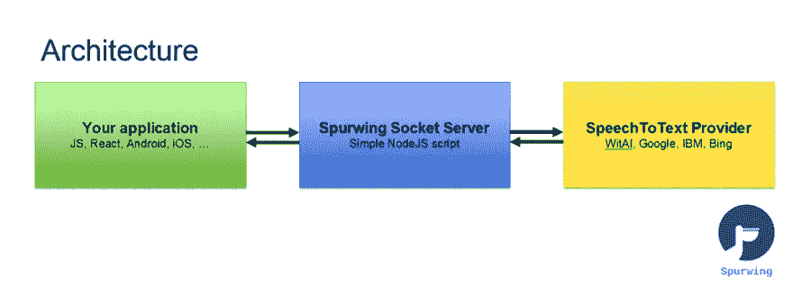

# 将语音命令和语音控制添加到您的应用程序

> 原文：<https://medium.com/geekculture/adding-speech-commands-and-voice-controls-to-your-apps-6236b7cde358?source=collection_archive---------17----------------------->


你有没有想过潜入未来，使用先进的人工智能技术？今天你可以，感谢我们简单的图书馆。在这篇文章中，我们展示了我们简单易用的语音识别库，可以为任何应用程序添加**语音命令和控件**。

无论您是构建 web 应用程序、本地应用程序还是桌面应用程序，这项技术都可以集成到任何具有互联网连接的系统中。

# 完整演示



Full YouTube Demo

YouTube:[https://www.youtube.com/watch?v=60llvnv3nDA](https://www.youtube.com/watch?v=60llvnv3nDA)

# 源代码

GitHub:[https://github.com/Spurwingio/Speech-Recognition](https://github.com/Spurwingio/Speech-Recognition)

这是我们简单而强大的服务器-客户端实现，在浏览器中具有语音识别功能。它可以在任何使用最新网络浏览器(推荐 Firefox 或 Chrome)的设备上运行。

# 体系结构

架构很简单。这个库包含 Spurwing Socket 服务器的实现，它也连接到一个语音到文本的提供者。对于后者，我们使用脸书的 WitAI，这是一个完全免费的服务，并且易于使用。或者，你可以很容易地集成任何其他 STT 提供商(谷歌，IBM Watson，必应等)，但这些可能是有代价的。



# 使用

1.  这是一个 NodeJS 实现，你需要 node(带 npm) v12+。使用`node -v`检查您的版本。
2.  克隆或下载此存储库。
3.  运行`npm install`让它下载所有必要的依赖项。(如果失败，您可能需要安装 C++构建工具)。
4.  我们使用 WitAI 作为免费的 STT 提供商。你需要在这里注册并创建一个应用程序[https://wit.ai/apps](https://wit.ai/apps)
5.  在“设置”下，您会找到您的“服务器访问令牌”。
6.  将`config.sample.json`复制到`config.json`并进行编辑。
7.  您必须为`WITAPIKEY`提供一个值，这是您的“服务器访问令牌”。
8.  使用`node index.js`启动 Socket 服务器。
9.  访问[http://localhost:8002/spur wing/audio/](http://localhost:8002/Spurwing/audio/)开始测试。

*套接字服务器运行在端口`8002`上，您可以在`index.js`中更改该端口。

# 客户端实现

下面的代码片段展示了如何将这个语音识别库添加到 web 应用程序中。

在您的 HTML 的`<head>`中添加以下内容:

```
<script src="https://cdnjs.cloudflare.com/ajax/libs/socket.io/4.0.1/socket.io.min.js"></script>
<script src="https://spurwing.github.io/Speech-Recognition/public/VAD.js"></script>     <!-- Required: VAD algorithm -->
<script src="https://spurwing.github.io/Speech-Recognition/public/audio.js"></script>   <!-- Required: Speech Recognition Library --><script src="demo.js"></script>    <!-- Your implementation -->
```

在`demo.js`里面你有:

```
const spa = new SpurwingAudio();// on user click start mic:
spa.init().then((stream) => { // ask user for microphone access
    processStream(stream);
}).catch((err) => {
    alert("You must allow your microphone.");
    console.log(error);
});
// on user click stop mic:
// spa.end();function processStream(stream) { // start Voice Activity Detection
  spa.startVAD(
      () => console.log('recording'), // function: on speech start
      (buffer, duration) => {         // function: on speech end
        socket.emit('stream', {buffer, id:0}) // send audio/speech fragment to server (optional custom id of fragment)
      }
  );
}// create socket connection to server
let socket = io('localhost:8002', { // server domain
  path: "/Spurwing/audio/socket.io" // server endpoint
});// capture "text" event from server (containing data)
socket.on('text', data => {
    console.log(data) // do something with the transcribed audio text // data structure: { raw: "hello", nlp: null, id: 0 }
});
```

# 结论

只需几行代码，这就为业务自动化、时间管理和许多其他领域带来了无数的可能性和机会。

我很想知道你会用它来构建什么样的解决方案，请在下面的评论中告诉我们！:)

# 关于我们

Spurwing 为您的业务和项目提供企业级 [**预约调度 API**](https://www.spurwing.io/) 和日历管理解决方案。易于定制和轻松集成。由于我们的企业级预约调度 API，我们为软件团队提供了时间管理解决方案。此外，我们正在建立一个完全免费和开源的市场，包含小工具，聊天机器人，仪表板和集成解决方案。

更多项目请关注我们的博客和 https://github.com/Spurwingio/[GitHub](https://github.com/Spurwingio/)