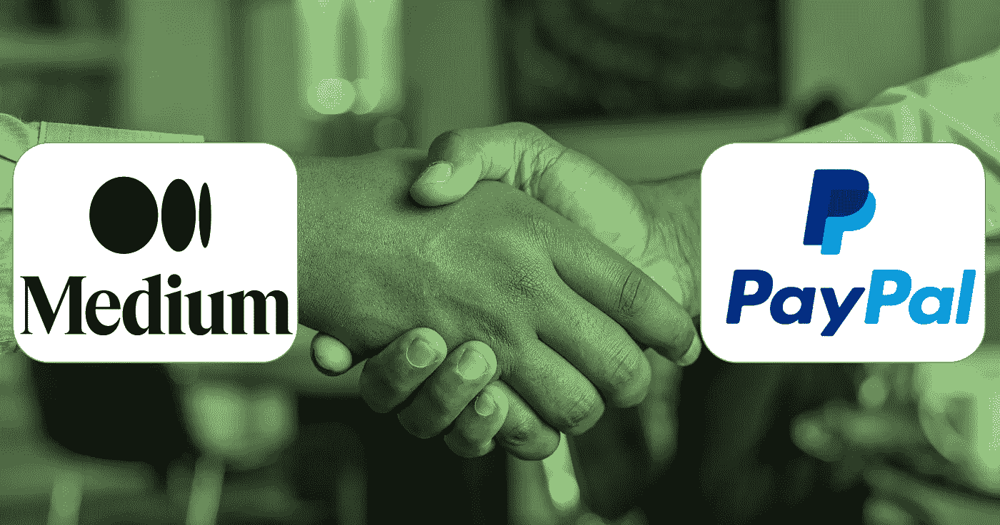

# 添加 Paypal 链接，以便在您的介质上接收小费

> 原文：<https://medium.com/geekculture/adding-the-paypal-link-for-receiving-a-tip-on-your-medium-661fdaae2d33?source=collection_archive---------10----------------------->

如何在您的中型博客上添加链接以获得 Paypal 小费？

以下是我们正在讨论的内容的概要:

1.  **转到您的媒体“设置”中寻找“小费”菜单**
2.  **找到“创建贝宝。Me link”创建链接(转到 Paypal 帐户)**
3.  **粘贴你创建的链接**