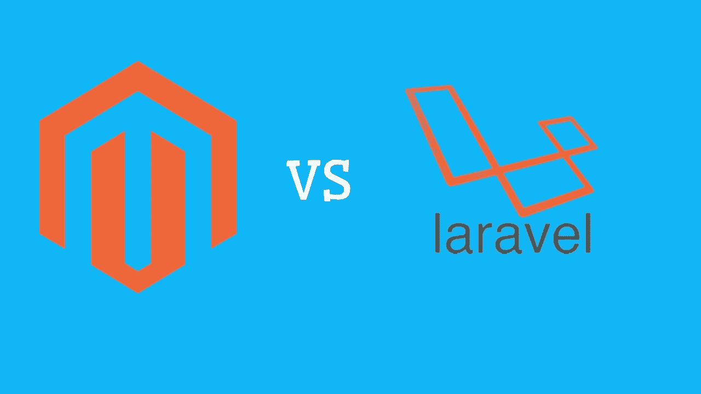
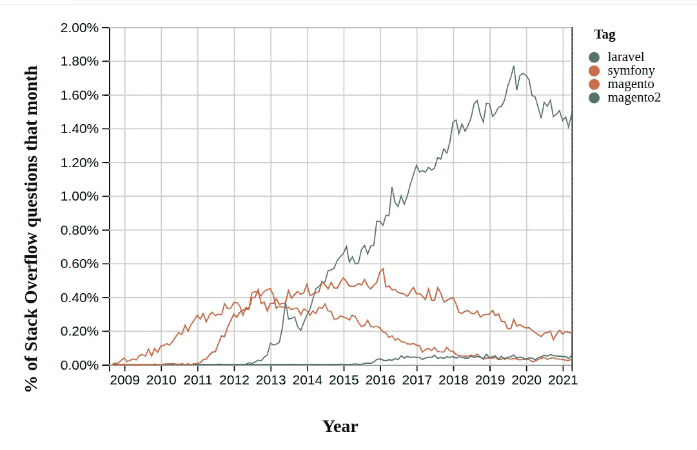

# Adobe Commerce (Magento 2)与 Laravel PHP 框架

> 原文：<https://medium.com/geekculture/adobe-commerce-magento-2-vs-laravel-php-framework-2226967c4c6f?source=collection_archive---------8----------------------->

Adobe Commerce 是遗留 Magento 2 的新名称，使用了同样的 10 年旧框架，写在 Zend Framework 1 上，在过去 6 年中被放弃。使用遗留技术栈(KnockoutJS，ZF1)来实现现代电子商务并不是最好的软件开发实践。

Laravel 是现代先进的 PHP 框架。

Laravel 由 Taylor Otwell 构建和开发，基于模型-视图-控制器(MVC)架构。但是，它也有利于 API 开发。Laravel 是用 PHP 语言编写的，它是在 MIT 许可证下授权的。Laravel 的首次发布是在 2011 年 6 月。

Laravel 的突出特点是用户友好和简单。当 Magento2 (Adobe Commerce)是相反的框架。对于开发人员来说，这是一场噩梦，代码臃肿，过度工程化，而且复杂。Laravel 拥有 PHP 开发基于 web 的电子商务应用程序的最强框架之一。

Laravel 推荐用于任何容易受到安全攻击的 web 应用程序，因为 Laravel 具有强大的安全特性。

在那里你可以找到关于如何使用 Laravel、tinker 和雄辩 ORM 与过时的 Magento PHP 框架构建 Magento 微服务的开源 Git Hub 项目:

 [## Genaker/laragento

### Magento 2 有基于废弃的 Zend Framework 1 的遗留代码，在过时的 Zend_DB 上有非常丑陋的 ORM。Zend_DB…

github.com](https://github.com/Genaker/laragento) 

# **Laravel vs Adobe Commerce 的优势**

*   Laravel 有非常好的开发文档和论坛。从入门到涵盖每个组件的详细信息，Laravel 拥有构建电子商务 web 应用程序或 Magento 微服务所需的所有信息。
*   Laravel 对构建 restful 服务有很好的支持。您可以轻松地添加新的 API 和处理 CRUD 操作。
*   Laravel 自带一个名为雄辩 ORM 的内置 ORM，当 Magento 使用真正过时的 Zend Framework 1 ORM 时，它对连接 MySQL、Postgres 和 SQLite 等数据库有极好的支持。
*   Laravel 自带一个名为 Artisan 的内置 CLI。使用 Artisan，开发人员可以启动他们的项目，迁移数据库，并执行他们的代码。Adobe Commerce 2 有一些缺陷和巨大的技术债务。
*   这很容易学习和启动你的电子商务项目。
*   Laravel 为开发人员提供了构建代码的灵活性。
*   Laravel 允许您使用 Symphony 组件。这些组件中有很多都在早期测试过，可以很容易地集成。
*   Laravel 有一个非常强大的模板系统，叫做 Blade。虽然编写起来有点困难，但它被编译成 PHP 代码，您可以在视图中直接使用它。
*   Laravel 的活动管理做得很好。
*   Laravel Elixir 也是一个由 Laravel 提供的优秀框架，使用它您可以执行 Gulp 任务。Laravel Elixir 支持各种 CSS 预处理程序。
*   围绕 Laravel 构建的工具生态系统非常强大。
*   Laravel 有很好的社区支持。

45 分钟就能学会 Laravel。今天就开始做吧！->

**Magento 框架的缺点**

*   Magento 开发文档不存在。对于真正的应用程序开发来说，这是许多没有任何意义的页面
*   它的学习曲线非常糟糕。要开始了解 Magento，你需要 5-10 年。当你最终理解 Magento 的时候，你会对它非常沮丧，会开始使用 Laravel 或者 Noe JS。
*   存在太多组件，这扰乱了代码的一致性。
*   它有巨大的性能问题。
*   与 Laravel 相比，Magento 可以处理少 100 个请求。
*   它的响应时间很短。
*   它没有遵循现代软件开发的最佳实践。它有自己设计好的开发坏习惯。

【Laravel 对电子商务有什么具体好处？

凭借其可观的社区支持和内置库，Laravel 是电子商务的完美选择:

*   它为开发人员提供了自由，而不会损害安全性(见下文)或性能
*   它为应用程序提供了简单的第三方集成
*   Laravel 通过快速调试和测试以及简单的网站维护，加快了上市时间
*   Laravel 使用一种工具，在小型轻量级服务容器中运行应用程序和服务，这不会干扰已经安装的软件或计算机配置
*   这些服务容器将产品加载到平台内存中，使平台在代码和插件方面具有高度可扩展性
*   Laravel 提供了大量的包选项，无论您是使用 Laravel 插件还是构建自己的模块
*   它有一个非常有效的异步调度和排队系统，这意味着客户不需要等待流程发生，因为系统会仔细控制时间。