# 使用 OpenCV 的高级计算机视觉—使用 Google Colab 的 Python

> 原文：<https://medium.com/geekculture/advanced-computer-vision-with-opencv-python-using-google-colab-23458173105d?source=collection_archive---------10----------------------->

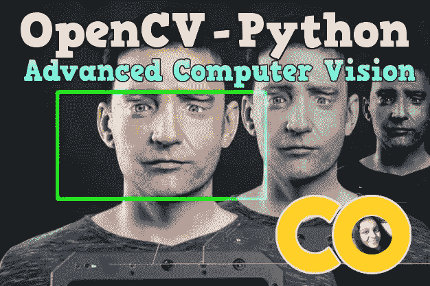

# 介绍

*   OpenCV 是一个巨大的开源库，用于计算机视觉、机器学习和图像处理。
*   它可以处理图像和视频来识别物体、人脸，甚至是人的笔迹。
*   OpenCV 由 Gary Bradsky 于 1999 年在英特尔创立。
*   目前，OpenCV 支持多种编程语言，如 C++、Python、Java 等
*   OpenCV 可以在不同的平台上使用，包括 Windows、Linux、OS X、Android、iOS 等
*   计算机视觉在自动驾驶汽车、机器人以及照片校正应用程序中发挥着重要作用。

# OpenCV-Python

OpenCV-Python 是一个 Python 绑定库，旨在解决计算机视觉问题。OpenCV-Python 使用 Numpy，这是一个高度优化的库，使用 MATLAB 风格的语法进行数值运算。所有 OpenCV 数组结构都与 Numpy 数组相互转换。这也使得与使用 Numpy 的其他库(如 SciPy 和 Matplotlib)的集成更加容易。

# OpenCV 的应用

使用 OpenCV 可以解决许多应用程序，下面列出了其中一些

*   人脸识别
*   自动化检查和监视
*   人数——计数(购物中心的客流量等)
*   高速公路上的车辆及其速度
*   街景图像拼接
*   视频/图像搜索和检索
*   机器人和无人驾驶汽车导航和控制
*   物体识别
*   医学图像分析
*   电影——来自运动的 3D 结构
*   电视频道广告识别

# 从预构建的二进制文件安装 OpenCV

我们将学习在您的 Windows 系统中设置 OpenCV-Python。下面的 Python 包将被下载并安装到它们的默认位置。

1.  Python3
2.  Numpy
3.  Matplotlib
4.  OpenCV-python

```
pip install opencv-python
import cv2
```

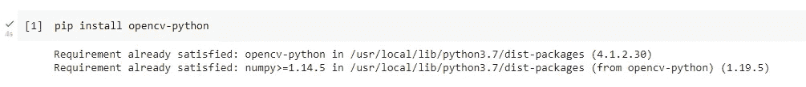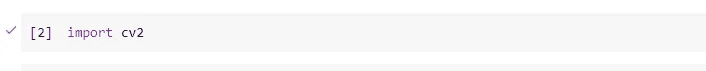

# 在 OpenCV-Python 中读取彩色或灰度图像

在本文中，我将尝试使用 OpenCV(开源计算机视觉)打开一个图像。要在 python 中使用 OpenCV 库，我们需要安装这些库作为先决条件:

*   Numpy 库(必要的，因为 OpenCV 在后台使用它)。
*   OpenCV python

要安装这些库，我们需要在 cmd 中运行这些 pip 命令:

*   pip 安装 opencv-python
*   pip 安装数量
*   pip 安装 matplotlib

## 您需要了解的功能

*   从文件中读取图像(使用 cv::imread)
*   在 OpenCV 窗口中显示图像(使用 cv::imshow)
*   将图像写入文件(使用 cv::imwrite)

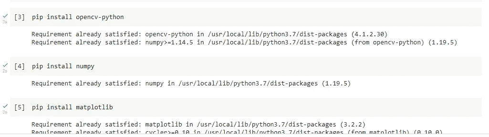

使用上传文件上传你的图片(我的图片是 Robo.jpg)。

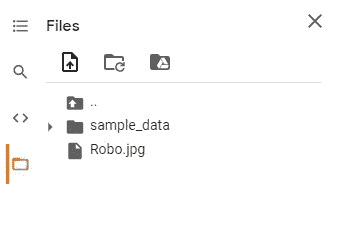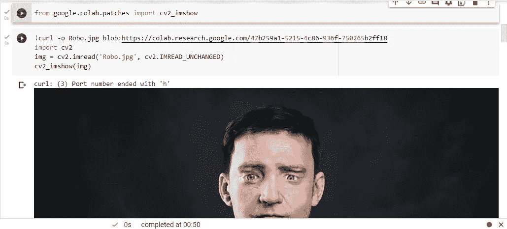

要使用 OpenCV-python 将图像读取为彩色图像，可以使用 IMREAD_UNCHANGED 或 IMREAD_COLOR。

要将图像读取为灰度图像，可以使用 IMREAD _ gray 代替它。

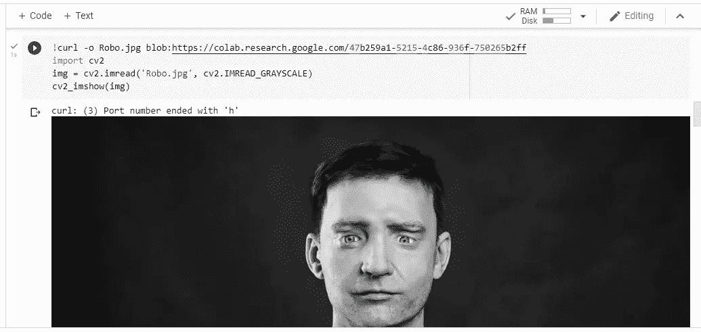

否则，您可以对彩色图像使用 1，对灰度图像使用 0。

# 读取高度为 100–200 像素、宽度为 200–400 像素的图像

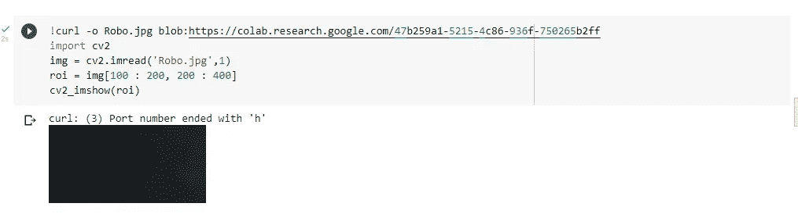

# 将图像大小调整为 200 像素 180 像素(宽高)

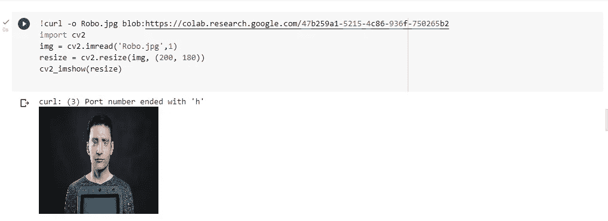

# 旋转图像

旋转图像需要很多步骤。这里使用的两个主要函数是:

*   getRotationMatrix2D()
*   瓦尔帕芬

**getRotationMatrix2D():它需要 3 个参数**

*   中心—图像的中心坐标
*   角度—图像应该旋转的角度(以度为单位)
*   比例-比例因子

**沃帕芬()**

*   函数 warpAffine 使用旋转矩阵变换源图像:

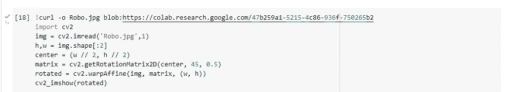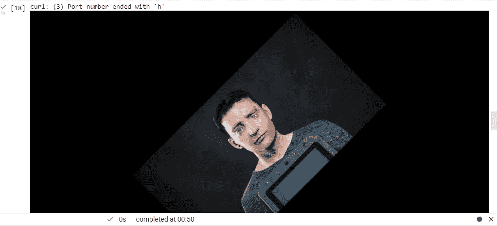

# 在图像上绘制矩形

rectangle()函数有 5 个参数

*   图像
*   左上角坐标
*   右下角坐标
*   颜色(BGR 格式)
*   线条宽度

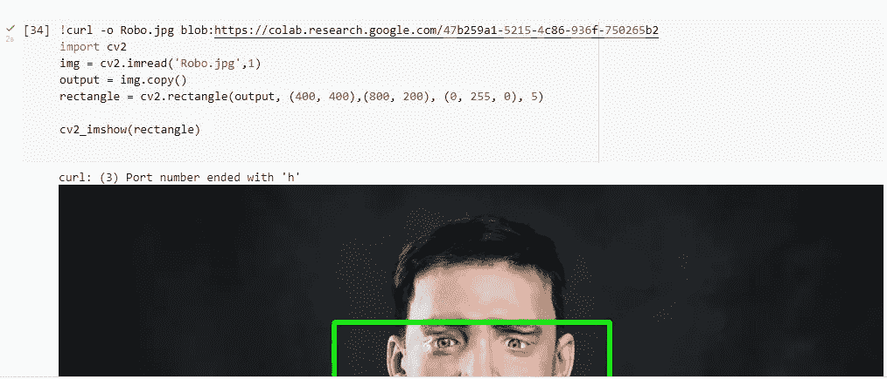

# 使用 OpenCV 在 Python 中显示图像上的文本

put text()函数接受 7 个参数

*   图像
*   要显示的文本
*   左下角坐标，文本应该从这里开始
*   字体
*   字体大小
*   颜色(BGR 格式)
*   线条宽度

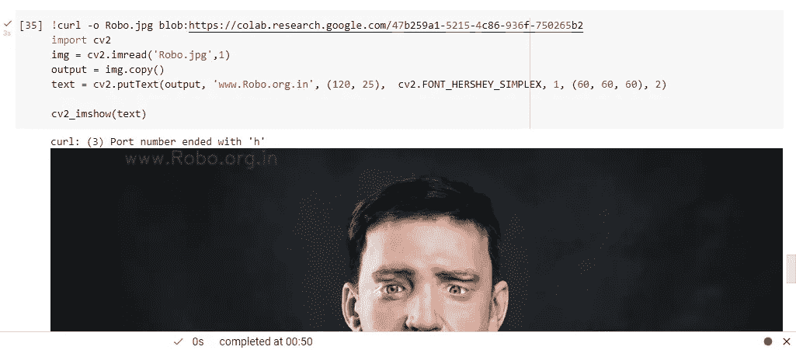

***如果你喜欢这篇文章，请在下面留下评论，并与你认为可能对你有帮助的朋友分享。感谢阅读！***