# Pandas 中的高级过滤和数据操作— loc、iloc、apply 和 lambda

> 原文：<https://medium.com/geekculture/advanced-filtering-and-data-manipulation-in-pandas-loc-iloc-apply-and-lambda-95990df0ad?source=collection_archive---------2----------------------->

## 关于在 pandas 中使用 loc、iloc、apply 和 lambda 进行高级过滤和数据操作的指南。

Photo by [Skitterphoto](https://pixabay.com/users/skitterphoto-324082/) from [pixabay](https://pixabay.com/)

我们之前探讨了如何与熊猫进行基本的数据争论。有时候基本功能就是不够用，这就是为什么 *loc* 、 *iloc* 、apply 方法和 lambda 函数可以派上用场。

 [## 熊猫的基础数据探索和操作

### 熊猫的基本数据操作技术列表。

python .平原英语. io](https://python.plainenglish.io/basic-data-explorand-manipulation-in-pandas-4b35d976acab) 

跟随我们的流失数据之旅——谁不想深入了解辞职员工故事的肮脏小细节——假设一些对你漂亮的总结的基础数据感兴趣的人现在想稍微调整数据，以便它更多地反映他们想象的数据应该是什么样子。

 [## 熊猫快速报告:快速探索，交叉表

### 使用熊猫进行快速探索、低调报道和分析的指南。

python .平原英语. io](https://python.plainenglish.io/pandas-rapid-reporting-quick-exploration-crosstab-b6511400c48e) 

对于本文，我将使用来自 Kaggle 的 [IBM HR Analytics 员工流失&性能数据集。](https://www.kaggle.com/pavansubhasht/ibm-hr-analytics-attrition-dataset?select=WA_Fn-UseC_-HR-Employee-Attrition.csv)

这里我们有原始的 IBM 流失数据，列出了唯一的部门名称。我们的首要任务是将“研发”值重命名为“R&D ”,以保持简洁明了。让我们使用 *loc* 来快速解决这个问题

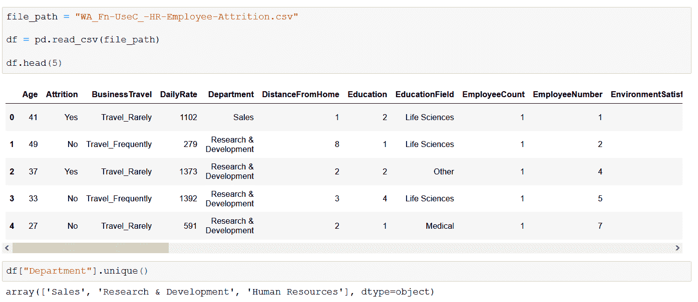

Screenshot by Author

## **DataFrame.loc**

您可以使用标签或布尔数组，使用 *loc* 方法来访问数据帧中的特定行和列。一个简单的例子是使用 *loc* 方法选择第二行(标签 1)以及“年龄”、“流失”和“部门”列:

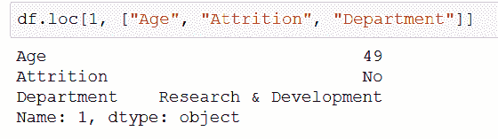

Screenshot by Author

如您所见，第一个参数是我们想要获取的索引标签，第二个参数是我们感兴趣的列/列列表。当然，您可以选择多行，或者是标签列表，甚至是范围:

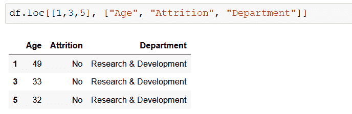

Screenshot by Author

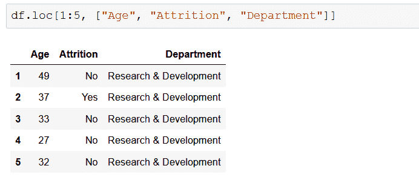

Screenshot by Author

请注意，当选择 1:5 切片时，第 5 个索引(第 6 行)也包括在内，这与 Python 中通常的切片不同，Python 中的切片上限是唯一的。

当您意识到可以使用布尔数组(实际上是一个只有真/假值的列表)来过滤行时，有趣的部分就开始了。这允许您在返回布尔值的第一个参数中编写逻辑语句—将对所有行评估该语句，返回产生 True 的行:

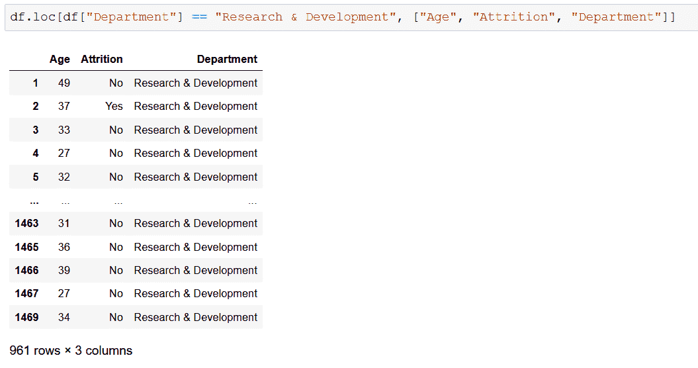

Screenshot by Author

再做一点调整，我们可以将“研发”重命名为“R&D”:我们可以使用 *loc* 为我们正在过滤的特定行/列字段赋值:

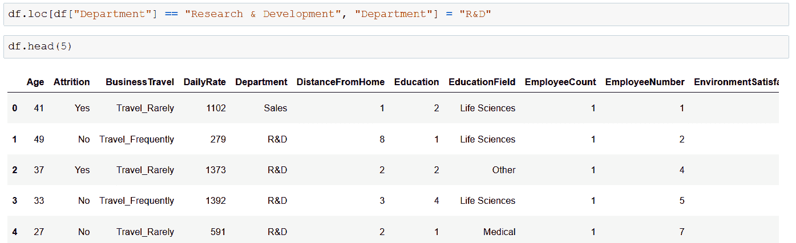

Screenshot by Author

我们可以用这种方法一次修改多个列，只需提供我们想要使用的列和值的列表:

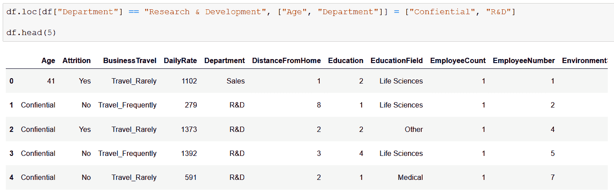

Screenshot by Author

> 如果你想让我保持咖啡因创造更多这样的内容，请考虑支持我，只要一杯咖啡。

## 数据帧**。iloc**

*iloc* 背后的思想与 *loc* 相同，唯一的区别是——正如名字中的*‘I’*所暗示的——它在提供位置选择时完全基于整数。第一个参数是行，第二个是要选择的列。在第一行和第三列的交叉点上归零看起来像这样:

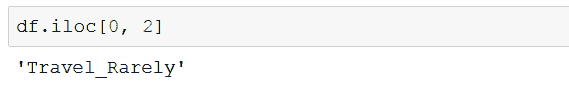

Screenshot by Author

我们也可以使用整数和切片器列表进行选择:

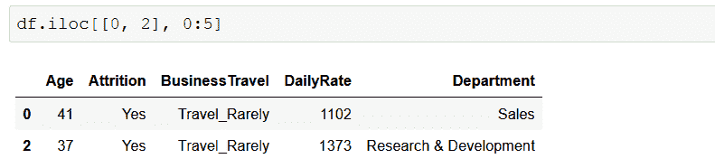

Screenshot by Author

也可以应用更复杂的逻辑——假设您希望只返回列名长度为偶数的列。不过，不要问为什么。

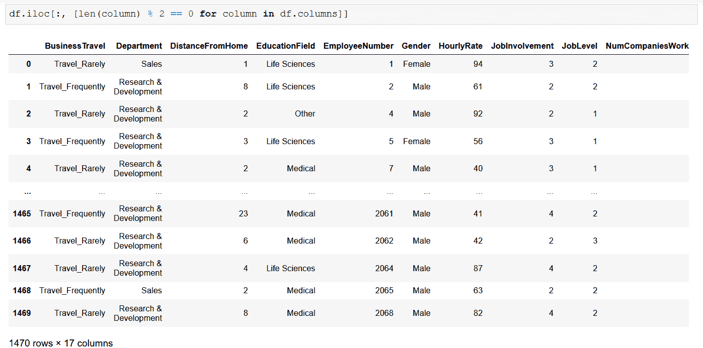

Screenshot by Author

请注意，如果您想返回所有行，只需在第一个参数中写“:”。这适用于第二个(列)输入，但是，如果您根本不提供它，它还是会选择所有的列。

## **对系列应用功能**

假设我们希望通过创建一个新的列来对 EducationalField 维度进行扩展，对其中的值进行分类——让它变得简单，比如说“工程师”或“不是工程师”:任何拥有“技术学位”的人都可以获得“工程师”(我知道我知道，但请给我一些线索，这只是一个示例)。

我们可以使用 apply 方法对列的每个值调用一个函数，并将该函数的返回值赋给一个新列:

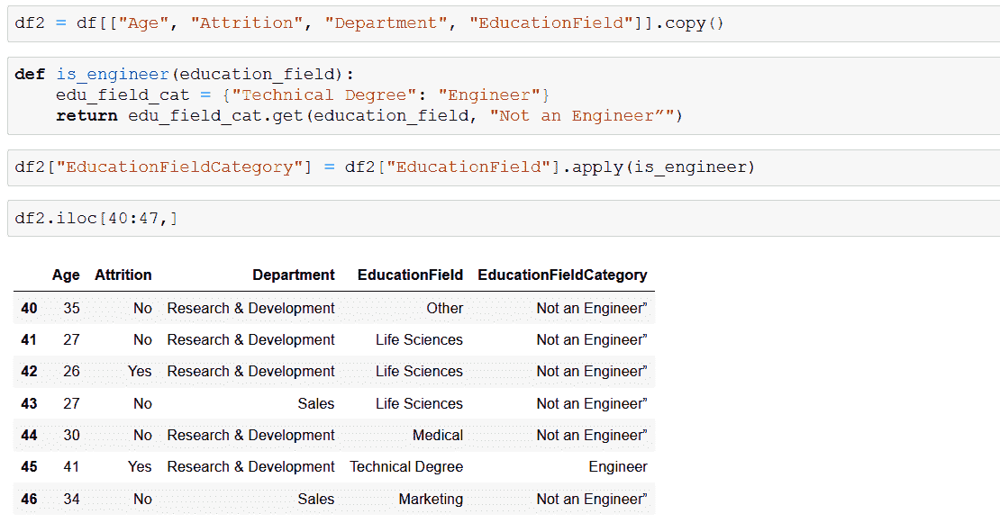

Screenshot by Author

我已经定义了 is_engineer 函数，当“技术学位”是输入时返回“工程师”,在任何其他情况下返回“不是工程师”——如果您愿意，字典允许您在将来扩展分类，如果一个键不在集合中，dictionary.get()允许您提供字典的默认返回值。请注意，您不能将()放在作为 apply 参数提供的函数名之后——在执行该行时，您不是在调用函数，apply 会调用，因此只给出名称就足够了。

剩下的语法应该已经很熟悉了:我已经定义了一个新的 Series，通过赋值左边的一个表达式来定义它，这样就给我们的 DataFrame 添加了一个新列。

## **λ函数**

Python 中的 Lambda 表达式是匿名函数，通常是表达逻辑的小段代码，需要一定的复杂性，但不需要太多来定义实际的函数以供进一步使用。RealPython 有一篇关于这个主题的[很酷的文章](https://realpython.com/python-lambda/),如果你想了解更多关于 lambdas 的信息，除了我的蹩脚的一行程序来完成手头的任务，我建议你花 20 分钟来读它，这是值得的。

让我们以前面的例子为例，使用一个 lambda 函数来解决这个问题:

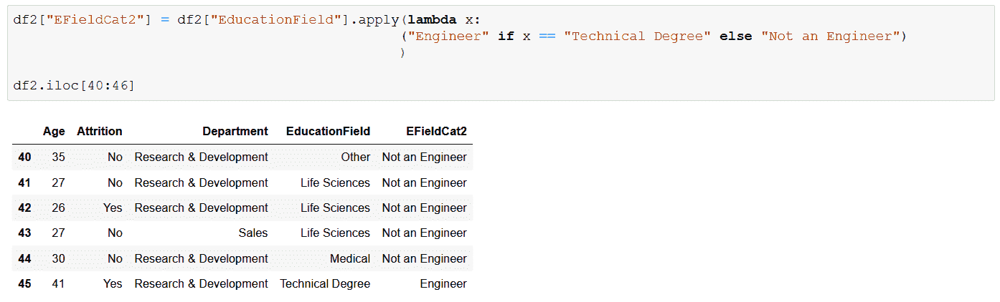

Screenshot by Author

现在，我们可以无休止地争论哪种方法更好，在这种简单的情况下，这取决于你的品味和风格。然而，更复杂的逻辑需要正确定义函数名:lambdas 有局限性，如果你做复杂的事情，可读性很快就会成为一个问题。

上述方法可以为您提供广泛的选择，以进一步处理不仅仅需要基本操作的数据集——用例实际上是无穷无尽的，您只需要了解这些方法，以便在需要时可以自然使用它们。强烈推荐 [loc](https://pandas.pydata.org/docs/reference/api/pandas.DataFrame.loc.html) 和 [iloc](https://pandas.pydata.org/docs/reference/api/pandas.DataFrame.iloc.html) 的文档，不要错过熟悉它们的机会。

这个题目到此为止。感谢您的阅读。