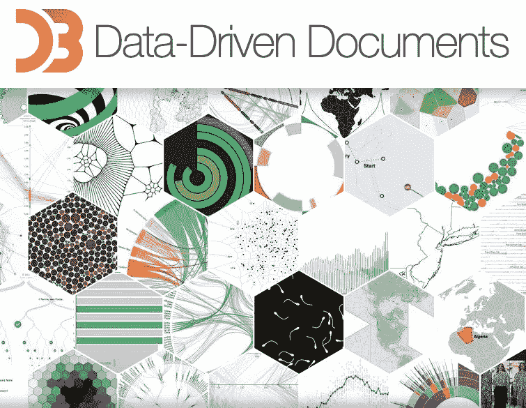
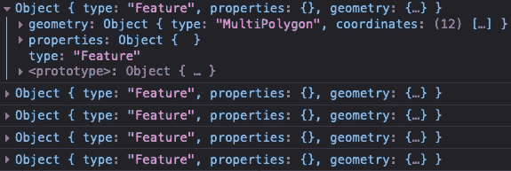
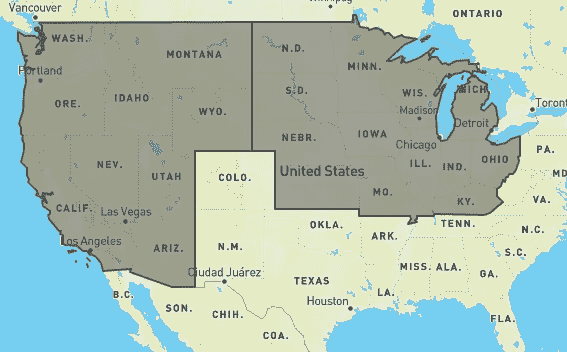

# 使用 GeoJSON/TopoJSON 制图在 D3.js 中实现地图可视化

> 原文：<https://medium.com/geekculture/advanced-map-visualization-and-cartography-with-d3-js-geojson-topojson-2de786ece0c3?source=collection_archive---------18----------------------->

# 序幕

**可视化**是围绕 ***创造的一个术语，“以图表或其他图像的形式表示一个对象、情况或一组信息”*** 。在它真正的荣耀里，一个可视化可以仅仅是化妆，而不是它的视觉美；关于底层数据的更多信息。

可视化为信息架构、会计、分析数据、触摸屏显示甚至智能手表提供了丰富的视觉帮助。

# 地图可视化

想象一下，在 15 世纪，在一张纸上画出墨卡托投影，自由精神的遥远概念是一个遥远的声音，更不用说那个时代的贸易工具了。

[Mercator 1569 world map](https://en.wikipedia.org/wiki/Mercator_1569_world_map) (*Nova et Aucta Orbis Terrae Descriptio ad Usum Navigantium Emendate Accommodata*) showing latitudes 66°S to 80°N. Attribution: Wikipedia.org

地图可视化一直在发展，同样，我们在这里讨论的是 [**D3.js**](https://d3js.org/) (数据驱动文档) [**GeoJSON**](https://geojson.org/) 和 [**TopoJSON**](https://github.com/topojson/topojson) 。坐在最上面的 D3.js 是一个库，通过 SVG、HTML5 和 CSS 可视化 GeoJSON/TopoJSON 中的数据。

# 简而言之，D3.js 但是你已经知道了？

D3.js Library

js 可以为树状图、热图、绘图、图表和地理图创建复杂的、2D 交互式的和动画的可视化，可能性是无限的。在引擎盖下，D3.js 使用 SVG 或 Canvas 对象来绘制可视化，优雅地与您的数据一起播放。

说到地图，D3.js 附带了预定义的美国地图投影，也称为`d3.geo.albersUsa()`，这就引出了一个问题，为什么要投影？原因如下:

> 在制图学中，地图投影是一种将地球表面展平成平面以制作地图的方法。这需要将地球表面位置的纬度和经度系统地转换成平面上的位置。归属地:Wikipedia.org

通俗地说 ***“投影可以把一个地理拓扑勾勒成它的展平(平面)版本”*** 。说够了，让我们举一个来自 D3.js 的实际例子来画一幅美国各县的地图:

Example of US Counties

用 [**流畅的**](https://en.wikipedia.org/wiki/Fluent_interface) 句法糖，可以组合在一个 liner 里。现在 D3.js 可以使用 GeoJSON features 集合绘制美国所有县的 SVG 路径。

D3.js 与 TopoJSON 合作得很好，简化了地图可视化。所有的数据魔术都是通过调用`topojson.feature(us, us.objects.counties).features()`函数实现的，该函数将美国各县作为 GoeJSON `FeatureCollection`返回。只需进行一项更改，您就可以绘制美国各州，唯一需要的更改是`topojson.feature(us, us.objects.states).features()`，因为 TopoJSON 文件将美国各县和州都定义为几何图形集合。

# GeoJSON 和 TopoJSON 是什么？

GeoJSON 是一种开放的标准格式，以 JSON 格式存储和交换地理数据以及非空间属性。随着 GIS(地理信息系统)系统和设备的出现，这种格式得到了发展。由于其高精度，GeoJSON 格式对于网络或带宽不友好。

作为 GeoJSON 之上的扩展，TopoJSON 格式通过使用几种算法来消除冗余和重复数据，从而弥补了这些缺点。简洁地说，将路径简化为弧线，并将拓扑结构之间的边界结合起来，这可能会产生双重效果。

TopoJSON 附带了一组有用的 CLI 工具来简化这一过程。您可以使用 NPM 软件包管理器安装它们。一些著名的 CLI 工具:

它们对于高级 CLI 制图非常有用，这是我们的目标。如果现在感觉像是 cakewalk，那么在操作地图时就不一样了，比如 choropleth 地图、3D 地图、地图交互或者组合/合并拓扑。

# GeoJSON/TopoJSON 解剖

围绕本文的主题，让我们了解 GeoJSON/TopoJSON 如何存储地理拓扑。GeoJSON 使用`FeatureCollection`和`Feature`对象，为了测试它，让我们用特拉华州的`Feature`对象(注意没有弧线):

仔细看看坐标对象，它们是定义特拉华州边界的经度和纬度(在谷歌地图上颠倒过来)。现在让我们看看 TopoJSON 格式的同一个地图对象(点击*查看原始数据*):

注意`bbox`或边界框和`arcs`对象，也没有`geometry`对象。这就是 TopoJSON 如何克服 GeoJSON 令人疲惫的有效载荷大小，通过将 GeoJSON `feature`集合编码到`arcs`中，可选地量化和简化几何图形，导致更简单和更小的格式，并在一定程度上进行精度权衡。

# 使用 CLI 的高级制图

将美国各州合并成区域——从西北、中西部、西南部、东南部和东北部开始。几个想法从 [**可观察的总部**](https://observablehq.com/) 注入，其中两个非常突出。在 Observable HQ 上探索更多，在 D3.js 上有丰富的信息和匹配的示例。

有两种方法，一种是使用`topomerge` CLI，另一种是在浏览器中使用`topojson.merge()`。我先用了浏览器的方法，又快又脏，但证明是有效的！

如果你错过了上面格式中的`id: 10`，那么它代表特拉华州 FIPS(联邦信息处理标准)代码。美国每个州都有一个嵌入在 GeoJSON/TopoJSON 中的唯一的 FIPS 代码，以及相关的邮政编码，这两者都是合并和过滤的核心。从查找开始(FIPS 代码作为关键字，邮政编码作为值):

Example of US States merged using topojson.merge()

它完美的工作，耶！但是刚刚发生了什么？如果一个地区`(datum <- data(regions))`在查找中包含一个匹配的邮政编码，函数`topojson.merge()`设法根据它们的 FIPS 编码合并和过滤州；然后，它返回多多边形或合并状态的几何集合对象:

Feature collection of merged geometries

查看浏览器控制台，它会为您提供合并几何图形的特征集合。现在跳到 [**GeoJSON.io**](https://geojson.io/) 并开始从控制台添加每个特征对象到特征集合数组。添加时，您将看到实时变化:

Live preview GeoJSON.io

从那以后，你几乎可以用各种格式保存它，比如 TopoJSON、CSV、KML 或者 Shapefile。现在，如何使用更适合 shell 脚本的任务`topomerge` CLI 进行类似操作已经相当清楚了:

做本质上相同的事情，脚本应该生成一个有效的 TopoJSON 文件，然后可以直接与 D3.js 或 DataMaps 一起使用，以增加交互。注意:这个脚本没有经过测试。

# 为什么不直接在 CLI 中做呢？

不能保证它会一蹴而就。此外，这更像是一个基于网络的解决方案，将挑战分解为更易于管理的任务。有时候，即使是一点成功的暗示也会让你有足够的动力去提升。

引人注目的是，在从 [GeoJSON.io](https://geojson.io) 生成 TopoJSON 文件后，我不得不运行`toposimplify`来让它工作。很少有荣誉奖:

*   [https://geojson.io](https://geojson.io)
*   [https://github.com/topojson/topojson](https://github.com/topojson/topojson)
*   https://observablehq.com/@anbnyc/united-states-by-regions
*   【https://observablehq.com/@elaval/topojson-us-state-region 
*   [https://gist.github.com/wavded/1250983](https://gist.github.com/wavded/1250983)
*   [https://medium . com/@ MBO stock/command-line-制图学-part-1-897aa8f8ca2c](/@mbostock/command-line-cartography-part-1-897aa8f8ca2c)
*   [https://medium . com/@ MBO stock/命令行-制图-零件-2-c3a82c5c0f3](/@mbostock/command-line-cartography-part-2-c3a82c5c0f3)
*   [https://medium . com/@ MBO stock/command-line-制图学-part-3-1158e4c55a1e](/@mbostock/command-line-cartography-part-3-1158e4c55a1e)