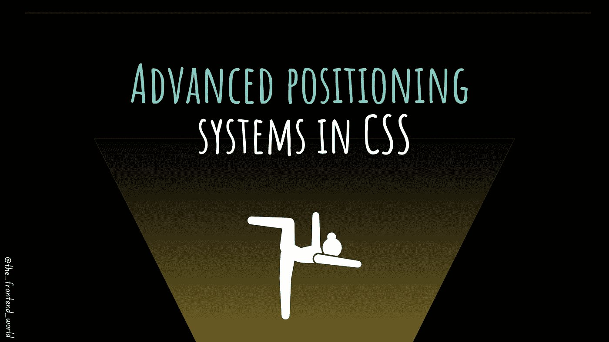

# CSS 中的高级定位系统

> 原文：<https://medium.com/geekculture/advanced-positioning-systems-in-css-90cf5689cb61?source=collection_archive---------12----------------------->

## CSS 中的 Flex 和 grid 是什么？

By FAM

你好👋

我希望你平安无事，上帝会保护乌克兰公民😌。在继续学习这门重要的 CSS 课程之前，我非常感谢亚历克斯·细川玉子·卢波托对我的信任，感谢他成为我新推荐的会员！我会一直尽我最大的努力！