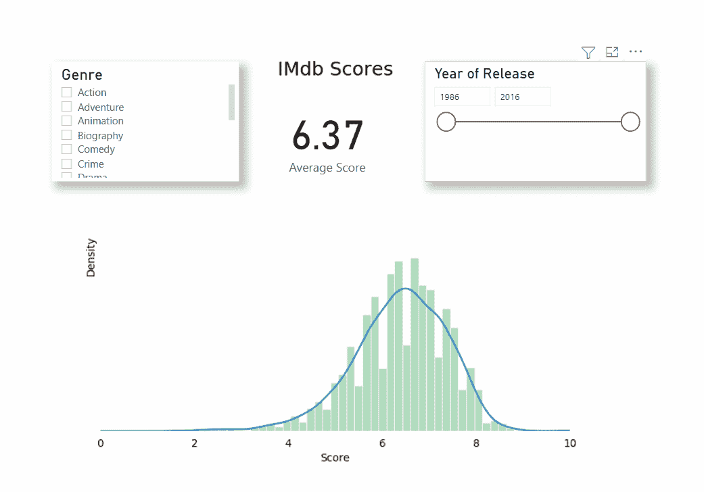

# PowerBI 中的高级 Python 可视化—直方图和频率图

> 原文：<https://medium.com/geekculture/advanced-python-visualizations-in-powerbi-histograms-and-frequency-plots-66f238684011?source=collection_archive---------6----------------------->

> 一分钟之内在 PowerBI 中创建直方图的快速替代方法

Image by author

如果您是一名数据分析师，并开始使用 Power BI，您会发现默认图表中缺少的一项内容是数字特征的直方图/频率图。尽管市场上有一个自定义的可视界面，但它的功能有限。