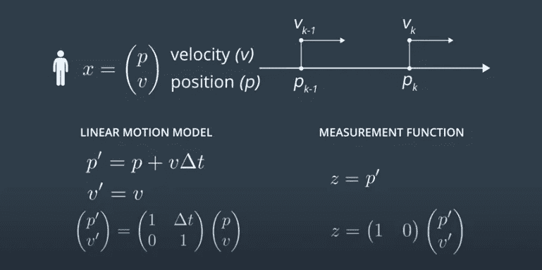
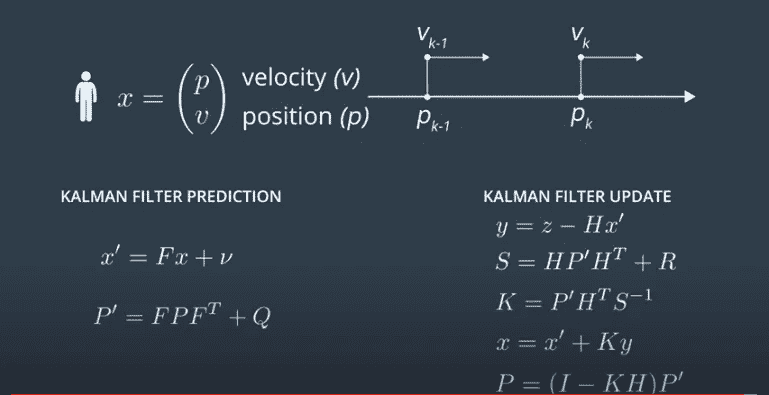
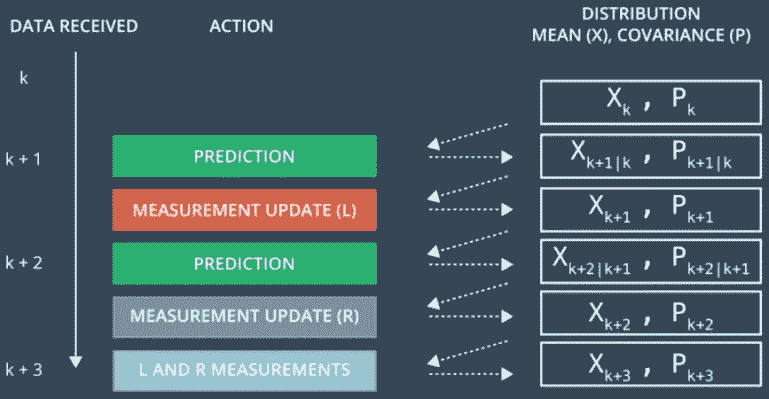
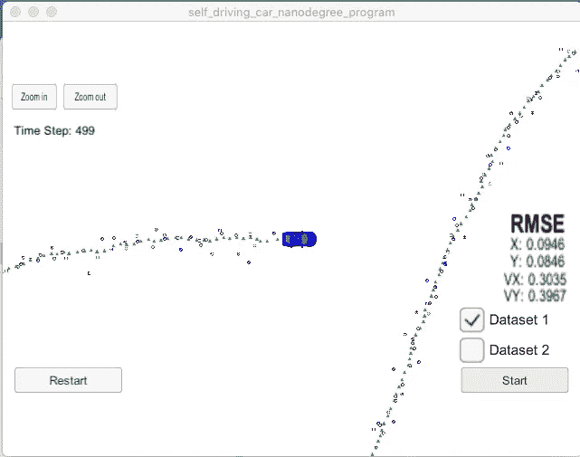

# 避免科利森的先进技术——自动驾驶汽车

> 原文：<https://medium.com/geekculture/advanced-techniques-to-avoid-collison-self-driving-cars-5e25df5f1caf?source=collection_archive---------29----------------------->

## 自动驾驶系列

## 用扩展卡尔曼滤波器跟踪自行车

Photo by [Mathias P.R. Reding](https://unsplash.com/@matreding?utm_source=medium&utm_medium=referral) on [Unsplash](https://unsplash.com?utm_source=medium&utm_medium=referral)

小精灵驾驶的汽车必须追踪其他车辆才能安全导航。这种汽车使用称为雷达和激光的传感器来跟踪其他车辆。

一种用于跟踪的技术叫做卡尔曼滤波器。这将在下面的文章中讨论。

 [## 自动驾驶汽车如何避免碰撞

### 使用卡尔曼滤波器跟踪其他车辆

siddartha-govada-9750.medium.com](https://siddartha-govada-9750.medium.com/how-self-driving-cars-avoid-collisions-92bfdd1be40c) 

与卡尔曼滤波器不同，扩展卡尔曼滤波器(EKF)将能够处理更复杂的运动模型和测量模型。

*通过结合激光雷达和雷达的优势，我们将使用 EKF 跟踪自行车的位置、方向和速度。*

## 位置和速度

在定位的情况下，卡尔曼滤波器的变量反映了物理世界的状态，如其他车辆的位置和速度。

这些状态分为可观察变量(如位置)和隐藏变量(如速度)。由于这些相互作用，随后对可观察变量的观察提供了关于隐藏变量的信息。因此像速度这样的隐藏变量也可以被估计。

为了模拟这种行为，我们需要一个使用多元高斯分布的高维卡尔曼滤波器。

## 线性运动模型

假设我们正在跟踪一辆自行车，它的状态由位置(p)和速度(v)决定，我们需要两个主要函数。

1.  *模拟从时间 k-1 到 k 的状态变化的状态转移函数*
2.  *对测量计算及其与预测状态的关系进行建模的测量函数。*

***直线运动模式***

courtesy: Udacity

*   *x 是平均状态向量。它包含了物体的位置和速度的信息。*
*   *位置和速度由均值为 x 的高斯分布表示。*
*   *P 是状态协方差矩阵。它包含关于物体位置和速度的不确定性(标准偏差)的信息。*
*   *z 是来自激光雷达或雷达的测量值。*

***预测和更新***

courtesy: Udacity

*状态转移函数:矩阵(F)
测量函数:矩阵(H)
不确定性协方差:**P**
测量噪声:R
运动矢量:*v* (nu)
恒等矩阵:I*

## EKF 算法步骤

courtesy: Udacity

*   *k 代表时间步长*
*   *第一次测量:过滤器将从雷达(R)或激光雷达(L)接收物体相对于汽车位置的初始测量值*
*   *初始化:滤波器将根据第一次测量初始化状态(位置、速度)和协方差矩阵(不确定性)。‘xk’是对象在时间 k 的状态(位置和速度)向量*
*   *第二次测量:汽车将在时间 k+1(在时间周期“δt”之后)接收另一次传感器测量*
*   *预测:算法将预测对象在时间 k+1 的状态 X(k+1∣。X(k+1∣k)意味着你已经预测了物体在 k+1 的位置，但是还没有考虑第二次测量。假设速度不变，物体会以“速度*δt”移动*
*   *更新:过滤器首先将“预测”位置与第二次测量进行比较。预测位置和测量位置被组合以给出更新的位置 x(k+1)。卡尔曼滤波器将根据每个值的不确定性对预测位置或测量位置赋予更大的权重。*
*   *第三次测量:在时间周期“δt”之后，汽车将接收另一次传感器测量。然后，算法进行另一次预测和更新步骤。*

***实现***

这是来自 udacity 自动驾驶汽车 nanodegree 项目的一个项目。

提供了一个发送测量值的模拟器。这些测量值被传递到卡尔曼滤波器，该滤波器在初始化变量之后，在每个时间步长之后执行预测和更新功能。这种预测和更新功能形成一个循环。

为了测量卡尔曼滤波器的性能，通过将卡尔曼滤波器的结果与提供的地面实况进行比较来计算**均方根误差**。

**自行车追踪项目结果**

*RMSE 值完全符合要求！(≤[0.11，. 11，0.52，0.52])*

*Lidar measurements are red circles, radar measurements are blue circles with an arrow pointing in the direction of the observed angle, and estimation markers are green triangles.*

参考资料:

www。Udacity.com