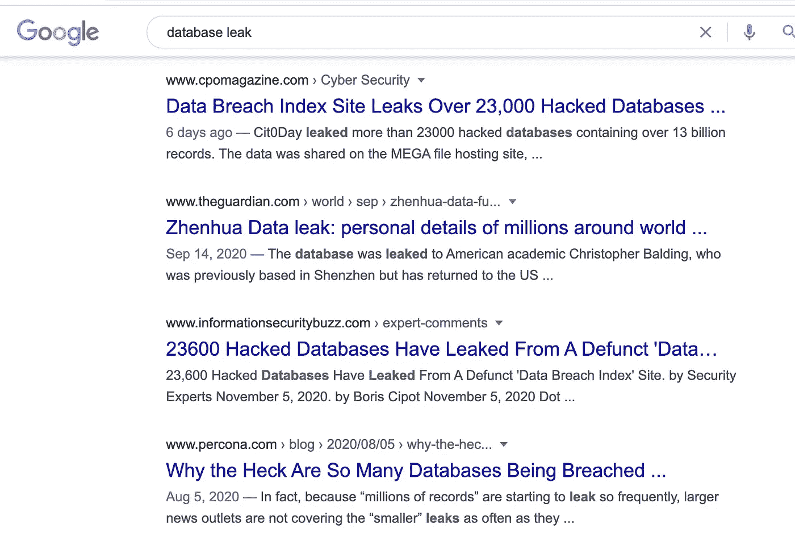
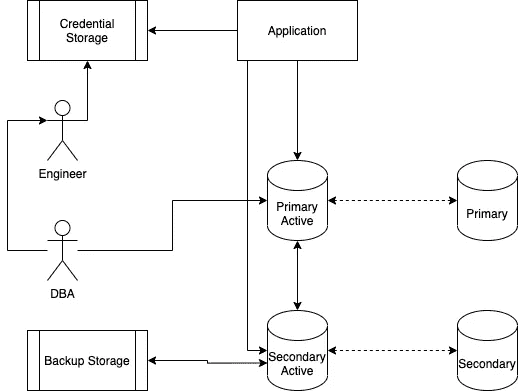
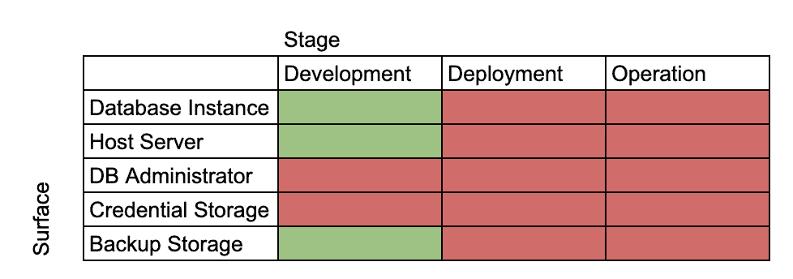
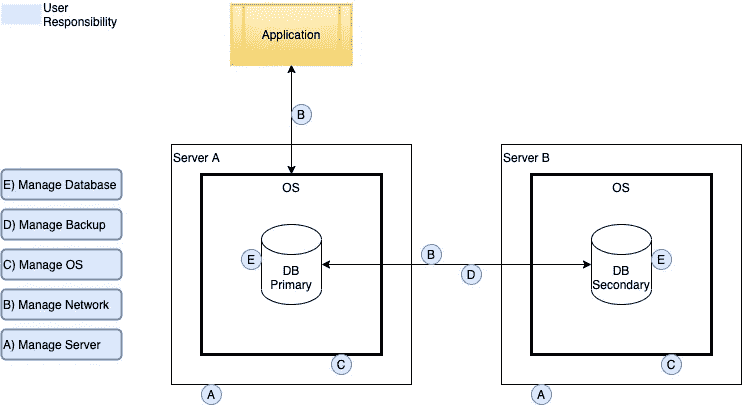
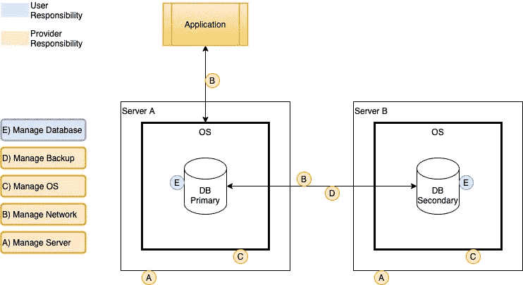
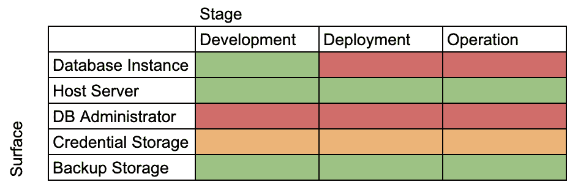

# 从安全角度看使用云托管数据库的优势

> 原文：<https://medium.com/geekculture/advantage-using-cloud-managed-database-from-security-perspective-fdec5aa7cbce?source=collection_archive---------20----------------------->

## 数据库是任何科技公司生态系统中最重要的组成部分之一。从业务连续性的角度来看，如果没有运行的数据库系统，公司就无法开展业务。预计将有一个专门的团队来管理数据库。

目前，与数据库相关的网络安全攻击呈指数级增长。一次数据泄露事件就可能造成一百万美元的损失。更糟糕的是，攻击类型的数据破坏或勒索可以立即停止业务活动。网络安全不是数据库或网络安全团队的责任，而是与数据库相关的所有利益相关方的协作，包括基础设施和开发团队。

Hacked Database News

# 目标

分析管理数据库系统的威胁，并了解如何利用公共云托管数据库来控制威胁。

在大多数现代数字原生业务中，与数据库相关的活动如下:

*   为应用程序存储数据
*   复制数据库以实现高性能数据访问
*   高可用性设置的冗余
*   业务连续性计划的备份数据
*   管理应用程序使用的数据库凭据
*   管理数据库服务器实例

Activity Around Database

# 威胁向量

## 服务器实例受损

有许多服务器支持高可用性和高性能设置。服务器作为一个技术组件，从本质上继承了来自操作系统和硬件漏洞的威胁。当攻击者可以利用这个弱点访问服务器时，他们可以做很多事情。或者简单地说，他们可以以服务器管理员为目标来获取对服务器的访问权限。

## 凭据泄露

使用用户名和密码验证本地用户对数据库的访问。它的单因素身份认证在身份认证过程中造成了一个弱点。对于本机 DB 引擎来说，更新或重新创建凭证并不容易。因此，当攻击者可以通过成功的攻击侦测获得凭据时，他们可以利用该凭据进行更严重的攻击。

## 备份中心受损

备份中心与主数据库系统同等重要。按照设计，它们应该有相同的数据。有两点可以利用弱点。一个是备份存储，另一个是数据传输访问。大多数与数据泄露相关的事件实际上都是针对数据库备份中心的。

# 威胁分析

基于上面的威胁，我们可以更新之前的图表。

作为定性分析，下面的热图可以代表每个团队必须管理的威胁。

Threat Heatmap on self-managed database

# 托管数据库

托管数据库是一种提供数据库系统的解决方案，其中用户不必操作基础设施。在传统的(自我管理)数据库中，用户必须管理基础设施、提供服务器、维护操作系统并强化实例。为了支持使用自我管理的数据库设置的业务用例，我们需要处理各种事情，例如从简单的操作系统修补到复杂的数据库备份。

Self-managed database system responsibility

自我管理的数据库设置已经存在了几十年，并被视为标准设置。但是管理数据库的引入正在改变什么是正确设计的观点。通过允许用户专注于数据库，管理数据库将减轻数据库团队的负担。

Managed database system responsibility

# 托管数据库提供程序

## 亚马逊网络服务— RDS

RDS 是由 Amazon Web Service (AWS)管理的数据库。他们通过在每个区域使用多可用性区域来提供高可用性。我们还可以设置复制来支持高性能读取访问。我们还可以使用 AWS IAM 访问数据库，以便更好地管理和分发凭证。最重要的是它们的价格，如果由内部团队来完成，与设置和操作所有功能所需的工时相比，价格相对低廉。AWS RDS 的自动备份和自动更新功能将减少数据库团队的操作工作量。

查看[此处](https://aws.amazon.com/rds/)了解更多信息。

## 谷歌云平台—云 SQL

谷歌云平台(GCP)正在提供名为 Cloud SQL 的托管数据库。它支持高可用性、自动备份和使用 GCP IAM 的访问。它还使用现收现付的概念，这有助于更轻松地管理成本。

查看[此处](https://cloud.google.com/sql)了解更多信息。

# 裁决

基于两个公共云提供的功能，这里是从安全角度来看的亮点。

*   托管数据库的安全服务器
*   灵活访问数据库
*   集成备份功能

从这张热图中，我们可以看到托管数据库的优势。

Threat Heatmap using Managed Database

通过利用公共云中的托管数据库，我们可以将威胁转移给服务提供商。这种方法使我们能够专注于提供一个可扩展且安全的数据库。