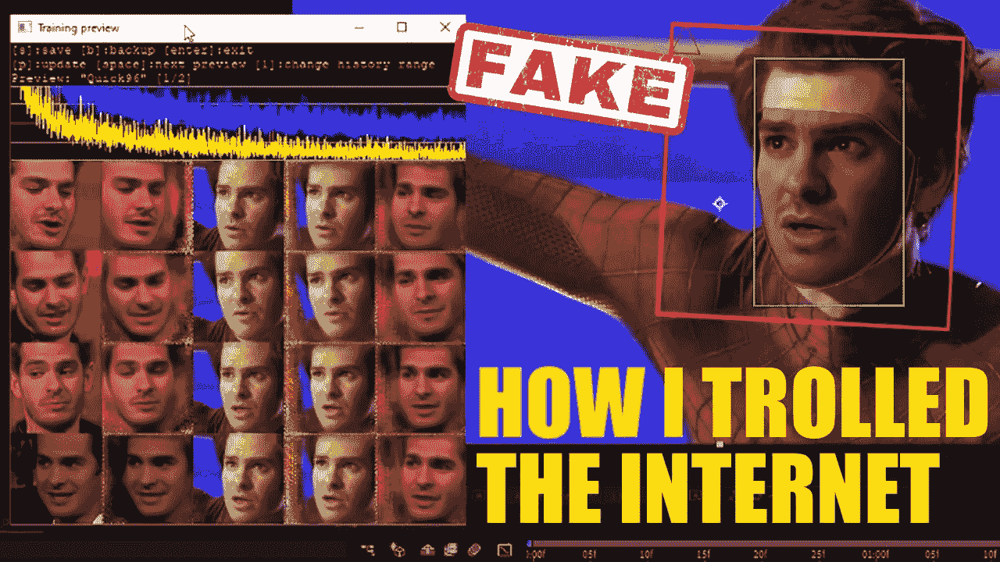
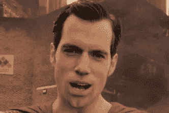
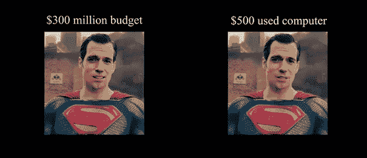
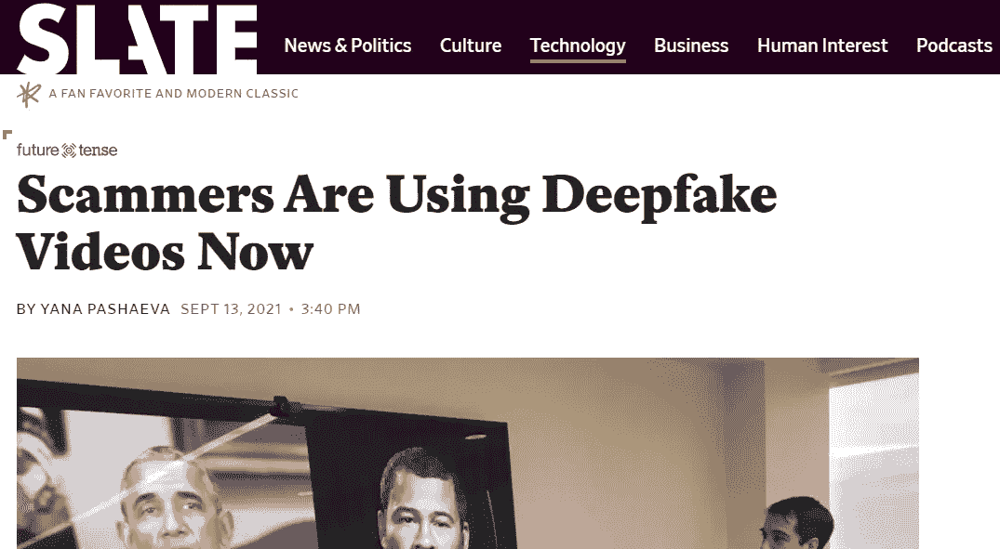
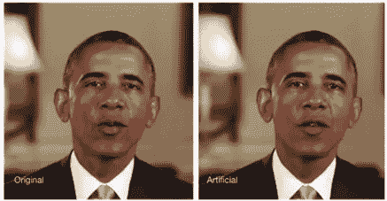

# Deepfake 技术的优缺点

> 原文：<https://medium.com/geekculture/advantages-and-disadvantages-of-deepfake-technology-ccfa7c12b1ae?source=collection_archive---------0----------------------->

我们生活在一个可以创造不真实的视觉和声音的世界里。这种合成现实是把我们引向一个更好的世界，还是一个更坏的世界？

我们称这种合成视频处理为 Deepfake。那么，这个假的东西到底是什么？

商业内幕称:

> “deepfake”这个词来自底层技术“深度学习”，这是人工智能的一种形式。深度学习算法可以在给定大量数据的情况下自学如何解决问题，用于交换视频和数字内容中的人脸，以制作逼真的假媒体。”
> 
> [*https://www.businessinsider.com/what-is-deepfake*](https://www.businessinsider.com/what-is-deepfake)

*是的*，*我们在技术上已经走了这么远，而且每天都在变得越来越好。*

*当然，deepfake 技术有利有弊。在这篇文章中，我们将讨论这些。*

# ***deep fakes 的优点***

*   ***带回亲人！***

*Deepfakes 在电影行业有很多潜在的用途。*

*你可以让已故的男演员或女演员复活。这可以从伦理的角度来讨论，但如果我们不考虑伦理，这是可能的，而且非常容易！而且，可能比其他选择更便宜。*

*你还记得在《速度与激情 7》中他们把保罗·沃克带回来的时候吗？他们已经使用了 CGI 和 VFX，花了无数个小时把他带回来，但 Deepfake 方法更容易，也更便宜！*

**

*Paul Walker VFX — H 2015*

*唯一的问题是，这部电影是在 2015 年上映的，但 Deepfake 的趋势是在 2017 年开始的。*

*   ***电影中更真实的场景***

*我不知道你是否看过乔斯·韦登的正义联盟(2017)。*

*演员亨利·卡维尔在电影《正义联盟》中用令人难以置信的表演天赋赋予超人：钢铁之躯以生命，但有一个问题。*

*他还同时参加了《碟中谍:辐射尘》的拍摄。他在《军情六处》中的角色留着小胡子。但是超人没有胡子，你知道的！工作室不让他刮胡子。*

*枪击发生在同一时间。所以，他们决定用电脑合成技术去除他的胡子。这样，他可以毫无问题地扮演两个角色。这是一个双赢的局面，对不对？不。那是一场灾难。电脑动画很糟糕，看起来很奇怪。它震动了互联网，成为一个有趣的人物。*

**

*然后 YouTube 上有个家伙用 Deepfakes 成功摆脱了小胡子。在这里你可以看到结果。*

**

*[https://www.youtube.com/watch?v=2PZ3W1W20bk&t=27s&ab_channel=DeepFakesClub](https://www.youtube.com/watch?v=2PZ3W1W20bk&t=27s&ab_channel=DeepFakesClub)*

*看到了吗？超级简单，还不用花几百万。*

*   ***从主人那里获得教育的机会***

*想象一下，在一个世界里，你可以随时随地从阿尔伯特·爱因斯坦那里学到物理课！Deepfake 让不可能的事情成为可能。从主人那里学习话题是一种激励工具。你可以提高效率，但还有很长的路要走。*

# ***deep fakes 的缺点***

*   ***诈骗***

*不幸的是，有很多方法可以利用这项强大的技术进行诈骗。最近我们看到了一些例子。*

**

*[https://slate.com/technology/2021/09/deepfake-video-scams.html](https://slate.com/technology/2021/09/deepfake-video-scams.html)*

*凡事都有代价。有时这个价格可能足够高，比如 24.3 万美元。*

*这项技术为这类骗局铺平了道路。*

*在这个全新的数字时代，我们必须质疑一切。你能相信你看到的吗？你能相信你听到的吗？这年头很难找到答案。这种情况促使我们开发新的算法来检测造假。*

*2 年前在 Kaggle 有一个 Deepfake 检测算法比赛，奖金是 100 万美元。也许更光明的未来是可能的。*

**

*[https://www.forbes.com/sites/jessedamiani/2019/09/03/a-voice-deepfake-was-used-to-scam-a-ceo-out-of-243000/?sh=6e186e312241](https://www.forbes.com/sites/jessedamiani/2019/09/03/a-voice-deepfake-was-used-to-scam-a-ceo-out-of-243000/?sh=6e186e312241)*

*   ***通过政客散布误导性消息***

*现在很难识别假货。*

*我们如此开放地相信我们在媒体上看到或听到的。如果你看到一个公众人物谈论一个话题，你通常不会想这个人是“真实的”还是“虚假的？”。但是，当 Deepfake 存在的时候，你必须。心怀不轨的人很容易操纵新闻。这会导致战争、混乱，甚至饥饿。*

**

*[https://chameleonassociates.com/why-you-should-know-about-deepfake/](https://chameleonassociates.com/why-you-should-know-about-deepfake/)*

*Deepfake 的使用范围完全取决于个人。你会用它来做好事吗？*

*   ***隐私问题***

*我们都有社交媒体账户。我们都有脸书、Instagram 和 Twitter。我们所有人每天都会产生大量的数据。我们都从各个角度分享自己的照片，带着不同的心情。这可能会导致一些隐私问题。一个居心不良的 Deepfaker 可以很容易地访问你的照片，未经许可就拿走并使用它们。*

*没有你的允许，你不会想在假视频里看到你自己。但这是可能的。我们需要执法部门。隐私是 21 世纪最大的问题。*

*   ***制造假新闻***

*你听过蜘蛛侠：英雄无归吗？*

*演员安德鲁·加菲尔德在片场的镜头已经泄露，尽管他没有被确认会出现在电影中。影迷们期待他出现在电影中，但是索尼和漫威方面都没有官方声明。*

**

*[https://www.youtube.com/watch?v=5PbqGAmUnVU&t=1s](https://www.youtube.com/watch?v=5PbqGAmUnVU&t=1s)*

*这段视频泄露后，互联网炸开了锅。每个人都在讨论这个视频是真是假。有些人认为这是一个深度造假，但没有任何线索。它非常准确。*

*一个名为“走廊船员”的 YouTube 频道分析了该视频，并决定它不是一个 Deepfake。(原始镜头的创作者说这是一个深度伪造，但他可能已经被迪士尼和索尼警告过了。)*

*仍然有很多困惑，我们必须等到电影上映。*

# ***结论***

*人们已经习惯了听说 Deepfakes。大部分互联网人都知道 Deepfake 是什么。我们不必像过去那样等待多年才能接触和使用新技术。*

*我们处在人工智能时代。他们可以看到，他们可以分析，他们可以伪造。Deepfakes 有好有坏的一面，但是技术的使用领域取决于我们。我们必须把它用于更大的利益。此外，还必须做一些法律安排。*

*事实上，所有这些都需要一段时间才能达到某一点。我们将看到这项技术将我们带到一个什么样的世界。*