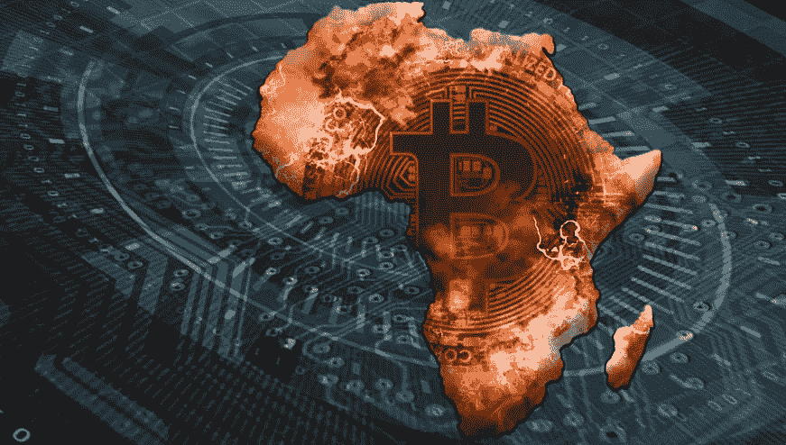
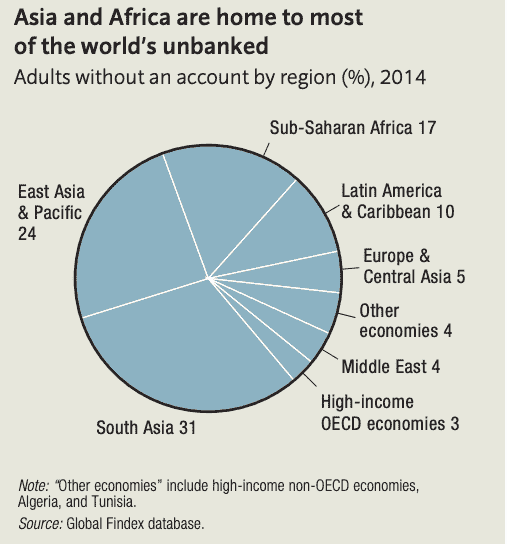

# 比特币作为第三世界国家货币的优势

> 原文：<https://medium.com/geekculture/advantages-of-bitcoin-as-a-currency-in-third-world-countries-e230aab82673?source=collection_archive---------24----------------------->

Image by Lucas Continentino for FurtherAfrica.

加密货币生态系统经历的增长使其成为过去十年中增长最快的行业之一。比特币对一些个人和组织的财务增长产生了广泛的影响，尤其是在第三世界国家。例如，尼日利亚，一个第三世界国家，在 Paxful (世界上最大的 P2P 市场)上的比特币交易数量在[排名第二，仅次于美国。因此，在本文中，我们关注比特币对发展中国家个人和企业的影响。准确理解其影响和优势将有助于决策者理解其在减少发展障碍方面的重要性。](https://qz.com/africa/1947769/nigeria-is-the-second-largest-bitcoin-market-after-the-us/)

## 为没有银行账户的人群提供银行服务

上图显示了世界上没有银行账户的人数统计。世界银行 2014 年在[进行的研究](https://www.worldbank.org/content/dam/Worldbank/Research/GlobalFindex/PDF/N2Unbanked.pdf)表明，全球有 20 亿人没有银行账户，其中大部分在非洲和亚洲。大多数第三世界国家位于非洲大陆和亚洲。因此，这显示了巨大的金融缺口，大约 30%的世界人口无法获得金融服务。然而，比特币为这个问题提供了一个简单的解决方案。

只需一部可以上网的手机/电脑，人们就可以创建比特币钱包来进行交易，不像商业银行那样需要各种文件&在开户前实施严格的措施。Statista 透露，截至 2021 年 3 月，[加密货币钱包用户](https://www.statista.com/statistics/647374/worldwide-blockchain-wallet-users/)的数量已经达到 7000 万。此外，用户可以使用比特币钱包进行国际支付，而无需任何第三方。因此，比特币的优势之一是，它有助于抑制无银行账户人群获得金融服务的问题。

## 低交易费用

比特币的核心特征之一是交易费用低。 [BitInfoCharts](https://bitinfocharts.com/comparison/bitcoin-transactionfees.html) 显示，比特币的平均交易费用为 0.00024 BTC(约 8.13 美元)。因此，比特币提供了一种更便宜的系统，可以将钱从一个人汇给另一个人。国际支付的平均交易成本为汇款总额的 1-3%。因此，如果你从一个国家向另一个国家汇款 1000 美元，交易费将在 10 美元到 30 美元之间。因此，用户被迫为高额交易支付高额费用。

然而，你可以将比特币从一个钱包转移到另一个钱包，而不必支付这些离谱的费用。请注意，在某些情况下，根据您希望矿商确认交易的速度，您可以支付更高的费用。然而，对汇款公司和比特币相关费用的仔细比较表明，比特币是更好的选择。

## 安全支付系统

除了与比特币相关的低费用之外，在其区块链上进行的每一笔交易都是安全的。比特币是一种加密货币，建立在一个使用密码术的被称为区块链的安全系统上。区块链是一个加密网络，记录每一笔比特币交易。区块链一词的产生是因为每笔交易都被分块记录，并用代码连接在一起。不能修改或删除区块链上记录的交易。因此，它有助于抑制欺诈性退款。

商业银行利用私有且可修改的支付网络。然而，比特币交易是公开的。因此，一旦交易被矿工网络(即负责验证比特币交易的人)确认，它就不能被添加到分类账中，从分类账中减去或删除。这是如今比特币在第三世界国家的另一个优势，这样用户就不会成为毫无防备的骗局的牺牲品。

## 对冲通货膨胀

比特币已被宣布为过去十年(2011 年至 2020 年)T2 表现最好的资产，其回报率高于全球其他资产。来自[区块链](https://www.blockchain.com/en/charts/market-price?timespan=all)的数据报告显示了比特币的价格如何从 2010 年 9 月的 0.06 美元上涨到 2020 年 12 月的 28860 美元——这意味着 10 年内上涨了 48099900%。这种天文数字的价格上涨可以归因于该资产相对于菲亚特支持资产的独特特征。

多年来，一些个人和公司投资了比特币，投资回报很高。通货膨胀年复一年地上升。然而，比特币不受通货膨胀的影响。冠状病毒疫情使许多国家陷入经济萧条，通货膨胀和货币贬值。然而，在所有这些情况下，比特币达到了 63，000 美元的历史新高。所以，对于第三世界国家来说，比特币是一个很好的选择，当其他资产价格下跌时，它会保持稳定或呈上升趋势。

## 新资产类别中的储蓄

全球最大的投资银行之一高盛(Goldman Sachs)最近宣称，比特币是一种新的资产类别。高盛全球数字资产主管马修·麦克德莫特(Mathew McDermott)表示，

> “比特币现在被认为是一种可投资的资产。它有自己的特殊风险，部分原因是它仍然相对较新，正在经历一个采纳阶段……客户和其他人在很大程度上将其视为一种新的资产类别，这一点值得注意——我们不常看到一种新资产类别的出现。”

因此，由于顶级金融公司正在将比特币视为一种新的资产类别，因此拯救比特币是一个绝佳的策略。截至 2020 年 12 月，NGN/美元汇率固定在 380 美元，现在是 410 美元(官方汇率)，黑市汇率高达 500 美元。因此，截至 2020 年 12 月，在奈拉省下的钱在全球经济规模上将比现在有更大的价值。然而，如果他们将奈拉兑换成比特币，它在今天会更值钱。因此，在不可预见的经济环境下，用比特币储蓄是一种优势。

## 结论

比特币为第三世界国家面临的许多问题提供了可持续的解决方案。因此，这些国家的个人和政府采用新技术并接受比特币作为法定货币至关重要。

## 您需要加密货币书写服务吗？给我发一封[邮件](mailto:hello@johnoladokuno.com)。大家讨论一下。