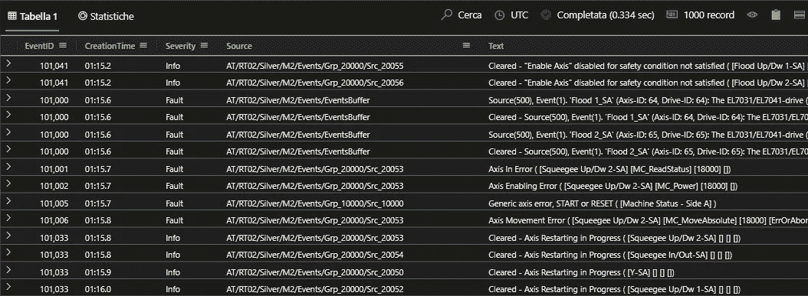
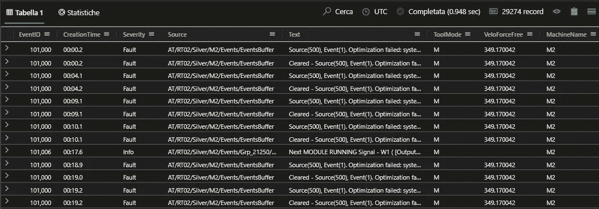
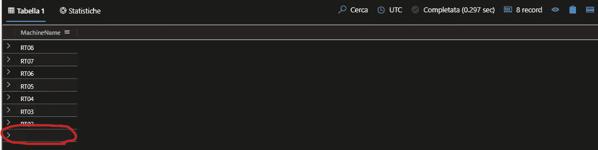
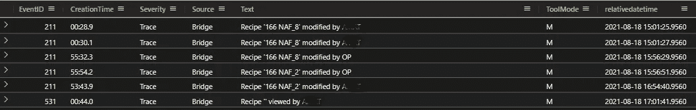
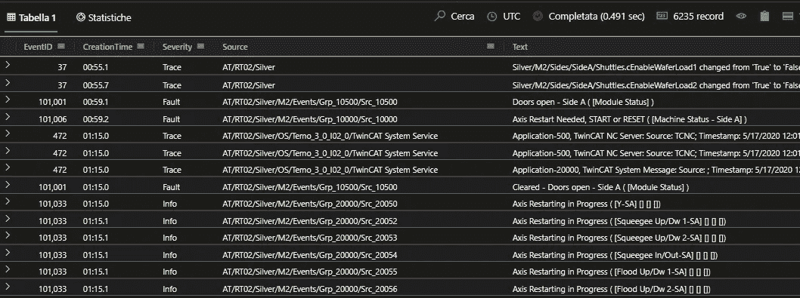
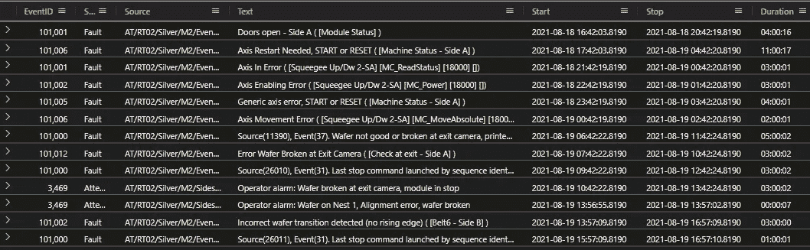
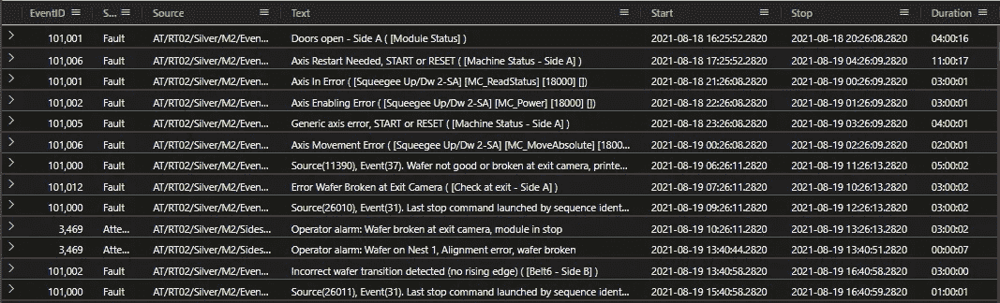

# ADX 数据浏览器和半结构化物联网数据。

> 原文：<https://medium.com/geekculture/adx-data-explorer-and-semi-structured-iot-data-ab3358ff38bd?source=collection_archive---------38----------------------->

## 在每个物联网项目中，都有一个称为“数据分析”的初步阶段，在这个阶段中，必须使用日志记录系统已经收集的原始数据，以展示使用工业物联网解决方案可以从半结构化数据中提取的真正价值。不允许编码时间，只能使用数据探索或数据操作。

## 一个使用真实数据集演示 Kusto 强大功能的数据挖掘的真实分步示例。

## 初始上下文

在工厂数字化项目中，最困难的事情是说服客户，机器数据的数字化实际上可以带来可观的价值，并使人们感知到用经验工具或“传统”工业数据管理无法看到的东西。能够引发兴趣的行为是立即向客户展示生产线以某种方式产生的数据，以及可能只是被归类为“原始数据”(但从未真正使用过)的数据隐藏了什么。

这种类型的方法基于以下几点:
1。机器数据到达并可读
2。数据可以传输到工厂外，通过云服务进行清理、重新整合和过滤
3。数据有话要说(这是基本的，因为客户通常不知道在他们的数据中寻找什么)。

我们正在谈论一个基于数据探索的项目阶段，称为“售前/预分析/数据 POC”(假设您有一个包含一些样本文件的 u 盘，并且您必须突出数据价值)。
在这种情况下，Azure 上使用的服务当然是 ADX Data Explorer，因为它是一个集成了数据库存储、数据操作引擎和使用 dashboarding 元素的数据可视化的工具。
在这些情况下，数据工程师面临着一项艰巨的任务:必须从一个乍一看完全没有意思的文件开始创造奇迹。
但是，如果有的话，开展这类项目的正确方法是什么？
真正的方法并不存在，相反，有许多工具和教程可以教你如何在使用 ADX Data Explorer 时使用 KUSTO 操作数据。

下面不是关于如何使用 KUSTO 的学校教程，而是一个“实践测试”,一步一步地，故意与一个不鼓励的数据集的使用相关联:一个单一的日志文件，其中组成一行的不同机器的日志已经被写入，格式和标准并不总是相同，当然也没有被封装在具有定义的列的表模型中。该数据不包含精确的时间参考，而仅包含循环的每小时时间。没有代码记录，但都可以找到。
本文还包含数据集的链接，您可以下载该链接来亲自测试指定的查询。记住:这个数据集，因此这个体验，是真实的。

```
File_test
| take 1000
```



## 没什么有趣的..但是您会看到有一个源字段，您可以在其中看到源机器。所以首先，用解析操作符来提取其他信息。

```
File_test| where Source contains "/RT02/Silver/M2/"| parse kind = regex flags = Ui Text with * "VeloForceFree: " VeloForceFree ',' *| parse kind = regex flags = Ui Text with * "VeloForceFree: " VeloForceFree ',' *| parse kind = regex flags = Ui Source with * "/RT02/Silver/" MachineName '/' *
```



## 好吧，听起来好多了。所以是时候找出机器了。

```
File_test| parse kind = regex flags = Ui Source with "AT/" MachineName '/' *| distinct MachineName| order by MachineName
```



**第一个惊喜:有些消息来自另一个通信层，而不是基于机器的**。是时候更深入了，所以是时候用“HASPREFIX”清理掉不重要的行，放一个真正的 datetime(看流程:先计算时间增量，然后加上 Now())。

```
File_test| parse kind = regex flags = Ui Source with "AT/" MachineName '/' *| where MachineName == ''| where Text !hasprefix "E10"| where Text !hasprefix "User"| serialize rn = row_number()| extend _temp_timeslots = split(translate('.', ':', CreationTime), ':')| serialize _temp_millis = (_temp_timeslots[0]*60)+(_temp_timeslots[1])| extend prev_millis = prev(_temp_millis)| extend _temp_millis_offset = iff( (prev(_temp_millis) > 0) and (_temp_millis >= 0) and (prev(_temp_millis) < _temp_millis), _temp_millis - prev(_temp_millis), (3600 - prev(_temp_millis))+_temp_millis)| extend _progressive_offsset = row_cumsum(_temp_millis_offset)| extend relativedatetime = datetime_add('second',_progressive_offsset,now())| project-away MachineName, rn, _temp_millis, _temp_timeslots, prev_millis, _temp_millis_offset, _progressive_offsset
```



我发现有两个配方更改和一个验证。*提示:您可以了解每个配方变化的时间段，并在其他数据中查看零件/不合格品或问题/不合格品的搜索进度。*

## 现在怎么办？

我停下来一分钟，试图探索一台机器的数据，以了解消息格式有多么不同。仔细阅读数据，我注意到每条消息代表一个州，所以有一条完全匹配的消息“关闭了以前的”。我明白了，因为一半的信息包含相同的描述，但前缀是“CLEARED —”。
这让我想到用时隙来研究现象(开门维护，自动化故障持续时间，开/关警报)。

我拿了一台机器，在清理了故障(持续时间不到一秒的事件)和通知消息(具有信息级别的日志)之后，我开始理解数据，例如，发现了开门和关门动作(典型的维护事件或修复某些情况下产生的问题)

```
File_test| parse kind = regex flags = Ui Source with "AT/" MachineName '/' *| where MachineName == "RT02"| where Text !hasprefix "Source(500)" and Text !hasprefix "Cleared - Source(500)"| where Text !hasprefix "Enable Axis" and Text !hasprefix "Cleared - Enable Axis"| where Text !hasprefix "Next MODULE" and Text !hasprefix "Cleared - Next MODULE"| where Text !hasprefix "Warning, Wafer" and Text !hasprefix "Cleared - Warning, Wafer"| where Text !hasprefix "Buffer" and Text !hasprefix "Cleared - Buffer"| where Text !hasprefix "Previous" and Text !hasprefix "Cleared - Previous"| where Text !hasprefix "Next" and Text !hasprefix "Cleared - Next"
```



我进一步清理了数据，删除了“通信/确认”消息，该消息指的是生产线内正在加工的产品在上下一台机器之间传递。

我开始看到数据的价值。然而，在进一步探索之前，需要解决一些共同的特征，即:
1。参数化非结构化日志的严重性级别
2。清除上一次-下一次故障/自动化通知/产品通道中的数据

还需要从循环时间格式转换成日期时间格式。显然，这个规范化操作带来了两个假设:
# 1。如果 T2 < T1，那么时间已经被隐含地改变了(例如:T2 =第 11 分钟，而 T1 =第 59 分钟)
#2。事件顺序必须通过选择单个设备来完成

所以我决定通过使用函数来存储基本查询。开始时，将结果放入一个 **let** 变量中，硬编码 MachineId 和 BaseDateTime。

```
let startdate = now();let data = File_test| where Severity != "Info"| where Text !hasprefix "AmatPMon"| where Text !hasprefix "Source(500)" and Text !hasprefix "Cleared - Source(500)"| where Text !hasprefix "Enable Axis" and Text !hasprefix "Cleared - Enable Axis"| where Text !hasprefix "Next MODULE" and Text !hasprefix "Cleared - Next MODULE"| where Text !hasprefix "Warning, Wafer" and Text !hasprefix "Cleared - Warning, Wafer"| where Text !hasprefix "Buffer" and Text !hasprefix "Cleared - Buffer"| where Text !hasprefix "Previous" and Text !hasprefix "Cleared - Previous"| where Text !hasprefix "Next" and Text !hasprefix "Cleared - Next"| parse kind = regex flags = Ui Source with "AT/" MachineName '/' *| parse Text with "Cleared - " Cleared:string| where MachineName == "RT02"| serialize rn = row_number()| extend _temp_timeslots = split(translate('.', ':', CreationTime), ':')| serialize _temp_millis = (_temp_timeslots[0]*60)+(_temp_timeslots[1])| extend prev_millis = prev(_temp_millis)| extend _temp_millis_offset = iff( (prev(_temp_millis) > 0) and (_temp_millis >= 0) and (prev(_temp_millis) < _temp_millis), _temp_millis - prev(_temp_millis), (3600 - prev(_temp_millis))+_temp_millis)| extend _progressive_osset = row_cumsum(_temp_millis_offset)| extend relativedatetime = datetime_add('second',_progressive_osset,startdate)| project-away _temp_timeslots, _temp_millis, prev_millis, _temp_millis_offset, _progressive_osset;let pairedevents = data| project EventID, Severity, Source, Text, Cleared, Start=relativedatetime, relativedatetime| join kind=innerunique(data| project EventID, Severity, Source, Text, Cleared, Stop=relativedatetime, relativedatetime) on $left.Text == $right.Cleared| where datetime_diff('second', Stop, Start) > 0| project EventID, Severity, Source, Text, Start, Stop| order by Start asc, Stop asc ;let pairedevents2 = pairedevents| summarize make_list(Stop) by EventID, Severity, Source, Start, Text| project EventID, Severity, Source, Text, Start, Stop = todatetime(list_Stop[0])| extend Duration= Stop - Start;pairedevents2
```



关于这个困难的查询的一些注释:

1.  您必须学会对同一个表进行内部连接
2.  没有一个 correlationID 来耦合开始和停止事件，我做了一个“快速而肮脏”的把戏:一个停止事件的列表，并选择第一个结果作为“最近”的结果。

## 如今，现在..一个功能？

现在函数时间到了，为了重用基本查询，参数化 DateTime 和 MachineID:

```
.create-or-alter function with (docstring = "BaseQuery",folder = "Query") getDataByMachineId(mid:string, startdate:datetime) {let data = File_test| where Severity != "Info"| where Text !hasprefix "AmatPMon"| where Text !hasprefix "Source(500)" and Text !hasprefix "Cleared - Source(500)"| where Text !hasprefix "Enable Axis" and Text !hasprefix "Cleared - Enable Axis"| where Text !hasprefix "Next MODULE" and Text !hasprefix "Cleared - Next MODULE"| where Text !hasprefix "Warning, Wafer" and Text !hasprefix "Cleared - Warning, Wafer"| where Text !hasprefix "Buffer" and Text !hasprefix "Cleared - Buffer"| where Text !hasprefix "Previous" and Text !hasprefix "Cleared - Previous"| where Text !hasprefix "Next" and Text !hasprefix "Cleared - Next"| parse kind = regex flags = Ui Source with "AT/" MachineName '/' *| parse Text with "Cleared - " Cleared:string| where MachineName == mid| serialize rn = row_number()| extend _temp_timeslots = split(translate('.', ':', CreationTime), ':')| serialize _temp_millis = (_temp_timeslots[0]*60)+(_temp_timeslots[1])| extend prev_millis = prev(_temp_millis)| extend _temp_millis_offset = iff( (prev(_temp_millis) > 0) and (_temp_millis >= 0) and (prev(_temp_millis) < _temp_millis), _temp_millis - prev(_temp_millis), (3600 - prev(_temp_millis))+_temp_millis)| extend _progressive_osset = row_cumsum(_temp_millis_offset)| extend relativedatetime = datetime_add('second',_progressive_osset,startdate)| project-away _temp_timeslots, _temp_millis, prev_millis, _temp_millis_offset, _progressive_osset;let pairedevents = data| project EventID, Severity, Source, Text, Cleared, Start=relativedatetime, relativedatetime| join kind=innerunique(data| project EventID, Severity, Source, Text, Cleared, Stop=relativedatetime, relativedatetime) on $left.Text == $right.Cleared| where datetime_diff('second', Stop, Start) > 0| project EventID, Severity, Source, Text, Start, Stop| order by Start asc, Stop asc ;let pairedevents2 = pairedevents| summarize make_list(Stop) by EventID, Severity, Source, Start, Text| project EventID, Severity, Source, Text, Start, Stop = todatetime(list_Stop[0])| extend Duration= Stop - Start;pairedevents2}
```

现在我的生活更简单了: **getDataByMachineId("RT02 "，now())**



## **模式声明**

一旦构建了基本功能，我拒绝了外部应用程序可以做的无参数中间层操作。
使用模式语句，我构建了正确的查询，易于检索。

```
declare pattern app = (applicationId:string)[eventType:string]{("RT02").["Doors"] = {database("deltalake_example").getDataByMachineId("RT02", now())| where Text startswith "Doors"};("RT02").["GenericErrors"] = { database("deltalake_example").getDataByMachineId("RT02", now()) | where Text startswith "Error" };("RT02").["OperatorAlarms"] = {database("deltalake_example").getDataByMachineId("RT02", now())| where Text startswith "Operator alarm"| extend Source2 = strcat(Source, "/A/")| parse kind = regex flags = Ui Source2 with "AT/" MachineCode:string "/Silver/" MachineId:string "/Sides/" Side:string "/OpAlarms/" Alarm:string "/A/" *| extend description = strcat(Alarm, replace("Operator alarm", "", Text) )| extend replaced=replace(@'Operator alarm', @'', Text)| project EventID, Severity, Source, Text, Start, Stop, Duration, MachineCode, MachineId, Side, Alarm, description};("RT02").["ProductTransitionErrors"] = { database("deltalake_example").getDataByMachineId("RT02", now()) | where Text startswith "wafer transition" };("RT02").["AxisErrors"] = { database("deltalake_example").getDataByMachineId("RT02", now()) | where Text hasprefix "Axis" and Text hasprefix "Error" };};
```

**现在，我能够从数据**中检索有用的信息，例如发生率最高的操作员警报(>错误校准导致的 36k 剔除):

```
app("RT02").["OperatorAlarms"]| summarize AlarmAmount = sum(Duration) by Alarm, description| order by AlarmAmount desc| render columnchart
```


## 后续步骤

下一步可能是:
1。根据参考表对事件类型进行分类，分配一个代码，以便在模式声明阶段简单地搜索和查询组合
2。生成一个多折线图仪表板，用户可以在其中选择机器、事件类型、时间片、事件类型/报警代码

## 结果呢

一般结果是，您可以简单地使用日志文件来展示有价值的信息。
使用这种方法很容易事半功倍地增加更多价值:例如，通过同样的方法，可以以互动的数据驱动方式增加与客户逐班讨论的 KPI 数量(记住，他知道流程，所以他可以将“原因”和“结果”联系起来)。

## 概述

在这篇文章中，我解释了如何使用 KUSTO 和 Data Explorer first 功能进行数据分析:**探索数据**。我发现，当您的客户想要对工厂进行数字化，而不知道在数据中搜索什么是有用的时，这种方法是一种快速的胜利。

注意:这里是数据集[链接](http://www.filedropper.com/line3-temp-2020-05-1817-51-13-163)来测试所有的查询。