# 谷歌云平台(GCP)中的 Aerokube Selenoid 部署

> 原文：<https://medium.com/geekculture/aerokube-selenoid-quick-setup-in-google-cloud-platform-gcp-1be8c3b5e252?source=collection_archive---------15----------------------->

大家好！！

在本文中，我们将探讨如何在谷歌云平台(GCP)中部署和配置 Aerokube Selenoid。让我们开始吧。

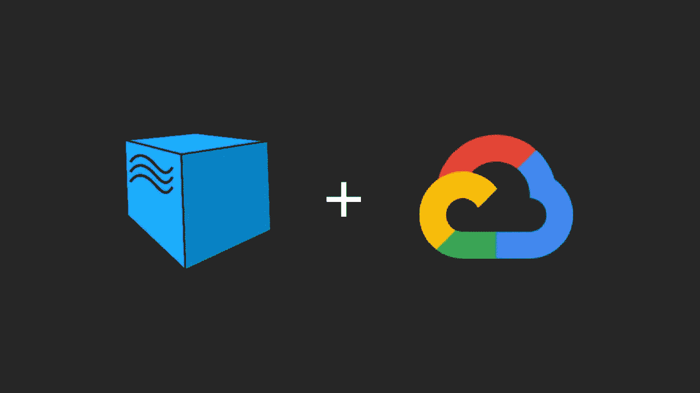

> 先决条件:你需要一个谷歌云帐户，如果你没有，你可以访问注册页面并创建一个新帐户。作为新客户免费层优惠的一部分，您将获得 300 美元的免费积分，可用于探索 Google Cloud 提供的各种服务。

*创建帐户并首次登录后，您将被导航到 GCP 仪表板页面，我们需要转到计算引擎服务下的虚拟机实例页面。*

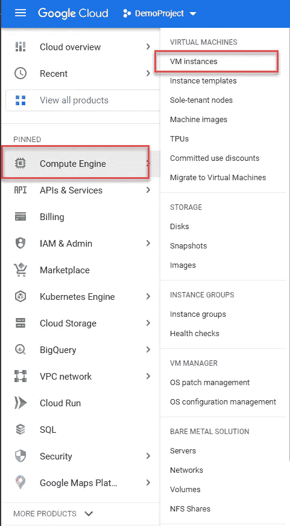

接下来，我们将继续在 GCP 创建一个新实例，为此，请单击“VM instances”页面上的“CREATE INSTANCE”按钮。

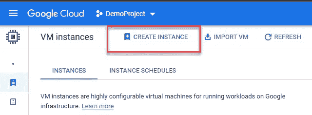

在“创建实例”页面中，选择“市场”选项，这将打开“市场”页面。

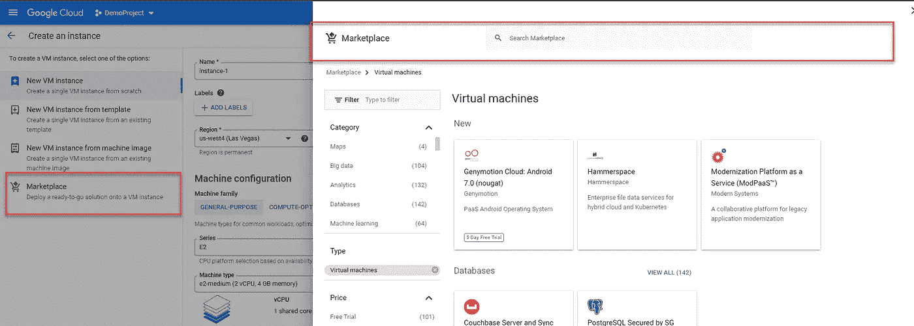

在这里，我们将搜索 Selenoid 并点击搜索结果。

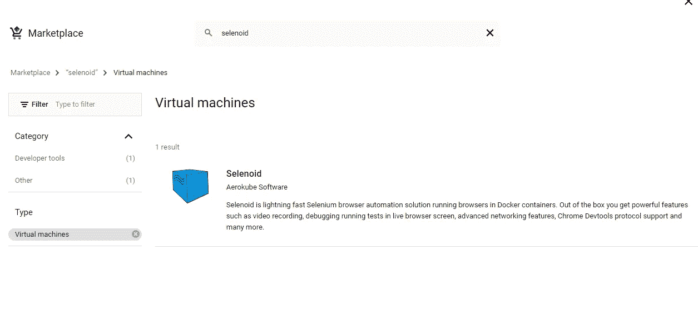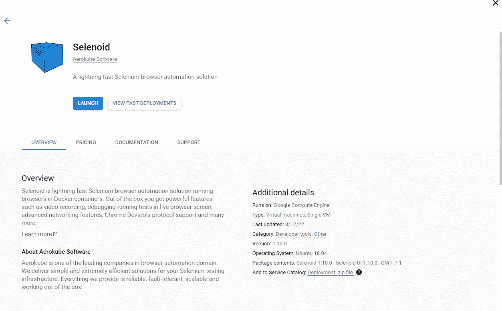

*正如你所看到的，Aerokube Selenoid 提供了与谷歌云平台的现成集成，我们只需点击几下鼠标就可以快速启动和配置我们自己的 Selenoid 网格。单击启动按钮开始。*

> *注意:如果您看到一个确认提示信息屏幕，要求您确认启用一些 API，请点击启用按钮。*

## 设置 Selenoid 部署:

在我的情况下，点击启动按钮后，下面的屏幕默认显示在我面前，我们将继续根据需要更新详细信息。

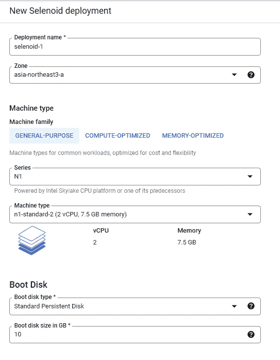

出于演示目的，我将为我们的部署添加以下细节。

> 部署名称:月形网格
> 区域:亚洲-南方-1c
> 
> 机种:通用
> 系列:N1
> 机种:n1-standard-2 (2 个 vCPU，7.5GB 内存)
> 
> 启动盘类型:标准持久盘
> 启动盘大小 GB: 15

*在防火墙部分，确保选中允许 TCP 端口:4444 和 TCP 端口:8080 的复选框，这将用于连接到我们的 Selenoid 网格和访问 Selenoid UI 仪表板。*

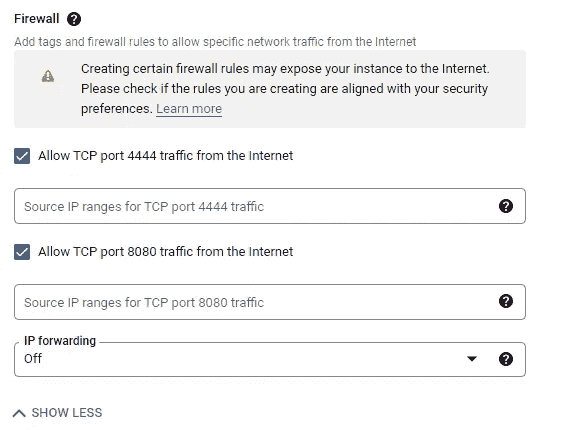

*最后，单击接受服务条款的复选框，然后单击部署按钮以完成部署流程。您需要等待几分钟，部署过程才能完全完成。*

> 你会看到一个如下的屏幕，显示“月球网格”已经展开。

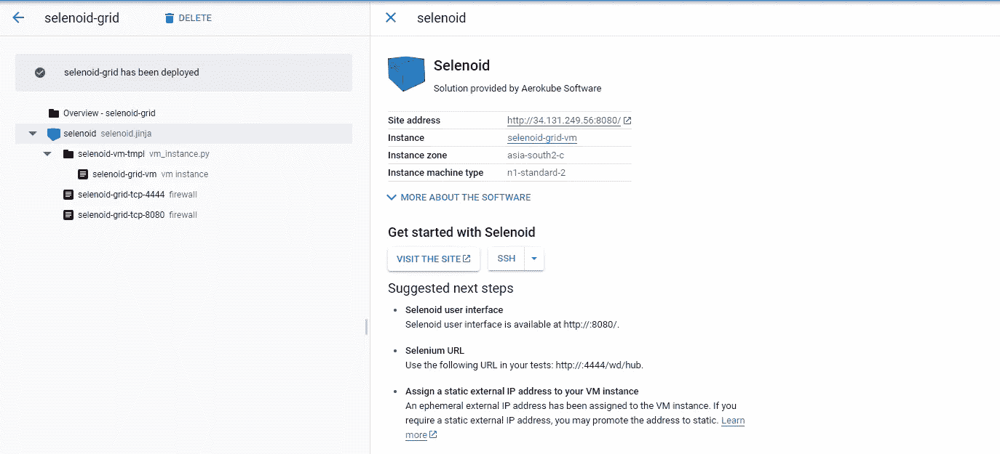

Selenoid grid deployed

发布 Selenoid 的部署，只需点击站点地址，即可访问部署的 Selenoid UI。这将用于查看我们的 Selenoid 网格中正在执行的测试。这在端口 8080 上运行。

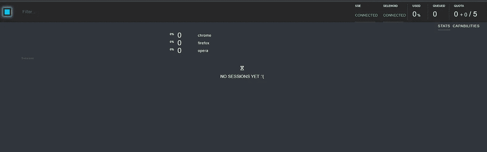

现在，您可以使用 RemoteWebDriver 和 DesiredCapabilities，并将 hubUrl 作为站点地址，在我们的 Selenoid 网格中运行您的测试自动化脚本。

在我的情况下，枢纽网址将:[http://34.131.249.56:4444/wd/hub](http://34.131.249.56:4444/wd/hub)

> 此外，我已经将 capabilities:enable VNC & enable video 设置为 true。

```
capabilities.setCapability("enableVNC", true);
capabilities.setCapability("enableVideo", true);
```

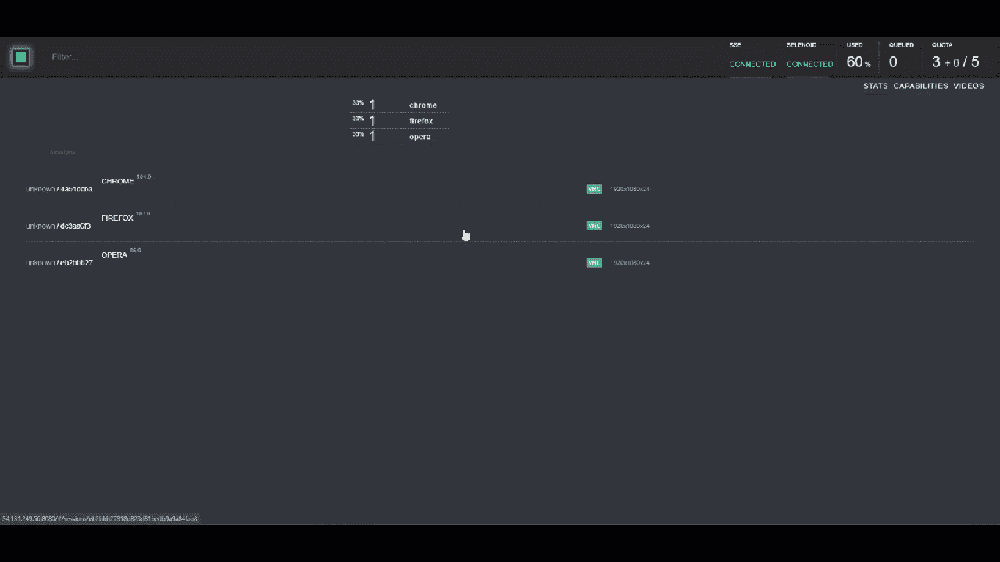

> 在 Selenoid UI: Capabilities 部分你可能会注意到的另一点是，在 Selenoid 中，Chrome、Firefox 和 Opera 的默认下载浏览器图像已经相当过时了。比如截至 2022 年 8 月，Chrome 浏览器最新版本为 104，Opera 为 88 等。

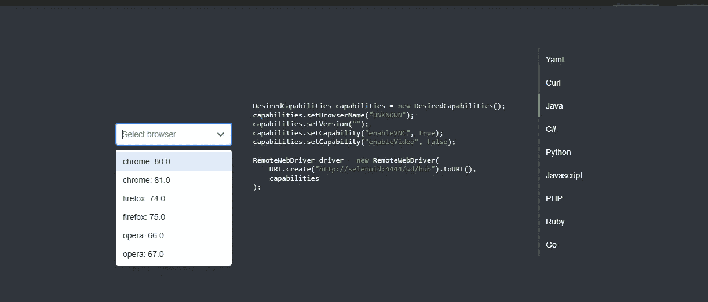

## 我们将继续更新 Selenoid 和浏览器图像

为此，使用 SSH 下的可用选项连接到您的 Selenoid 虚拟机实例:“在浏览器窗口中打开”

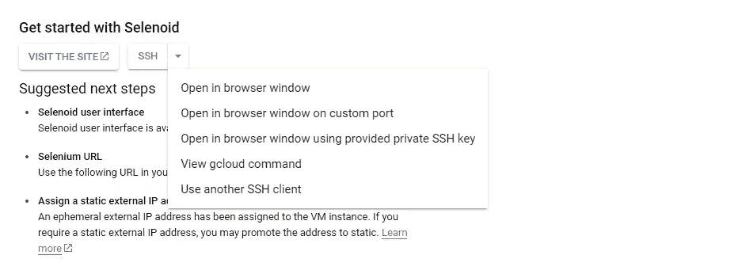

> 使用 wget 命令下载 Selenoid 配置管理器

sudo wget "[https://github . com/aero kube/cm/releases/download/1 . 8 . 1/cm _ Linux _ amd64](https://github.com/aerokube/cm/releases/download/1.8.1/cm_linux_amd64)

> 为下载的 configuration Manager 二进制文件分配执行权限

```
sudo chmod +x cm_linux_amd64
```

> 运行更新命令

```
sudo ./cm_linux_amd64 selenoid update --last-versions 3
```

> 注意:上述命令将更新 Selenoid 版本，并将下载所有最新的浏览器映像。我们已经指定了 last-versions 3，所以它将为 Chrome、Firefox 和 Opera 拉入最新的浏览器图像，以及所有浏览器的 2 个以前的图像。
> 
> 使用以下命令更新 Selenoid-UI:

```
sudo ./cm_linux_amd64 selenoid-ui update
```

最后，我们完成了，我们已经用所有最新的 Selenoid 版本、浏览器图像以及 Selenoid-UI 更新了我们部署的 Selenoid 设置。

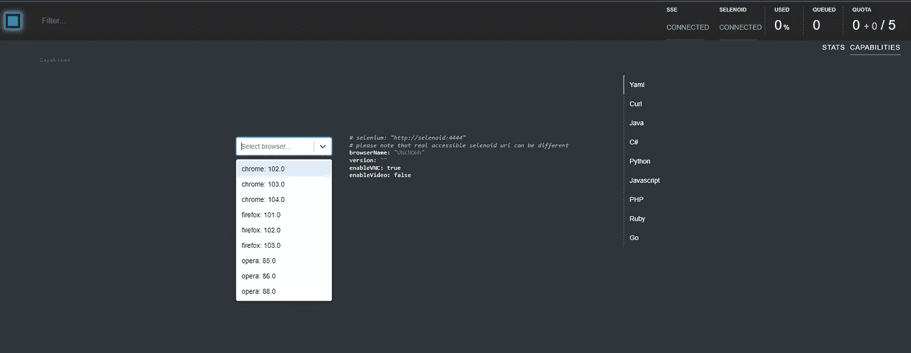

> 提交您的实际操作，确保使用仪表板中的删除选项删除 Selenoid 部署。这将删除 Selenoid 网格和它所创建的资源。

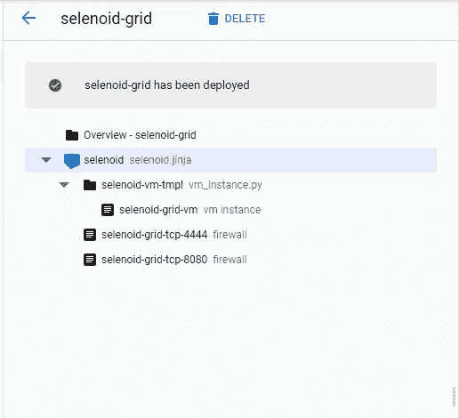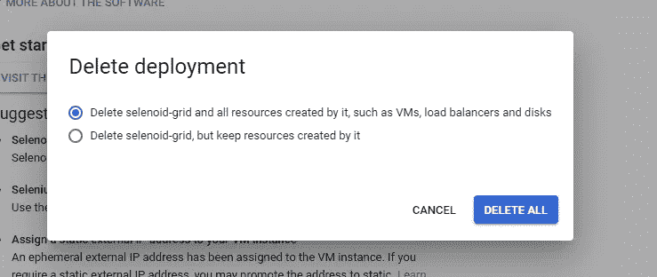

感谢阅读！！希望这篇文章对你有用！！