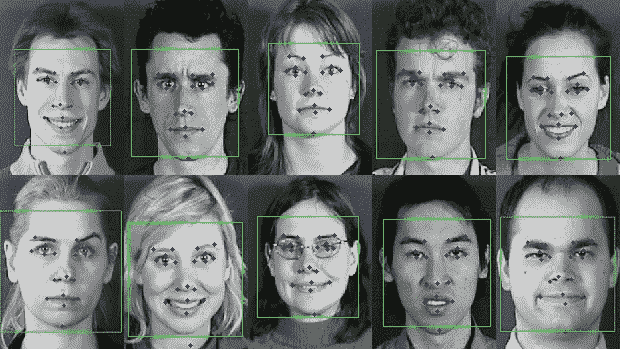

# 情感计算

> 原文：<https://medium.com/geekculture/affective-computing-ed6d9bd05c3c?source=collection_archive---------16----------------------->

## 另一项医疗人工智能创新

Image from https://cyfuture.com/blog/affective-computing-the-power-of-emotional-analytics-in-machines/

> 一种新的人工智能系统，用于基于应用程序和文本的聊天软件，具有情感分析功能。

几周前，我在约翰·伦诺克斯写的《T2 2084》一书中讨论了许多观点。其中我提到了医学人工智能中的一个小技术，叫做*情感计算*。这是一个…