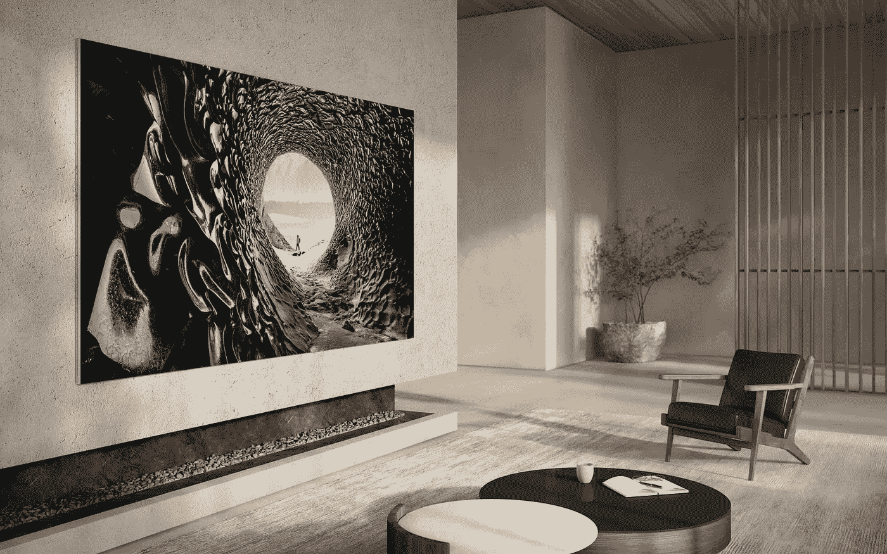

# 经济实惠的微型 LED 电视再次飘向远方

> 原文：<https://medium.com/geekculture/affordable-microled-tvs-drifting-far-far-away-again-ce5d8fbfd35f?source=collection_archive---------17----------------------->

## 三星将在 2022 年只推出大于 89 英寸的机型，价格可能会过高

Samsung is reportedly planning to focus on MicroLED TVs of 90 inches upwards, making 2022 another no-show year for this advanced, but awfully late, display tech. Is there a market slowdown somewhere down the line? (Image: Samsung)

**众所周知，就图像质量而言，电视几乎碰壁了**: OLED 提供完美的黑色，但无法为所有使用情况提供足够的亮度，LED/LCD 可以提供足够的亮度，但…