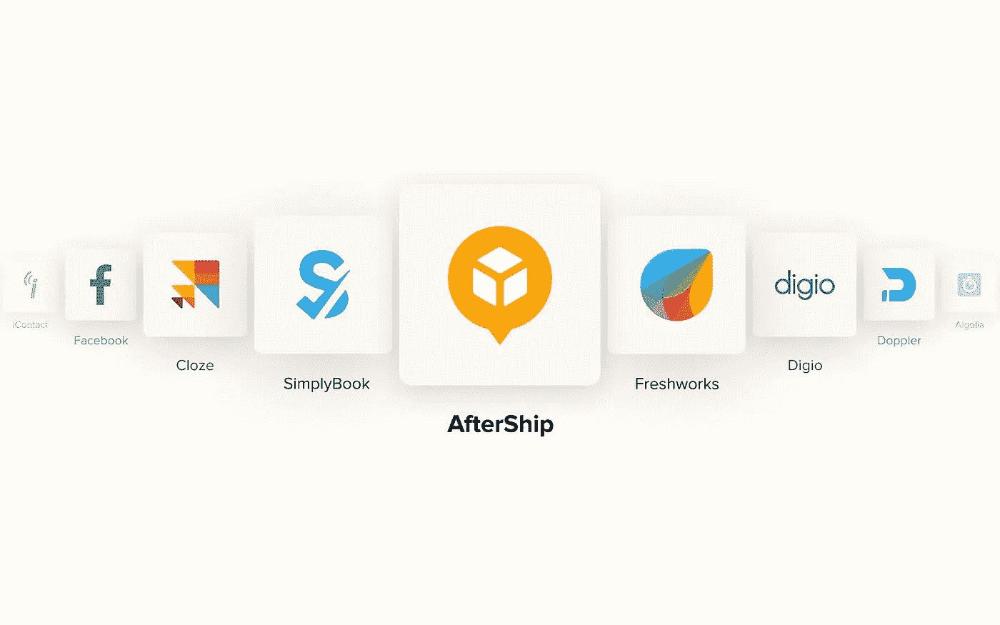

# AfterShip —通过准时发货跟踪自动化增强客户体验

> 原文：<https://medium.com/geekculture/aftership-enhance-customer-experience-with-on-time-shipment-tracking-automation-6d50bc02b194?source=collection_archive---------21----------------------->

问题、投诉和询问充斥着您的客户支持收件箱？

您的货件跟踪和交付是否无法说服您的客户？

现在是时候优化流程以消除所有这些瓶颈，尤其是使用 AfterShip 这样的最佳跟踪平台进行货物跟踪和报告。

是的，虽然你的电子商务商店提供具有吸引力的折扣的最优质的产品，但订单延迟或跟踪不佳会使你的客户陷入困境。

为客户提供准确的运输信息和及时更新，让他们知道您的业务是值得信赖和可靠的，这对留住客户至关重要。订单跟踪有助于最大限度地减少客户的焦虑和自责。像 Aftership 这样一个好的货运跟踪平台可以达到这个目的。

让我们深入了解 AfterShip，以及如何集成和自动化您的电子商务工作流。

# 关于后船

AfterShip 是最有效的货件跟踪平台，帮助电子商务企业无缝管理他们的货件。该平台提供跟踪和通知购物者送货更新..它还有助于通过详细的分析来分析整体负载的性能。

# 后船的特征

# 定制品牌通知

AfterShip 为不同的检查点提供实时交付通知，如过境、外出交付、装运检查点等。它有助于减少客户支持请求。它还提供可定制的模板，向客户发送个性化的电子邮件和短信。

# 跟踪按钮

企业可以为跟踪按钮嵌入一个小代码，用于跟踪商店的订单历史页面。它还使客户能够轻松检查整体订单状态。

# 汽车进口货件

AfterShip 通过自动从购物车、CSV 文件和市场导入跟踪编号，简化了整个跟踪过程。商店连接成功后，发货将每三小时自动同步一次。

# 多种运输解决方案

与多家运营商打交道有点困难。AfterShip 将您与全球 800 多家快递公司联系在一起。它还有助于标准化从不同页面接收的跟踪布局，这有助于更好地了解货件。

# 自定义域跟踪

独特的品牌名称可以更好地识别网站，帮助建立信任和忠诚度。通过使用 AfterShip，您可以设置一个自定义域来显示跟踪信息，这有助于提高网站的可搜索性。

# 与其他电子商务系统的集成

AfterShip 允许集成多个应用程序和插件，如 Shopify、BigCommerce、WooCommerce、Magento 等等。它有助于消除在一个地方提供整合数据的各种跟踪系统。

# 定价

AfterShip 提供 14 天的免费试用，以检查它提供的所有功能。试用到期后，系统会提示您选择一项计划。你可以在这里探索 Aftership [的详细定价方案](https://www.aftership.com/pricing#_ga=2.67383313.1295343846.1638459553-201792909.1638459553)

# 利用 Quickwork 自动化平台集成和自动化 AfterShip

Quickwork 是创建自动化工作流的最佳集成和 API 平台。该平台为您提供最有效的工具和指导，帮助您快速构建任何工作流自动化。您可以集成 1000 多个业务应用程序，无缝创建定制的工作流。Quickwork automation platform 可帮助您将 AfterShip 与您的技术堆栈相集成，并实现您所选择的工作流程的自动化，没有任何缺陷。

深入了解 Quickwork——最佳的 iPaaS 自动化平台！