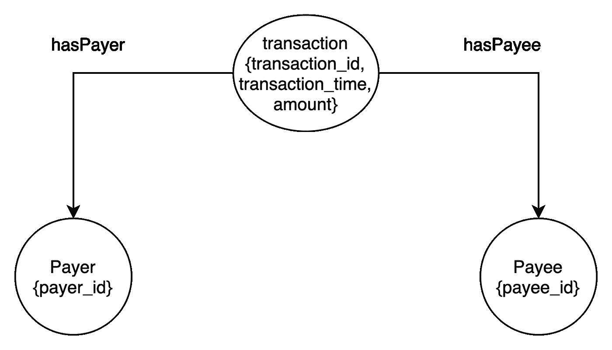
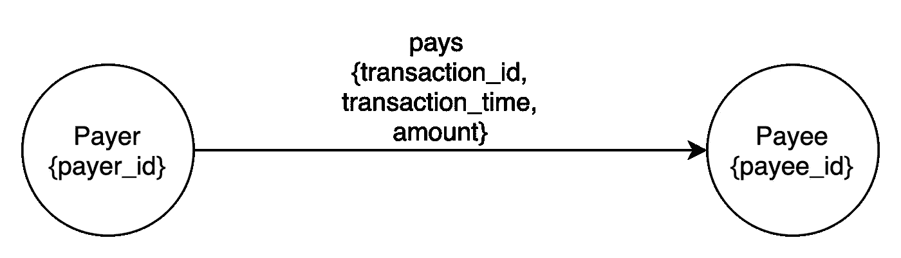

# 议程图一:设置和建模

> 原文：<https://medium.com/geekculture/agensgraph-i-setup-and-modelling-71416f606fac?source=collection_archive---------15----------------------->

> *Agensgraph 是 Bitnine 开发的基于 Postgres 的开源图解决方案。最近被 Apache 采用，正在开发为 Postgres 的* [*扩展*](https://age.apache.org/) *。*

在本帖中，您将了解 Agensgraph 存储和查询引擎如何利用 Postgres。您还将通过一些例子熟悉图建模。

## 储存；储备

在 Postgres 提供的数据库隔离之上，Agensgraph 提供了更细粒度的隔离，您可以使用它在单个 Postgres 数据库中创建多个图形数据库。

为了表示节点和它们之间的关系，Agensgraph 利用 Postgres 表。使用一个 [graphid](https://bitnine.net/documentations/manual/agens_graph_developer_manual_en.html) 标识符在整个图中唯一地标识每个节点和边。节点和边都有 JSONB 属性列，用于存储节点或边相关的属性。边有两个额外的列，使用图形 id 来表示开始节点和结束节点。

教师<>学生关系的简单图形表示可以概括如下

图中创建的每种类型的节点/边都存储在 Postgres 数据库中唯一的表中。

尽管节点和边在内部存储为 Postgres 关系，但 Agensgraph 不允许使用 SQL DML 查询对它们进行任何更改。只有密码查询可以用于任何数据操作。

## 询问

根据文档查询，支持图形[密码](https://bitnine.net/documentations/manual/agens_graph_developer_manual_en.html#cypher-query-language)、 [SQL](https://bitnine.net/documentations/manual/agens_graph_developer_manual_en.html#sql-language) 以及两者的[组合](https://bitnine.net/documentations/manual/agens_graph_developer_manual_en.html#hybrid-query-language)。但是 Cypher 标准仍在开发中，因此可能不会遵循所有的语法。

在我看来，文档还不够好，因此最好借助支持 Cypher 的图形数据库文档，例如 [Neo4j](https://neo4j.com/docs/) 。但是 Agensgraph 支持有限的图函数，这意味着这些其他的图查询应该尝试一次。在 Agensgraph 的过去的[问题](https://github.com/bitnine-oss/agensgraph/issues)页面可以找到一个更有资源的地方来查找支持的密码查询。

Agensgraph 广泛使用 Postgres 连接，我们将在下一篇文章中深入讨论 Agensgraph 如何使用它们。

## 建模

对于给定的数据集，如何在图中表示它被称为图建模。您可以在不同的图模型中表示一个数据集。您希望运行的查询类型会影响图形模型。假设您想要表示一个涉及银行交易的数据集，并且想要跟踪一个用户的交易。每个银行交易数据集行将有一个付款人、一个收款人以及他们之间的交易金额。我可以考虑用两种方式来表示这些数据:

**方法一:**

**方法 2:**

在这种情况下，第二种表示更好，因为它有更少的节点和边，并且符合我们跟踪用户事务活动的目的。此外，更少的边和节点意味着查询的性能会更好，因为数据大小会更小。

因此，以下是为数据集建模时可以遵循的简单步骤:

1.  了解查询需求。
2.  浏览样本数据集。
3.  找出用不同的节点和边来表示一个数据块的多种方法。
4.  取具有最小节点和边的表示。使用不同的文档来源找出哪个查询可以满足需求。
5.  通过获取样本数据来尝试计划的查询。

## 安装指南

您可以运行这个脚本在 Linux 中安装 Agensgraph

**参考文献**

*   [https://bit nine . net/documentations/manual/agens _ graph _ developer _ manual _ en . html](https://bitnine.net/documentations/manual/agens_graph_developer_manual_en.html)
*   [https://github.com/bitnine-oss/agensgraph/issues](https://github.com/bitnine-oss/agensgraph/issues)
*   [https://www.opencypher.org/cips](https://www.opencypher.org/cips)
*   [https://neo4j.com/docs/](https://neo4j.com/docs/)
*   [https://raw . githubusercontent . com/htlim/agens graph/5e 12 DCD 811214944588 fa 924 baa 714 D5 da 750 e2e/src/test/regression/expected/cypher _ DML . out](https://raw.githubusercontent.com/htlim/agensgraph/5e12dcd811214944588fa924baa714d5da750e2e/src/test/regress/expected/cypher_dml.out)