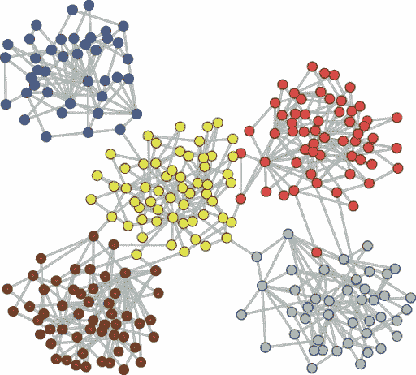
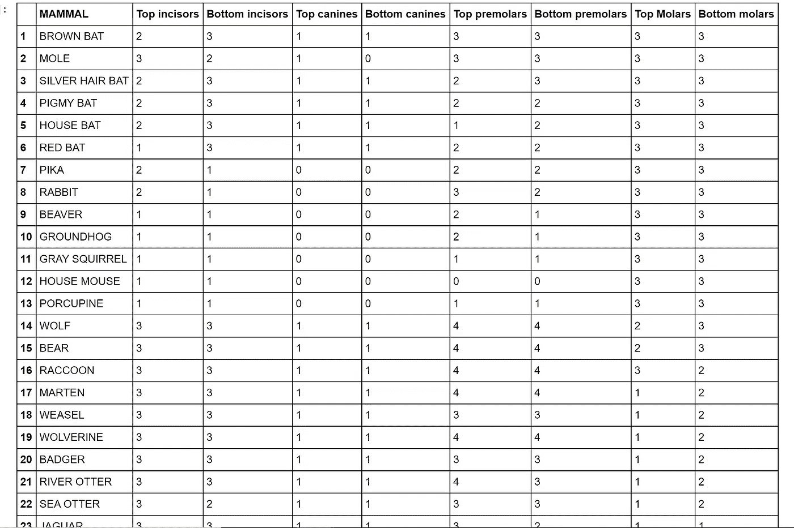
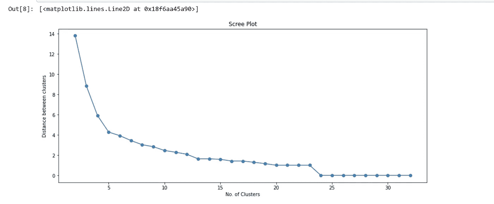
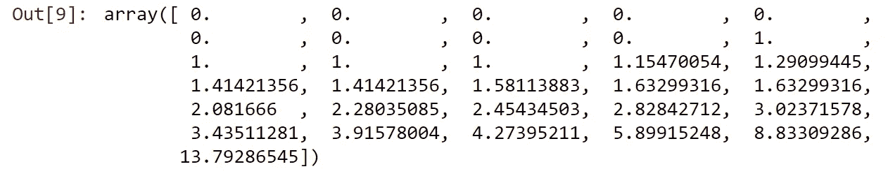
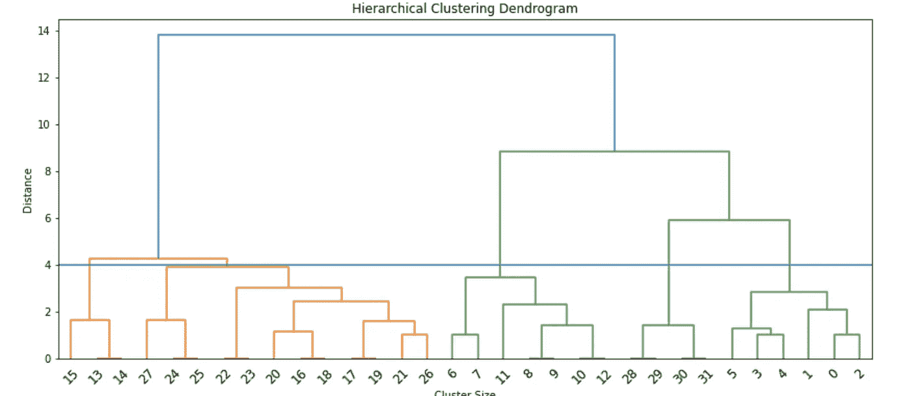
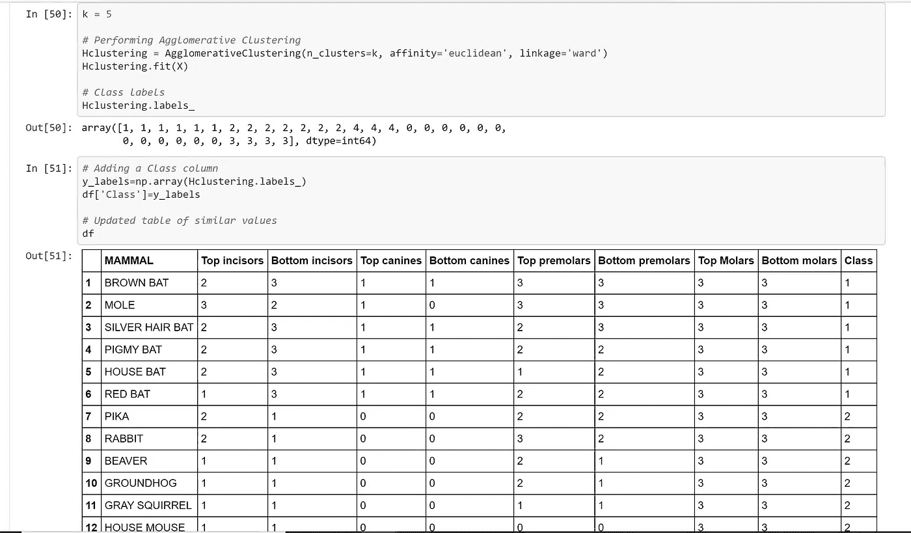
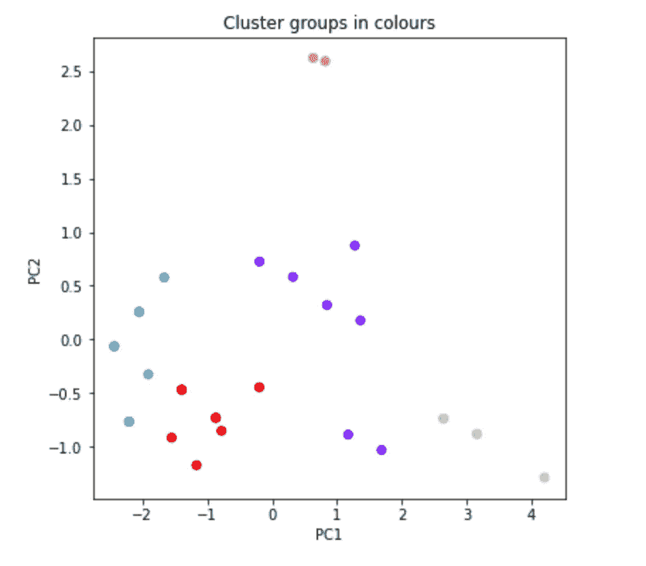
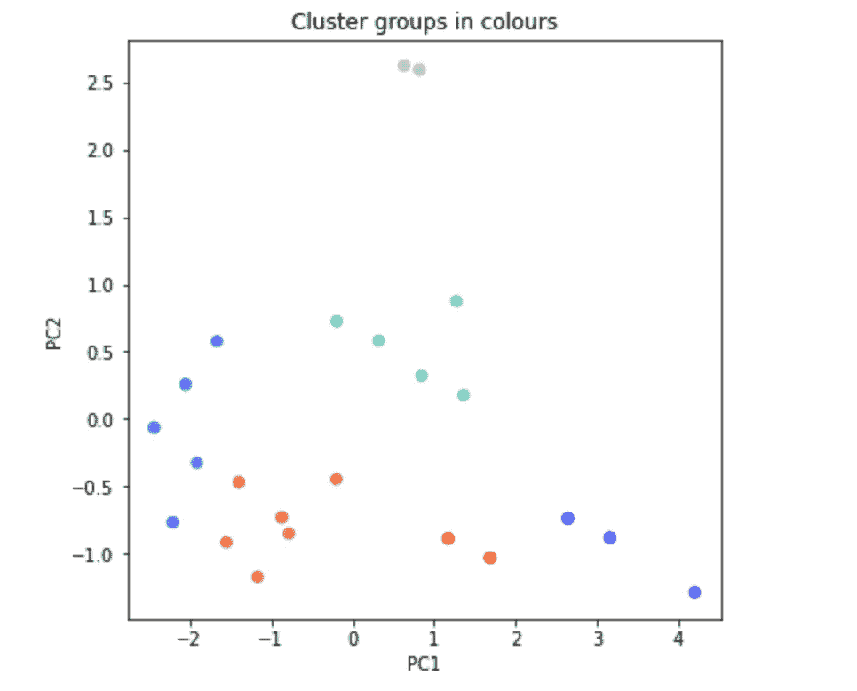

# 凝聚层次聚类——一个简单的介绍和一个示例程序

> 原文：<https://medium.com/geekculture/agglomerative-hierarchical-clustering-a-gentle-intro-with-an-example-program-4b7afe35fd4b?source=collection_archive---------13----------------------->

我们正在冒险进入无监督学习的领域。

使用无监督学习，类标签是未知的，并且数据被标绘以查看它是否自然聚类。聚类分析将数据分成有希望对我们以后有意义和有用的组。这些聚类可能与人类对相似性的感知相似，也可能不相似。

Clusters Representation. Source : [https://openi.nlm.nih.gov/detailedresult?img=PMC2542420_pcbi.1000190.g004&req=4](https://openi.nlm.nih.gov/detailedresult?img=PMC2542420_pcbi.1000190.g004&req=4)

在凝聚层次聚类中，我们首先将每个数据点视为自己的聚类。然后，我们将继续把最近的聚类合并在一起，形成一个新的聚类。我们将重复这一过程，直到所有的数据点合并成一个单独的聚类。

当应用程序需要某种层次结构时，我们使用层次集群，例如，创建一个分类法。

这是一种自下而上的方法，因为我们从与数据集中的数据点数量相等的聚类数量开始，直到我们到达所有数据点正好有 1 兆个聚类的点。在聚类的每一步，都会获得更大的聚类。

我们获得了一组组织成层次树的嵌套集群。这个图表叫做树状图。

Dendrogram

以下摘自 Geoff Dougherty 的《模式识别和分类》第八章。

## 算法:

1.  找出多元空间中“最接近”的两个特征
2.  用单个特征来代替它们
3.  对下两个最接近的要素重复上述操作，直到所有要素都归入一个聚类中

基础知识说完了，让我们用一个例子来理解凝聚聚类。

# 问题如下:

考虑哺乳动物的 [*牙齿. csv*](https://github.com/AnneDroidd/HierarchicalClustering/blob/main/teeth%20of%20mammals.csv) 中的数据，其中包含了各种哺乳动物不同类型牙齿数量的数据。执行层次聚类以获得相关的树状图。这会改变集群的数量吗？参考 scree 图，以及你自己对哪些动物应该聚集在一起的看法，你认为多少个集群是最佳的？

## 导入库和加载数据集:

如果我们显示数据集以获得其内容的一般概念，它将看起来像这样-

Dataset

## 将特征列分配给 X 变量

## 绘制树状图

我们选择了“Ward”作为关联—在这种方法中，两个聚类之间的接近度被定义为合并两个聚类所导致的 SSE(到聚类中心的平方距离之和)的增加。

基本上，它将最小化被合并的集群的方差。

除此之外，还有更多我们可以选择的。查看 [*此链接*](https://scikit-learn.org/stable/modules/generated/sklearn.cluster.AgglomerativeClustering.html) 了解更多。

Plotting Dendrogram

Output dendrogram

我们可以观察执行凝聚聚类后得到的树状图。现在的问题是，我们如何确定数据应该分成多少个簇？

嗯，看起来我们可以形成两个集群——一个是橙色的，另一个是绿色的…

或者，我们可以将绿色的一分为二，因为{6，7，11，8，9，10，12}和{28，29，30，31，5，3，4，1，0，2}之间的距离相当大，总共有 3 个簇…

我们不能通过目测树状图来确定。因此，解决方案是一个碎石图。(是的，它的名字来源于堆积在陡峭悬崖底部的碎石)没有任何标准可以告诉我们“这”是最佳的集群数量，但是我们可以使用 Scree plots，在给定一个看不见的数据集的情况下，了解最佳的集群应该是什么。

碎石图从陡峭的向下斜坡变化到更平坦的斜坡的地方(不总是明显的)是最佳聚类数的指示。通过在树状图的特定位置画一条水平线来选择聚类数。我们借助小石子图帮助确定这个位置。

## 碎石图

Output — a Scree Plot for the dataset

当聚类之间的距离约为 4 时，碎石图从急剧向下的斜率变为更水平的斜率。让我们打印每次迭代中聚类之间的距离，存储在变量' y '中。

31 iterations are printed, since we have 32 data points so we will require 31 steps to cluster all the data points into 1 mega cluster.

当聚类之间的距离大约为 4 时，碎石图从急剧向下的斜率变为更加水平的斜率，我们应该检查确切的值:第 4 个和第 5 个点(来自碎石图)具有如下 y 值:

这两个点具有相似的震级——大约 4 级。因此，最佳聚类数之间的最佳距离是 4。这个“4”是我们在“碎石图”一节中谈到的特定位置。我们还没有找到最佳的集群数量，但现在我们有了一个想法。

## 最佳聚类数

让我们再次绘制树状图，这次我们将在树状图中距离值= 4 处画一条水平线。

水平线经过树状图，并在至少 5 个点上切割聚类。不清楚我们是否应该将群集{27，24，25}和{22，23，20，16，18，17，19，21，26}视为独立的，因为它只接触水平线。聚类的最佳数量是 5 或 6。让我们观察这两种情况。

## 生成 2D 图以可视化和比较最佳聚类数

我们现在将数据绘制在 2D 图上，每个点代表一种动物。属于一个集群的动物将用相同的颜色绘制。

我已经对数据集执行了聚集聚类，并在代码中打印了每个类的数据框。发布在我的 GitHub 知识库上—[hierarchical clustering/aggregate _ clustering . ipynb 在主 AnneDroidd/hierarchical clustering(github.com)](https://github.com/AnneDroidd/HierarchicalClustering/blob/main/Agglomerative_Clustering.ipynb)

请随意查看每堂课的动物列表，这可能会让你更清楚。然而，我将继续前进，在这个博客中没有这一部分。下面是截图，供参考。

由于我们的数据集有 8 个特征列，我们将执行 PCA 来帮助绘制我们在 2D 的数据。我们将分别在 X 轴和 Y 轴上绘制主成分 1 和 2。我们正在考虑前 2 台电脑，因为它们为我们提供了关于任何给定数据集的最多信息。

**假设最优聚类数= 5，对数据进行凝聚聚类:**

Data plot when number of clusters = 5

5 个聚类已经足够好了，但我们还可以做得更好，因为右下角的 2 个紫色数据点与图中心的紫色聚类相距甚远。在我看来，他们应该被归类到另一个集群中。让我们观察当集群数量 k=6 时的情况。

**假设最优聚类数= 6，对数据进行凝聚聚类:**

Data plot when number of clusters = 6

这里，中间的青色数据点和底部的 2 个红色数据点被分类为单独的聚类。这看起来是一个恰当的分类，因为红点与蓝点相距甚远。因此我们可以得出结论，最佳的聚类数应该是 6。

## 结论

最佳聚类数为 6。属于同一群的动物是-

1.  鼠兔、兔子、海狸、土拨鼠、灰松鼠、家鼠、豪猪
2.  棕色蝙蝠，鼹鼠，银毛蝙蝠，小蝙蝠，家蝙蝠，红色蝙蝠
3.  貂，黄鼠狼，狼獾，獾，水獭，海獭，美洲虎，美洲狮，灰色海豹突击队
4.  驯鹿，麋鹿，鹿，驼鹿
5.  狼，熊，熊
6.  毛皮海豹突击队，海狮，大象海豹突击队

全部代码发布在 [*我的 GitHub 资源库*](https://github.com/AnneDroidd/HierarchicalClustering) 上👈看看这个链接。

我希望这篇文章能帮助你深入了解层次集群。因为博客的目的是从实践的角度来理解，我想推荐一些其他的资源，在理论和代码语法方面可能会有所帮助

1.  Geoff Dougherty 的“模式识别和分类”。
2.  [使用 Python 的层次聚类— AskPython](https://www.askpython.com/python/examples/hierarchical-clustering#:~:text=Hierarchical%20Clustering%20with%20Python%20Clustering%20is%20a%20technique,difficult%20to%20draw%20insights%20and%20patterns%20from%20it.)
3.  [sk learn . cluster . agglomerate clustering—scikit-learn 0 . 24 . 2 文档](https://scikit-learn.org/stable/modules/generated/sklearn.cluster.AgglomerativeClustering.html)

如果你对本教程有任何问题或想法，欢迎在下面的评论中提出。欢迎反馈和建议。

快乐学习！😊