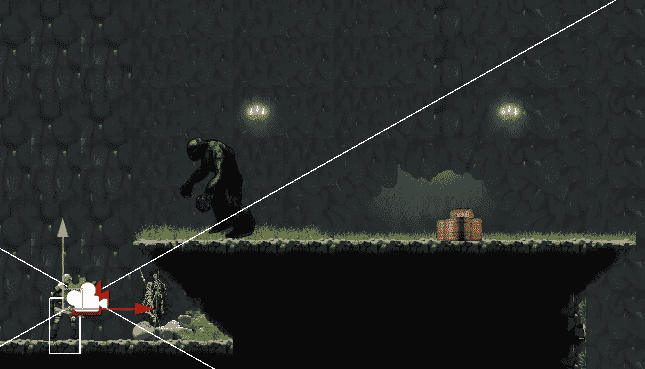

# 被击中后敌人的攻击行为

> 原文：<https://medium.com/geekculture/aggressive-enemy-behaviour-after-a-hit-9a24e3cc5d74?source=collection_archive---------19----------------------->

**目标**:让敌人在受到角色的攻击后进入仇恨模式

在前一个关于仇恨的教程中，我们让敌人在它的视线范围内追逐玩家，从而开始了敌人的仇恨。

但是仇恨不仅仅依靠距离或发现目标。很明显，敌人在被击中后也应该**追击玩家。场景…**