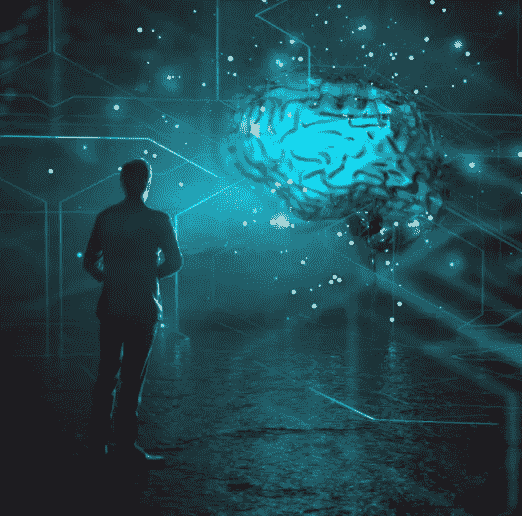

# AGI 及其社会学后果——我的思考

> 原文：<https://medium.com/geekculture/agi-its-sociological-consequences-ba8be6cad037?source=collection_archive---------30----------------------->

[https://thumbor.forbes.com/thumbor/fit-in/1200x0/filters%3Aformat%28jpg%29/https%3A%2F%2Fblogs-images.forbes.com%2Fcognitiveworld%2Ffiles%2F2019%2F06%2Fartificial-general-intelligence.jpg](https://thumbor.forbes.com/thumbor/fit-in/1200x0/filters%3Aformat%28jpg%29/https%3A%2F%2Fblogs-images.forbes.com%2Fcognitiveworld%2Ffiles%2F2019%2F06%2Fartificial-general-intelligence.jpg)

"人工智能及其后果对人类来说是一场灾难."这句话是基于尤那邦伯著名宣言的开头——泰德·卡钦斯基(工业革命&它的未来)。与他不同，我不反对技术，但我对 AGI 有严重的社会学担忧。在这篇文章中，我不会讨论生存威胁，人类的替代，等等…