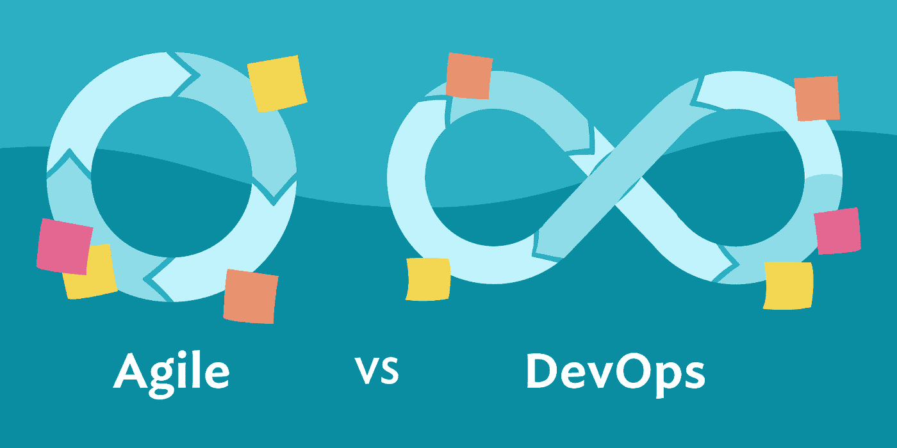
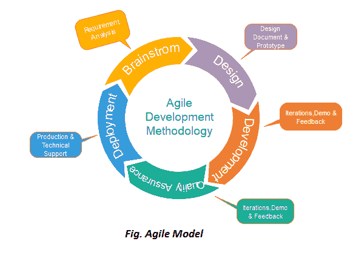
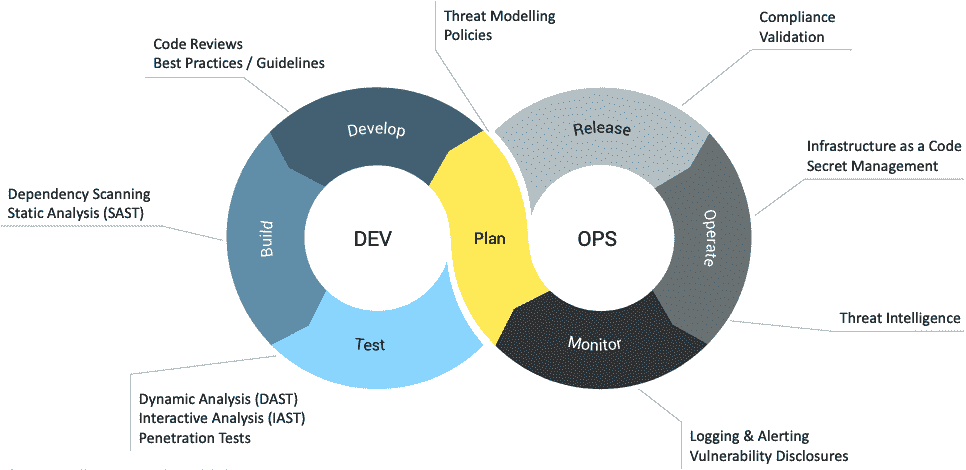
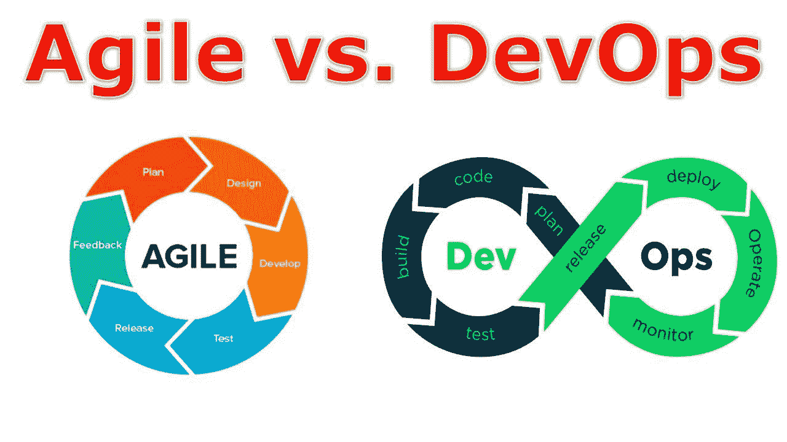

# 敏捷和 DevOps:软件开发中的顶级创新方法

> 原文：<https://medium.com/geekculture/agile-and-devops-top-methodologies-for-innovation-in-software-development-b0cbceef4374?source=collection_archive---------14----------------------->

在当今快节奏、技术驱动的世界中，对于企业来说，跟上最新的软件发展趋势以保持竞争力比以往任何时候都更加重要。

软件开发中最流行的两种创新方法是敏捷和 DevOps。但是它们是什么，它们有什么不同？

而且，在开发运维与敏捷的战争中，您如何知道哪一个适合您的业务呢？

在这篇博文中，我们将比较两种最流行的方法——敏捷和 devo PS——并解释为什么它们对软件开发很重要。

**敏捷方法:简介**

敏捷方法是一个迭代过程，意味着软件开发过程的每一次迭代都建立在前一次的基础上。

对于软件开发来说，它是 Agile vs DevOps 中的一个极好的选择，因为它允许开发团队和客户之间不断的反馈和协作。它还允许快速周转时间和工作软件的快速交付。

它基于敏捷宣言，该宣言概述了四个核心价值观:

-流程和工具之上的个人和交互

-在全面的文档基础上运行软件

-合同谈判中的客户协作

-按照计划应对变化

敏捷方法被设计成具有灵活性和适应性，允许软件开发过程中的变化。它经常与其他软件开发过程一起使用，例如瀑布式或螺旋式。此外，它通常用于中小型项目。

**它是如何为无缝软件开发服务的？**

[**Img src: Google**](https://www.google.com/search?q=Agile+Methodology%3A+A+Brief&tbm=isch&ved=2ahUKEwjk0IKqhv33AhUv_TgGHQSQCaYQ2-cCegQIABAA&oq=Agile+Methodology%3A+A+Brief&gs_lcp=CgNpbWcQAzoFCAAQgAQ6BAgAEEM6BAgAEBhQ5QdY5Qdg8AxoAHAAeACAAbMCiAG8A5IBBzAuMS4wLjGYAQCgAQGqAQtnd3Mtd2l6LWltZ8ABAQ&sclient=img&ei=y2KPYqS_Kq_64-EPhKCmsAo&bih=712&biw=1600#imgrc=UecIf24c1R_jmM)

敏捷方法是帮助团队更无缝地交付软件开发项目的过程。将项目分解成更小的部分可以让项目更灵活、更容易管理。

**敏捷过程通常分为四个不同的步骤:**

**1。规划和需求收集**

这是流程的第一步，包括了解客户想要从项目中得到什么。这一步对于确保最终产品满足客户需求至关重要。

**2。开发**

这是过程中的第二步，涉及到根据第一步中收集的规范对软件进行编码。这一步对于确保软件正常运行至关重要。

**3。测试**

这是流程中的第三步，包括测试软件以确保它符合第一步中收集的规范。这一步对于确保软件的高质量和满足客户需求至关重要。

**4。部署**

这是流程的第四步，也是最后一步，涉及到将软件投入生产。这一步对于确保软件对客户可用非常重要。

通过遵循这四个步骤，团队可以无缝地交付软件开发项目。敏捷方法是帮助团队更无缝地交付软件开发项目的过程。

**DevOps 方法:简介**

DevOps 方法是一套实现无缝软件开发的原则和实践。它旨在缩短代码更改和产品部署之间的时间，同时提高质量和降低风险。

这种方法依靠自动化和反馈循环来实现其目标。自动化减少了对人工流程的需求，加快了周转时间。反馈循环提供了对代码更改效果的可见性，允许早期检测和纠正错误。

它通常与敏捷方法结合使用，因为这两种方法都关注快速交付和持续改进。因此，[雇佣 DevOps 开发人员](https://www.valuecoders.com/hire-developers/hire-devops-developers?utm_source=Agile%26DevOps&utm_medium=Anu_B11&utm_id=Medium%28DevOps%29)，他们对软件开发过程有更全面的看法，包括从最初设计到最终部署的一切。

DevOps 被证明是提高软件开发效率和质量的有效方法。采用 DevOps 的组织报告了周期时间的显著减少和生产率的提高。DevOps 还与客户满意度和参与度的提高有关。

"开发运维并非灵丹妙药，需要精心的规划和执行才能成功. "

**DevOps 方法由以下步骤组成:**

**1)持续集成:**开发团队一天数次将代码变更集成到共享存储库中。这允许团队成员快速检测和修复错误，并避免代码更改之间的冲突。

**2)连续交付:** DevOps 团队自动构建、测试和部署代码变更到产品中。这使得新的特性和更新能够以最小的风险快速发布。

**3)持续监控:** DevOps 咨询公司使用监控工具实时跟踪应用程序的性能。这有助于快速识别问题和瓶颈，以便在它们给用户带来问题之前加以解决。

实施 DevOps 可能具有挑战性，需要许多组织转变文化和思维方式。但是对于那些愿意投资的人来说，DevOps 提供了一套健壮的工具和技术来简化软件开发。

**它是如何为无缝软件开发服务的？**

**Img src:** [**Google**](https://www.google.com/search?q=DevOps+methodology+&tbm=isch&ved=2ahUKEwiMna7hhv33AhXwk9gFHaRKCwkQ2-cCegQIABAA&oq=DevOps+methodology+&gs_lcp=CgNpbWcQAzIFCAAQgAQyBAgAEB4yBggAEB4QBTIGCAAQHhAIMgYIABAeEAgyBAgAEBgyBAgAEBgyBAgAEBgyBAgAEBgyBAgAEBhQqAVYwxdggxxoAHAAeACAAaQBiAHxCJIBAzEuOJgBAKABAaoBC2d3cy13aXotaW1nwAEB&sclient=img&ei=P2OPYsyBLvCn4t4PpJWtSA&bih=712&biw=1600#imgrc=2ocqR-KpN4wk5M)

DevOps 是一种鼓励开发和运营团队之间协作的方法，以更快、更有效地交付软件。DevOps 的主要目标是缩短软件开发生命周期，提供高质量软件的持续交付。

**DevOps 基于 4 个基本原则:**

*   自动化
*   沟通
*   综合
*   监视

DevOps 团队使用这些原则来简化软件开发过程并提高效率。开发运维周期中通常有四个主要步骤:开发、测试、部署和监控。

**开发:**在开发阶段，开发人员编写代码并创建新的功能或应用程序。

**测试:**一旦代码准备好了，就必须对它进行测试，以确保它能按预期工作，并且不包含错误。

**部署:**代码经过测试和批准后，就可以部署到生产环境中了。

**监控:**一旦代码投入生产，就必须对其进行监控，以确保它能按预期执行，并且任何问题都能得到快速解决。开发运维团队通常使用自动化工具来帮助完成这一过程。

因此，它帮助 DevOps 开发人员和运营团队更无缝地合作，以更快地交付软件。DevOps 可以通过自动化特定任务和使用支持更多协作的工具，帮助组织更快地发布新软件，并减少错误。

**敏捷 Vs. DevOps:朋友还是敌人**

敏捷 vs DevOps，都旨在加速软件开发过程。敏捷通过将项目分解成可以更快完成的更小的部分来做到这一点。同时，DevOps 自动化了软件开发中的许多任务，如测试和部署。

**那么，敏捷和 DevOps 是朋友还是敌人？那要看你怎么看了。**

一方面，敏捷和 DevOps 有一些共同的目标和理念。敏捷和开发运维都强调协作、沟通和持续改进的重要性。

另一方面，敏捷和开发运维之间有一些关键的区别。敏捷专注于通过将软件开发分成更小的块(称为 sprints)来缩短软件开发周期。另一方面，DevOps 专注于软件开发过程的自动化，并使其更加高效。

答案没有对错之分。这取决于你的具体需求和目标。如果你正在寻找一个更快、更敏捷的开发过程，那么敏捷就是方法。如果您正在寻找一个更加高效和自动化的开发过程，选择 DevOps 咨询服务是一个明智的决定。

最后，这取决于你需要从你的软件开发项目中得到什么。明智选择！

**敏捷与开发运维:两种健壮软件开发方法的比较:**

**Img src: G**[**oogle**](https://www.google.com/search?q=Agile+vs.+DevOps&source=lnms&tbm=isch&sa=X&ved=2ahUKEwjP96-Vh_33AhXQhJUCHT1PD7cQ_AUoAXoECAEQAw&biw=1600&bih=712&dpr=1#imgrc=49NdPbFqJ8opTM)

谈到软件开发，有两个主要的思想流派:敏捷和 DevOps。敏捷和 DevOps 都有自己的一套指导开发过程的价值观和原则。那么，敏捷和 DevOps 有什么区别呢？您可以在这里找到:

-敏捷侧重于手动测试，而 DevOps 非常依赖自动化。

-敏捷侧重于持续改进，而 DevOps 强调持续交付。

-敏捷更能适应变化，而 DevOps 则寻求最小化变化。

-敏捷团队通常是自组织的，而 DevOps 团队通常具有更集中的结构。

-敏捷非常依赖面对面的交流，而 DevOps 更依赖自动化。

-敏捷侧重于单个任务和功能，而 DevOps 对整个软件开发过程有更全面的了解。

-敏捷主要关注提高软件开发过程本身的效率，而 DevOps 旨在提高整个软件开发生命周期的效率。

-敏捷专注于快速交付工作软件，而 DevOps 专注于交付满足客户需求的软件。

-敏捷是一种软件开发方法论，而 DevOps 是敏捷原则的延伸。

-敏捷侧重于个体和交互，而 DevOps 侧重于系统。

-敏捷价值观是工作软件高于全面的文档，而 DevOps 看重稳定性和可靠性。

-敏捷更适合需要频繁变更或更新的项目。DevOps 更适合需要快速交付或者有很多依赖项的项目。

-敏捷团队通常依赖手动流程来跟踪进度和识别问题。另一方面，DevOps 团队使用自动化工具持续监控他们的系统。

最终，使用敏捷还是开发运维的决定取决于您组织的特定需求。如果你主要关心软件开发过程本身的简化，敏捷可能是更好的选择。然而，如果您正在寻找一种包含整个软件开发生命周期的更全面的方法，DevOps 可能是更好的选择。

**DevOps vs. Agile:** 哪个最适合你的软件开发项目？

哪个更好？敏捷还是 DevOps？就像生活中的大多数事情一样，答案是视情况而定。敏捷和 DevOps 各有优缺点，选择哪一个要根据项目的具体需求。

如果速度是你最关心的，那么敏捷可能是最好的方法。敏捷项目可以比传统项目更快地完成，敏捷团队通常可以更快地应对变化。敏捷 vs. DevOps:朋友还是敌人？明智选择！这完全取决于你需要从你的软件开发项目中得到什么。

另一方面，如果你需要确保你的软件是高质量的，没有 bug，DevOps 可能是一个更好的选择。DevOps 自动化了软件开发中的许多任务，包括测试和部署。这意味着您的软件不太可能包含错误，并且您可以确信它在发布时会按预期工作。

**使用敏捷和 DevOps 进行软件开发的商业优势**

毫无疑问，敏捷和 DevOps 已经改变了软件开发的前景。但是使用这些方法有什么好处呢？以下是主要优势的简要概述:

**1。提高速度和灵活性。**

使用敏捷和 DevOps 的最大好处之一是提高了开发和交付软件的速度。由于开发周期的缩短和开发人员与客户之间不断的反馈循环。

**2。质量提高。**

通过使用敏捷或 DevOps 方法，您可以通过在开发过程的早期捕捉错误来提高软件的质量。这意味着更少的返工和更满意的客户。

**3。改善沟通。**

使用敏捷和 DevOps 的另一个重要好处是改善了开发人员、客户和其他利益相关者之间的沟通。这得益于整个开发过程中不断的反馈循环和信息透明。

**4。降低成本。**

由于 Agile 和 DevOps 提高了速度和灵活性，您可以降低开发和交付软件的总成本。在将新功能或产品推向市场的过程中，返工的需要更少，延迟更少。

**5。提高客户满意度。**

最后，通过使用 Agile 或 DevOps，您可以通过改进软件质量、交付速度和整个开发过程中的沟通来提高客户满意度。

**结论:**

由业务和开发团队决定哪种方法最适合他们。敏捷提供了更多的灵活性，可以根据需要进行调整，而 DevOps 提供了一个更加自动化和简化的流程，可以提高效率和减少错误。

这两种方法都有优点和缺点，所以企业在决定之前应该仔细考虑他们的需求。然而，当一起使用时，它们可以为企业提供更加无缝的软件开发过程。

如果你想改进你的软件开发过程，可能值得考虑将敏捷和 DevOps 相互结合使用。可以联系可靠的 [DevOps 咨询公司](https://www.valuecoders.com/devops-consulting-engineering-services-company?utm_source=Agile%26DevOps&utm_medium=Anu_B11&utm_id=Medium%28DevOps%29)效果更好。如有任何疑问，请在下面的评论中告诉我们。