# 人工智能和微积分:消失的梯度

> 原文：<https://medium.com/geekculture/ai-and-calculus-the-vanishing-gradient-927a46646154?source=collection_archive---------7----------------------->

**简介:**

我们在微积分课上学过基本的导数、积分等。在 2018 年 AP 微积分 BC 考试中，我们不得不写一个方程来求解一个土豆在时间 t 分钟的内部温度的切线……绝对是微积分的一大用处(*笑*)。微积分有很多应用，其中一个很大的应用就是用在人工智能上。让我们来看看关键的微积分概念，并将其应用到现实世界中！

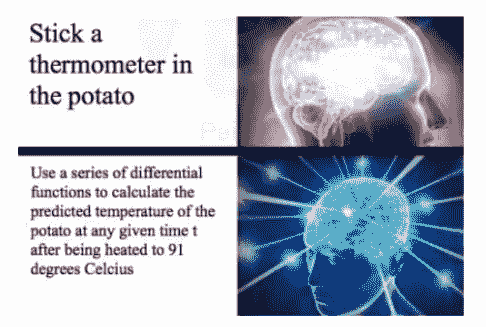

Image 1: Famous AP Calc Potato Problem, from: [Reddit](https://www.reddit.com/r/MemeEconomy/comments/6a90jg/quick_buy_ap_calc_bc_potato_memes_before_its_too/)

**人工智能与微积分:**

梯度下降是一种寻找函数的局部最小值和最大值的算法。神经网络(NN)梯度使用反向传播，它通过模型的各个层，使用链规则找到初始层的导数(或误差)。神经网络采用权重和偏差参数，并使用梯度下降算法更新这些值。该算法用于人工智能/人工智能、工程和工业领域。

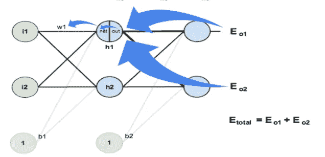

Image 2: Demonstrating Backpropagation, from: [Matt Mazur](https://mattmazur.com/2015/03/17/a-step-by-step-backpropagation-example/)

**消失渐变问题:**

使用反向传播，随着更多层的倍增，梯度呈指数下降并接近 0。这不会改变初始层的权重和偏差，只会改变外层。如果导数输出小于 1，它将收敛得更快，但不是很快。这使得我们很难训练模型，因为初始层没有更新，即使在最佳纪元编号下也产生低精度验证。

**芝诺悖论:**

芝诺悖论指出

> “如果一个人想从 A 点旅行到 B 点，他必须先在有限的时间内走完这段距离的一半。此后，他们必须在另一段有限的时间内再走完剩余距离的一半。然后，他们必须再次走完剩余距离的一半，以此类推。通过不断地将剩余的距离减半，这个人将会走无限长的距离，并且仍然稍微远离他们的最终目的地”([迈克尔·莫](https://www.futurescienceleaders.com/blog/2021/03/zenos-dichotomy-paradox/#:~:text=Once%20upon%20a%20time%2C%20an,a%20finite%20amount%20of%20time.))

消失梯度问题是芝诺悖论在现实生活中的表现，因为两种情况都试图接近渐近线，但永远不会达到它。

**微积分:**

不要害怕微积分！对我们写梯度下降算法是一个助力。现在让我们学习将在梯度下降算法中使用的关键微积分概念。然后，我们将探索如何找到一个令人讨厌的梯度发散的解决方案。

梯度下降只对可微且上凹的函数有效。该算法通过获取当前点的梯度来寻找下一个点，然后应用某个足够小的比率来引起收敛，以从当前点增加或减去该值，最终目标是最大化或最小化该函数。这是很多话，看看下面的伪代码来了解它是如何工作的！

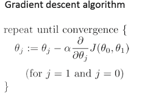

Image 3: of the Gradient Descent Algorithm, from: [Stack Exchange](https://stats.stackexchange.com/questions/166575/what-happens-when-i-use-gradient-descent-over-a-zero-slope)

*坡度*

多元函数的梯度是导数的向量。我们将使用偏导数，因为它给出了函数在某个方向(特定轴)上某一点的导数。

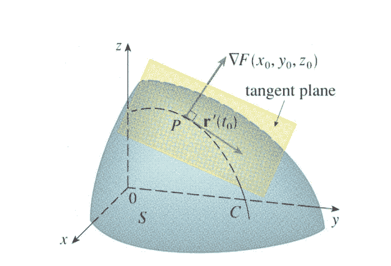

Image 4: Gradient, from: Stack Exchange

*可微*

函数是连续的，左边的导数等于右边的导数。为了使函数连续，函数在左右两边的极限必须等于该点的值。

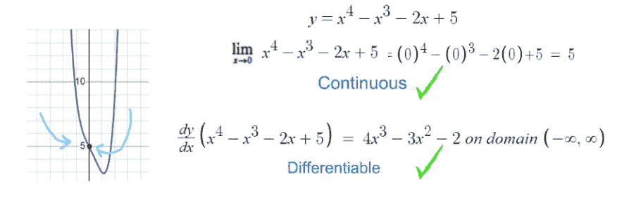

Image 5: Differentiable, from: Author

*凹度*

为了确保我们的函数是上凹的，我们必须对函数求二阶导数，并检查它是否大于 0。

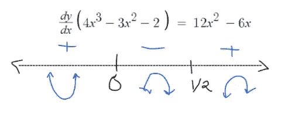

Image 6: Concavity, from: Author

因此，我们的函数是上凹的

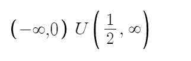

Image 7: Domain, from: Author

*偏导数*

梯度下降算法在方程中使用偏导数，所以我们来看看什么是偏导数。对于多元函数，偏导数只能找到其中一个独立变量的变化率。

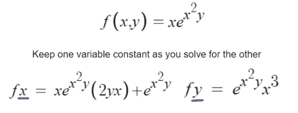

Image 8: Example of PD , from: Author

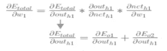

Image 9: PD in Algorithm, from: [Matt Mazur](https://mattmazur.com/2015/03/17/a-step-by-step-backpropagation-example/)

**消失渐变问题的解决方案:**

既然我们已经了解了梯度下降算法如何使用微积分概念，我们仍然需要讨论消失梯度的解决方案。我们要关注的一个解决方案是整流线性单元(ReLU)。

ReLU 是一个非饱和激活函数，用于创建 AI 模型，输出范围为 0 到正无穷大。ReLU 允许导数为 0 或 1。值 1 没有帮助进一步最小化偏导数。这允许整体更大的导数值，这有助于确保当我们将许多层相乘时梯度不会发散。不幸的是，当你得到一个连续的数字 0 作为输出时，这意味着神经元已经死亡:死亡。除了 ReLU 之外，还有许多其他解决方案有助于解决消失梯度问题，如 LReLU、残差网络和批量归一化。

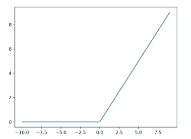

Image 9: ReLU Graph, from: [Machine Learning Mastery](https://machinelearningmastery.com/rectified-linear-activation-function-for-deep-learning-neural-networks/)

我们现在来看看我用 ReLU 构建模型的一些代码。下面的代码是一个卷积神经网络(CNN)模型。这比我们之前讨论的 NN 更复杂。与具有多个隐藏层的 NN 不同，CNN 具有宽度、高度和深度参数的三维。ReLU 用于代码第 3 行的隐藏层，帮助解决渐变消失的问题。您可以看到还使用了其他激活函数，如 SoftMax 它在输出图层中用于输出标注类的概率分布。

Image 10: Code of AI Model, from: Author

这是在将街道图像的一些数据输入到上面的模型中之后的输出，我们发现验证精度大约为 85.17%。调整隐藏层和所使用的激活函数的类型将有助于提高最佳纪元编号的最终验证精度。

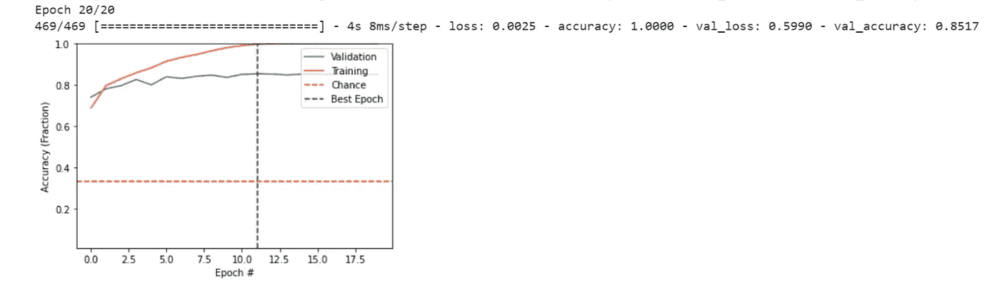

Image 11: Output of AI Model, from: Author

**结论:**

本文对算法中涉及的梯度下降和微积分做了深入的分析。我们还讨论了如何在 NN/CNN 和不同的解决方案中使用它来提高最佳历元值的验证准确性。

我在创建各种人工智能模型后写了这篇文章，并注意到一些阻碍验证准确性的东西。我进一步研究了是什么导致了一个降低的值，并且遇到了渐变消失的问题。消失梯度和 AI/ML 通常在数学中很重要，这起初令人生畏，但在学习了一些基本的微积分概念后(在我的老师 Wernau 先生的帮助下)，你可以开始看到它们是如何联系在一起的。你在课堂上学到的东西被积极地应用到现实世界中，这是非常令人着迷的！:)

*继续学习:*

 [## 托马斯·韦诺

### 与朋友、家人和全世界分享您的视频

www.youtube.com](https://www.youtube.com/channel/UCUpxD3z4-CDdHXHjnKCY2Jg)  [## 深度神经网络中的消失梯度和爆炸梯度

### 这篇文章是作为数据科学博客网络和可用于…

www.analyticsvidhya.com](https://www.analyticsvidhya.com/blog/2021/06/the-challenge-of-vanishing-exploding-gradients-in-deep-neural-networks/)  [## 梯度下降算法——深度探索

### 梯度下降法为机器学习和深度学习技术奠定了基础。

towardsdatascience.com](https://towardsdatascience.com/gradient-descent-algorithm-a-deep-dive-cf04e8115f21)