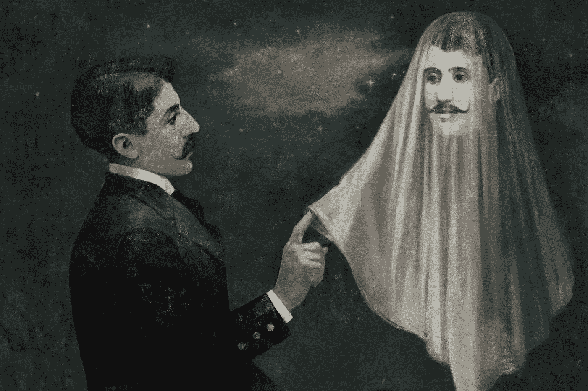

# AI 和意识；走向最终毁灭的旅程？

> 原文：<https://medium.com/geekculture/ai-and-consciousness-journey-to-eventual-doom-f3939f3dd9f0?source=collection_archive---------45----------------------->

## AI 有可能获得意识并战胜人类吗？

Credit: Gérard Dubois

古往今来，从最小的昆虫到最大的鲸鱼，所有有大脑的生物都从生物学上继承了意识。自己独有的意识，依赖于自己的经验。