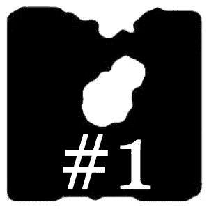

# 人工智能和艺术与卡利雷佐#1:项目和目标

> 原文：<https://medium.com/geekculture/ai-art-with-cali-rezo-1-project-goals-4d45b22663?source=collection_archive---------22----------------------->

## 我们是怎么用 AI 创作抽象画的……(差不多)！

[*#2:生成型模型➡️*](https://mina-pecheux.medium.com/ai-art-with-cali-rezo-2-generative-models-846ef96ba1f3)

如今，**机器学习** (ML)是一个炙手可热的话题，到处都在以各种方式讨论。越来越多的公司依赖人工智能作为其生产过程的一部分，无论是在金融，医药，管理，艺术领域…最后…