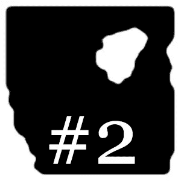

# 人工智能和艺术与卡利雷佐#2:生成模型

> 原文：<https://medium.com/geekculture/ai-art-with-cali-rezo-2-generative-models-846ef96ba1f3?source=collection_archive---------13----------------------->

## 我们能用 AI 程序化地生成抽象艺术吗？

[*⬅️ #1:项目&目标*](/geekculture/ai-art-with-cali-rezo-1-project-goals-4d45b22663) *|* [*#3:解析模型➡️*](https://mina-pecheux.medium.com/ai-art-with-cali-rezo-3-analytical-models-7d9323030594)

[上周](/geekculture/ai-art-with-cali-rezo-1-project-goals-4d45b22663)，我介绍了我和抽象画家[卡利雷佐](https://www.instagram.com/calirezo_/)合作的“AI &艺术”项目。作为这一系列文章的开始，让我们讨论一些常见的生成模型以及我们如何将它们应用到卡利的作品中…