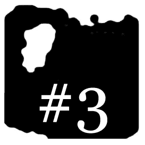

# 人工智能和艺术与卡利雷佐#3:分析模型

> 原文：<https://medium.com/geekculture/ai-art-with-cali-rezo-3-analytical-models-7d9323030594?source=collection_archive---------15----------------------->

[*⬅️ #2:生成模型*](/geekculture/ai-art-with-cali-rezo-2-generative-models-846ef96ba1f3)*|*[*# 4:ai 模型的可解释性和不确定性➡️*](https://mina-pecheux.medium.com/ai-art-with-cali-rezo-4-explainability-and-uncertainty-of-ai-models-4b4a2bca9eff)

在上一篇文章的[中，我们重点介绍了用于**图像生成**的 VAEs 和 GANs。这次，我们将讨论**分析图像并尝试识别类别**。我们也借此机会谈谈 AI 分类常见的**陷阱和限制**。](/geekculture/ai-art-with-cali-rezo-2-generative-models-846ef96ba1f3)