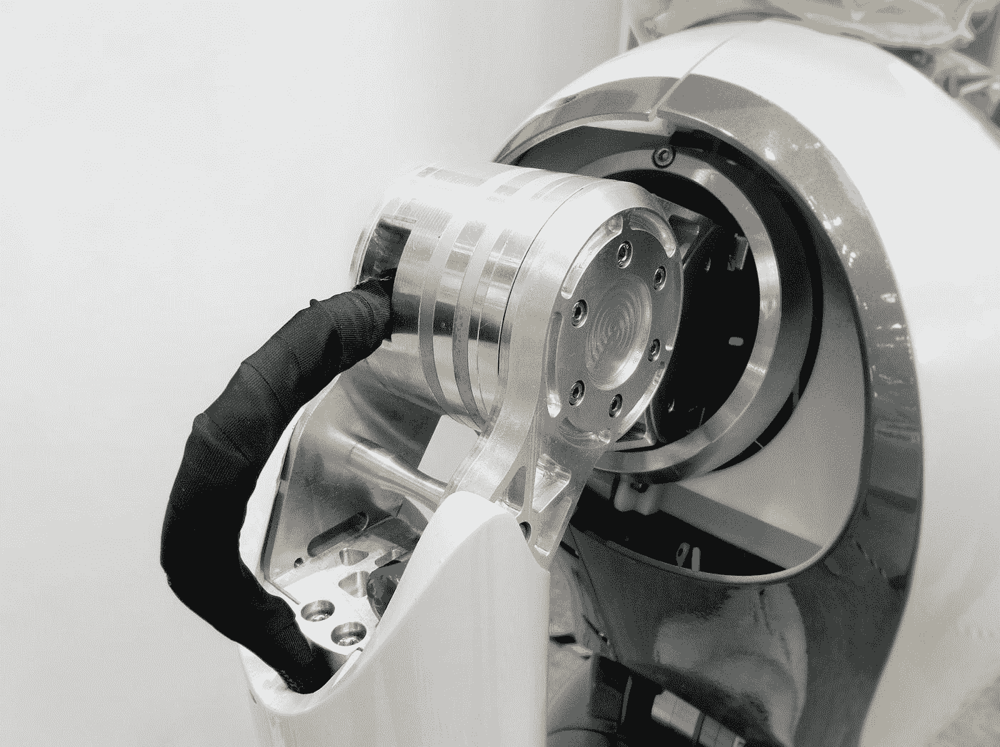

# 艾，毕和我们的未来！

> 原文：<https://medium.com/geekculture/ai-bi-and-our-futu-5c7693dc7e6c?source=collection_archive---------48----------------------->

Photo by [Possessed Photography](https://unsplash.com/@possessedphotography?utm_source=medium&utm_medium=referral) on [Unsplash](https://unsplash.com?utm_source=medium&utm_medium=referral)

今年是 2021 年，人工智能(AI)现在是一个常见的术语。尽管它很受欢迎，但我们许多人都没有意识到我们已经将多少人工智能融入了我们的生活。从我们的智能手机到我们的智能手表，从我们的汽车到我们的家；现在一切都很聪明。事实上，在我们大多数人度过一天的社交媒体上，是基于人工智能的。我们看到我们感兴趣的广告，我们喜欢的模因已经在我们的提要上，因为算法已经学习了。

有人可能会想嘿！至少我可以用我的工作来逃避这种技术，但看看商业智能(BI)。虽然缓慢但肯定的是，BI 将接管专业环境，在那里我们甚至不用移动就能制作我们的公司月度报告。

随着我们的技术进步，我们作为一个社会真正走上了从电影《瓦力 E》走向公理的道路。这不一定是一件坏事，但也有可能。

# 人工智能

如果我们开始列出我们日常生活中使用的已经实现人工智能的东西，这篇文章将会是一个很长的列表。但举几个例子，我们的手机知道我们的打字模式，它们会自动纠正我们将要拼错的单词，因为它们知道我们太顽固了，无法学习如何拼写。我们的电子邮件消息知道我们如何回应，并在收到消息时给我们特定的回复，所以我们不必把它们打出来。我们的电器知道我们的喜好，我们的家知道我们的时间表。基本上，简单来说——任何有学习和适应能力的东西都配备了人工智能。

我们将何去何从？

毫无疑问，人工智能通过讨论平凡的任务让我们的生活变得更加轻松。但是，它会达到一个威胁的位置吗？老实说，在未来的 10-20 年内这不太可能。在未来十年或二十年，我们可能会看到这项技术带来更多好处。有许多开发的人工智能系统帮助我们的整个社会。例如枪支检测软件和防盗程序，它们使用来自 CCTV 的实时信号并警告当局潜在的危险。然而，在这个时代之后，我们可能会开始看到这项技术的衰落和弊端，因为它已经侵犯了我们生活各个方面的隐私。

# 商业智能

虽然没有人工智能先进，但商业智能是指使用人工智能技术实现商业任务的自动化。一些广为人知的工具是 POWER BI & Tableau，它使用数据库来创建更有效的可视化，并以更好的方式使用数据。在这个时代，数据是最重要的不被重视的东西之一。粗略估计，大多数公司中有超过 50%的数据未被使用，这些数据失去了成为有价值信息的潜力。毕使用数据分析来解决这个问题的浪费"现代世纪的金矿"，并与统计数据，我们能够确定模式，否则将是未知的。在未来，我们肯定可以期待这种技术的兴起，因为公司将利用它来更好地了解他们的客户。然而，这种技术的缺点是有限的，因为它们对我们社会造成的最大损害是增加失业率。

描述这一切的最佳方式是引用希腊诗人赫西奥德的名言:

> “遵守适当的措施；凡事适可而止”。

或者现代版的奥斯卡·王尔德:

> “凡事适可而止，包括适度。”