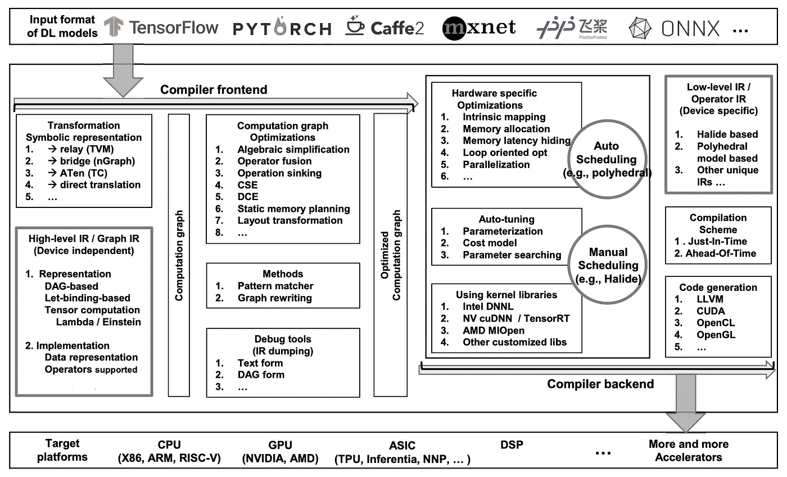

# 人工智能编译器去神秘化

> 原文：<https://medium.com/geekculture/ai-compilers-ae28afbc4907?source=collection_archive---------1----------------------->

## 人工智能工程

## 通过编译加速 AI/ML:NVIDIA TensorRT，ONNX Runtime，Apache TVM 等

Photo by [DeepMind](https://unsplash.com/@deepmind?utm_source=unsplash&utm_medium=referral&utm_content=creditCopyText) on [Unsplash](https://unsplash.com/@deepmind?utm_source=unsplash&utm_medium=referral&utm_content=creditCopyText)

深度学习在过去十年一直是 AI/ML 的主流。它几乎在任何地方改变着我们的日常生活。我们不太会数，从 Alexa 设备到广告推荐、仓库机器人、自动驾驶汽车等等。

但是随着深度学习和大规模模型的发展，训练和服务变得越来越具有挑战性。人工智能编译器的出现提高了训练和服务的效率。这里将揭示如何通过机器学习编译来加速分布式训练和服务，这是人工智能工程的一种基本方法。

## 面向人工智能工程培训和服务的编译器

大比例模型有**个**主拐点。第一个**是基于变形金刚的大型模型似乎按下了“加速”按钮，以指数方式增加模型的大小。如武道 2.0 以 [1.75 万亿](https://towardsdatascience.com/distributed-parallel-training-data-parallelism-and-model-parallelism-ec2d234e3214)参数登场，十倍于 GPT-3 参数。**

第二个挑战是对训练和发球效率的挑战。例如，在亚马逊 SageMaker 训练平台的 240ml . p4d . 24x 大型实例上训练 GPT-3 花费了大约 [25 天](https://towardsdatascience.com/distributed-parallel-training-model-parallel-training-a768058aa02a)。

MLOps 可以自动化 ML 模型部署和服务的过程。最近，它还扩展到特征工程和特征商店。但它仅限于人工智能工作流的过程，由于运营的性质，无法从根本上改善培训和服务。

人工智能工程，远远超出了 MLOps，可以全面地设计 ML 工作流程以及培训和服务的架构。此外，它可以通过机器学习编译来加速服务和训练。

ML 编译对大规模模型服务和训练效率起着至关重要的作用。与传统的 ML 流程(从培训到验证和服务的三个主要步骤)不同，它在大规模 ML 工作流中变得必不可少。

我们可以通过在将大规模模型部署到生产中之前编译它来加速服务。我们还可以通过编辑培训档案来加快培训速度。但是前者的效率似乎比后者更重要，因为在生产中服务是面向客户的，并且更关键。

此外，服务的总计算时间可能比训练的时间长得多，因为模型可能在一段时间内每秒处理数百万个请求。

除了 ML 编译，[其他机制](https://pub.towardsai.net/5-types-of-ml-accelerators-767d26a643de)可以加速训练和服务，比如 AI 计算平台、AI 框架、云服务。但是我们将把重点放在编译器上，这里不涉及这些。

## 人工智能编译器概述

AI 编译器出现了，并在加速训练和服务方面发挥了至关重要的作用，而我们几乎用尽了其他方法，如优化架构和硬件。

好消息是 ML 编译器可以显著提高大规模模型服务的效率。然后出现了很多 ML 编译器:Apache TVM，NVIDIA TensorRT，ONNX Runtime，LLVM，Google MLIR，TensorFlow XLA，Meta Glow，PyTorch nvFuser，以及 Intel PlaidML 和 OpenVINO。

让我们仔细看看，以便全面把握。

**Apache TVM**:Apache[TVM](https://tvm.apache.org)是一个开源的 ML 编译器框架，用于 CPU、GPU 和其他 ML 硬件加速器。它旨在使 ML 工程师能够在任何硬件后端优化和有效运行计算。TVM 提供了两个主要特性:1)。将深度学习模型编译成最小可部署模块；2).在更多后端上自动生成和优化模型的基础设施，性能更好。

**NVIDIA**[**TensorRT**](https://developer.nvidia.com/tensorrt):这是一款针对 NVIDIA GPUs 的高性能深度学习推理优化器和运行时库。它可用于优化和部署以 TensorFlow、PyTorch 或 ONNX 格式开发的模型。TensorRT 可以通过优化计算图、使用降低精度的算法和应用其他技术来显著提高 LLMs 的推理速度。

[**ONNX 运行时**](https://onnxruntime.ai) : ONNX(开放神经网络交换)是一种开源的表示深度学习模型的格式。它由微软、脸书和其他合作者创建，旨在提供一种标准格式，允许不同深度学习框架之间的互操作性。ONNX 运行时是一个专注于性能的引擎，用于运行 ONNX 模型。它支持广泛的硬件平台，包括 CPU、GPU 和边缘设备。ONNX 运行时旨在优化机器学习模型的执行，与直接在原生框架中运行模型相比，提供了更好的性能。

LLVM: [LLVM](https://llvm.org) 最初是作为[的一个研究项目](https://llvm.org/pubs/2004-01-30-CGO-LLVM.html)在 [UIUC](https://cs.illinois.edu/) 提供一个现代的、基于 SSA 的编译策略，支持任意编程语言的静态和动态编译。从那时起，LLVM 已经发展成为一个包含几个子项目的伞式项目。

**谷歌 MLIR** : [MLIR](https://www.tensorflow.org/mlir/overview) (多级中间表示)是一种表示格式和编译器实用程序库，位于模型表示和生成硬件特定代码的低级编译器/执行器之间。它是现代优化编译器的灵活基础设施。这意味着它由一个中间表示(IR)规范和一个对该表示执行转换的编码工具包组成。用编译器的话来说，就是从高级表示转换到低级表示。

**TensorFlow XLA**:[XLA](https://www.tensorflow.org/xla)(加速线性代数)是一个针对线性代数的特定领域编译器，可以加速 tensor flow 模型，而可能不会更改源代码。XLA 采用 HLO(高级操作)定义的图形(“计算”)，并将它们编译成各种架构的机器指令。XLA 是模块化的，因为它可以轻松地插入一个替代后端，以针对一些新颖的硬件架构。

**Meta Glow**:[Glow](https://ai.facebook.com/tools/glow/)从 PyTorch 等深度学习框架接受计算图，并为机器学习加速器生成高度优化的代码。它包含许多机器学习和硬件优化，如内核融合，以加速模型开发。

**py torch NV fuser**:[NV fuser](https://pytorch.org/tutorials/intermediate/nvfuser_intro_tutorial.html)是一款 DL 编译器，能够实时编译快速灵活的 GPU 专用代码，以可靠地自动加速用户网络，通过在运行时生成快速定制“融合”内核，为运行在 Volta 和后来的 CUDA 加速器上的 DL 网络提供加速。它是专门为满足 PyTorch 社区的独特需求而设计的，支持不同的网络架构和程序，具有不同形状和跨度的动态输入。

**Intel PlaidML**:[PlaidML](https://www.intel.com/content/www/us/en/artificial-intelligence/plaidml.html)是一款开源张量编译器。借助英特尔的 nGraph 图形编译器，它可以在各种 CPU、GPU 和其他加速器处理器架构之间实现流行的 DL 框架的性能可移植性。

**Open vino**:[Open vino](https://docs.openvino.ai)(开放视觉推理和神经网络优化)是一个开源的工具包，也是由 Intel 开发的。OpenVINO 主要是在英特尔硬件上实现快速、高性能的深度学习推理，比如 CPU、集成 GPU、FPGAs、VPUs(视觉处理单元)。它提供了一套工具和库，旨在优化和加速计算机视觉和其他人工智能应用的深度学习模型。OpenVINO 支持各种深度学习框架，包括 TensorFlow、Caffe、ONNX、Kaldi 等。总之，OpenVINO 是为优化和加速英特尔硬件上的深度学习推理而定制的，而 PlaidML 是一种更通用的、与硬件无关的深度学习编译器，允许更广泛的设备兼容性。

以上可能错过了其他有趣的 AI 编译器，但我们可以看到它们的受欢迎程度和重要性。

## 人工智能编译器如何工作

一个 AI 编译器内部是如何工作的？让我们深入了解它的架构。

High-level design architecture of DL compilers (Source: [The DL Compiler](https://arxiv.org/abs/2002.03794))

以上是大部分 AI 编译器的高层设计架构。它有两层:与框架相关的上层和与硬件相关的下层，分别对应于图中的编译器前端和后端。

[中间表示](https://en.wikipedia.org/wiki/Intermediate_representation) (IR)是程序的数据结构或抽象，是程序优化的关键。IR 被设计成有助于进一步的处理，例如优化和翻译。IRs 分布在上层和下层。

人工智能编译器将 ML 模型翻译成上层和下层的多级 IRs。上层侧重于独立于硬件但与框架相关的转换和优化。下层负责硬件相关的优化、代码生成和编译。

但是为了支持跨设备(例如，不同的 GPU 或混合的 GPU 和 CPU)，较低层可能不优化硬件专用但仍然与硬件相关的低级 IRs。同样，为了支持跨框架(例如 PyTorch 和 TensorFlow)，上层可以不限于特定的框架，而是仍然关注于与框架相关的高级 IRs。

一般而言，上层采用由 ML 框架(例如 PyTorch)生成的 ML 模型作为输入，并将该模型转换成计算图形表示(即图形 IR)。下层将来自上层的高级 IR 转换为低级 IR，并执行与硬件相关的优化。

## 下一步是什么

像其他 ML 技术一样，AI 编译器不断进化以优化和扩展。如上所述，AI 编译器通常可以在上层和下层进行优化:模型架构相关的优化和硬件特定的优化。

**模型架构相关的优化**:这种优化在构建计算图时在编译器的上层处理。它可以是特定于模型架构的(例如，变换器域)。它也可以在图节点和张量、数据流和块级别。

**特定于硬件的优化**:这发生在编译器的底层。优化主要基于硬件架构和属性，如内在硬件映射、内存分配和获取、内存延迟隐藏、面向循环的优化和并行化。此外，自动调谐机制在特定于硬件的优化中利用参数调谐。

**AI 编译器扩展** : AI 编译器在设计、转换和优化方面类似于编程语言编译器。一些类似的想法使 AI 编译器成为一个广阔的领域。然后他们的优化和设计可以更加复杂、灵活、可扩展和高效。例如，Google 在 MLIR 引入了可组合和模块化的代码生成，采用结构化和可重定向的方法来构建张量编译器。

## 最后的评论

这是我最近的第三篇关于深度学习分布式训练的文章。如果还没有，你可能想看看另外两个。[第一个](https://towardsdatascience.com/distributed-parallel-training-model-parallel-training-a768058aa02a)开始介绍分布式模型并行培训。[第二个](https://towardsdatascience.com/distributed-parallel-training-data-parallelism-and-model-parallelism-ec2d234e3214)全面覆盖关于数据并行和模型并行的分布式培训。

随着训练和服务规模的扩大，深度学习变得越来越具有挑战性。我们已经通过人工智能框架、计算平台和云服务进行了长期的努力来优化效率。AI/ML 编译对于加速训练和服务是非常重要的。所有这些都可以由人工智能工程用工程原理统筹安排，实现综合效率。

*想了解更多关于人工智能工程的知识或获得对人工智能编译器的见解？关注我或者在 LinkedIn 上接触* [***鲁晖胡***](https://www.linkedin.com/in/luhui)**！**

## *参考*

1.  *TVM:用于深度学习的自动化端到端优化编译器:[https://arxiv.org/abs/1802.04799](https://arxiv.org/abs/1802.04799)*
2.  *https://arxiv.org/abs/2202.03293[MLIR 的可组合和模块化代码生成:构造张量编译器的结构化和可重定向方法](https://arxiv.org/abs/2202.03293)*
3.  *Glow:神经网络的图形降低编译技术:[https://arxiv.org/abs/1805.00907](https://arxiv.org/abs/1805.00907)*
4.  *深度学习编译器:综合调查:[https://arxiv.org/abs/2002.03794](https://arxiv.org/abs/2002.03794)*
5.  *5 种类型的 ML 加速器:[https://pub . toward sai . net/5-type-of-ML-Accelerators-767 d26a 643 de](https://pub.towardsai.net/5-types-of-ml-accelerators-767d26a643de)*