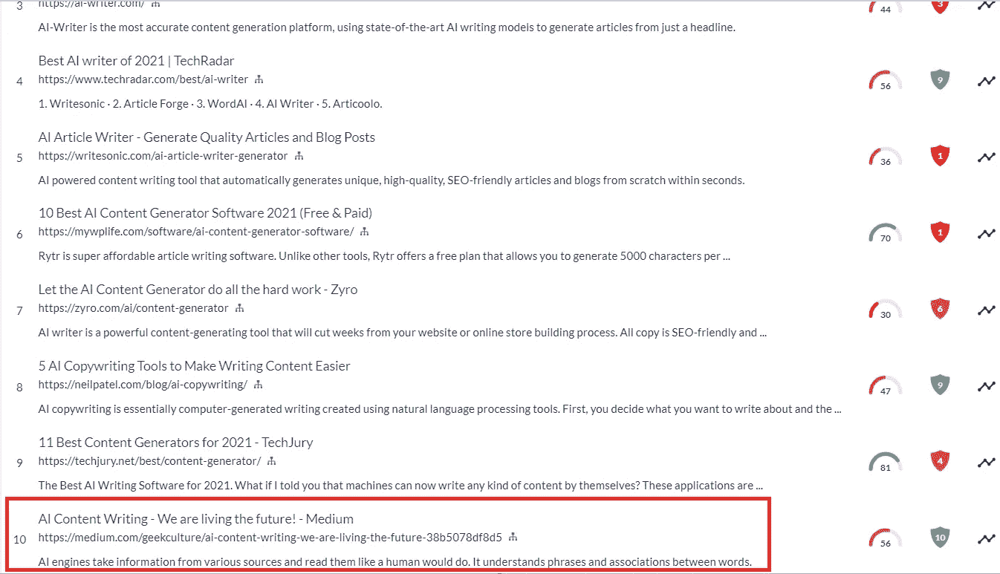

# AI 内容写作——我们活在未来！

> 原文：<https://medium.com/geekculture/ai-content-writing-we-are-living-the-future-38b5078df8d5?source=collection_archive---------10----------------------->

Feeling overwhelmed with your online business?

在线业务的潜力是无限的。这也是最容易和最好的赚钱方法之一。虽然从表面上看起来很简单，但成功经营一家网上企业需要做很多事情。

对于自筹资金或手头资源有限的中小型公司来说，挑战更大。

**内容写作只是**面临的巨大挑战之一。在线业务的长期战略是让高质量的有机流量流向你的网站，而不用每月花费数千美元在付费广告上。

**你所要做的，就是经常写出高质量的优化内容。**

这说起来容易做起来难……

你应该写哪种类型的内容？您需要多久发布一次新内容？你的内容应该专注于什么领域？如何想出一个很棒的标题，内容要多长？

你可能会想到一些问题，这些问题会让内容写作变得令人望而生畏。

但是不用担心！这就是人工智能拯救你的地方。

# 一个 AI 写手会产生优质内容吗？

这是想到的第一个问题。

人工智能作家产生优质内容的可能性有多大？

进行了一个实验来比较由人类写的文章和由高质量人工智能内容作者写的文章。

四个人的观众，不知道哪篇文章是由人写的，哪篇文章是由自动化文章写作软件写的，试图猜测是谁写的。

结果令人震惊！

50%的观众选择了人工撰写的文章，剩下的 50%选择了人工智能内容生成器撰写的文章。**这些商品被认为质量相同。**

虽然这起初听起来可能不起眼，但由 Ai 内容生成器编写的文章在大约 90 秒内完成(300 字的文章)，而人类需要 5 分多钟才能完成同样的任务。

一个人工智能内容生成器将很快写出你文章的主要部分，而你可以专注于其他重要的商业方面，如营销和推广。

人工智能正在数字营销领域实现巨大飞跃。人工智能生成符合特定标准的独特、可读文章的能力已经得到了很好的确立，这在很大程度上要归功于内容创作公司，它们使用的软件与我们今天将要讨论的软件类似。

作家的工作仍然很重要，但更重要的是你如何执行你的写作，并接触到你的目标受众。

# AI 内容生成器是如何工作的？

人工智能内容生成器将问题路由到人工智能引擎，人工智能引擎用于解决该特定问题。

人工智能引擎从各种来源获取信息，并像人类一样阅读它们。它理解短语和单词之间的联系。一旦理解完成，它将通过把单词和短语以一种有意义的方式放在一起，创造出结构独特的文章。

人工智能作家理解上下文，并可以通过使用适当的研究材料和关键词密度来撰写流畅的文章。

这项技术仍处于早期阶段，但它产生的结果已经足够好，可以用于内容创作。

# AI 生成内容有什么好处？

一个 [**AI 写手节省的**时间量远远超过软件的成本。****](/geekculture/ai-writer-a-better-writer-than-you-461a09f3da77)

你可以将业务中最重要的部分自动化，而专注于其他方面，如推动有机流量或 SEO，同时让机器做你需要它做的事情。

考虑到工作速度，人工智能内容作者提供的文章质量出奇的好。

人工智能生成的文章的问题是，你用得越多，它们听起来就越相似。与人工智能内容生成器相比，人类作家可以在更短的时间内创建一系列高质量的文章，因为人类可以浏览多个来源，理解它们，并产生完全不同风格的文章。

虽然这对于一些最新的人工智能作家来说也是可能的，但对于他们中的许多人来说仍然不是这样。

# 所以下一个大问题是:市场上最好的文章生成器软件是什么？

几个月前，我决定做一些彻底的研究，把我的时间用在我的钱上。

经过几个小时的工作，我设法找到了一个软件，它为你的钱提供了最好的价值和相对较好的内容。

我尝试了各种人工智能作家，但[**【Jasper AI】**](https://jasper.ai/free-trial?fpr=work-smart-not-hard&fpr=work-smart-not-hard&fp_sid=sa)脱颖而出，因为它有一个用户友好的界面，这使它成为各种营销人员和企业家的完美选择。

您可以使用它来创建:

-博客帖子，

-文章，

-报告，

-脸书广告，

-谷歌广告，

-社交媒体帖子等。请放心，您将不再需要旋转或外包它们！一切一键搞定！该软件还针对移动设备进行了全面优化，你只需在社交媒体上点击一下，就可以分享你的文章。

# 那么，与其他任何人工智能内容生成器相比，Jasper 有什么特别之处呢？

答案是双重的，**首先是易用性，其次是工作速度。**

[**【Jasper AI】**](https://jasper.ai/free-trial?fpr=work-smart-not-hard&fpr=work-smart-not-hard&fp_sid=sa)拥有直观的界面，这意味着您可以在没有任何内容创作软件经验的情况下开始使用。Jasper 的另一个优点是它的上市速度。它将在几秒钟内用正确的标点和格式写一篇完整的文章。

你最不需要的就是因为界面不友好而陷入数小时的培训中。另一个给**留下深刻印象的重要方面是 Jasper 为 SEO 格式化帖子的能力。**

我之前测试的每一个人工智能软件都给出了相同的结果——文章很难阅读，也很难编辑，因为它们的格式很糟糕。一个人类作家可以花几分钟来格式化一篇文章，但是 Jasper 可以在几秒钟内完成，这让你的工作变得更加容易和快速。

最后但并非最不重要的是，这款软件的起价是 27 美元，对于这么大的价值来说，这真的很便宜。

贾斯珀能够写各种各样的主题，它可以在几秒钟内产生高质量的独特的文章。

如果你以前从未使用过人工智能作家，你可能仍然会持怀疑态度。我也是这样，直到我用了一个。

总的来说，人工智能写作仍在证明他们可以产生高质量的内容。人工智能内容生成器背后的大多数公司都提供免费试用期，包括免费学分。

在免费试用期间，你甚至不需要支付 1 美元，就可以确切地了解人工智能写作是如何工作的。现在你会有足够的时间来体验人工智能的力量。

我不会为任何不提供免费试用的人工智能作家付费，因为这意味着他们想让你注册一个可能达不到你预期的未知写作软件。

Jasper AI 提供 5 天的免费试用期，免费单词多达 10，000 个。 你可以测试一下，保证你甚至可以用人工智能写出一篇高级的小众文章。

# 底线！

底线是人工智能作家可能无法完全取代人类，但他们肯定可以写出高质量的文章，可以发表在博客或网站上。

在未来，人工智能也有望取代人类作家，最初的重点将是电子商务网站，它们将帮助产品页面生成具有 SEO 最佳实践的新鲜内容。

不要忘记，首先实施人工智能的公司或企业家将在市场上具有竞争优势。

你猜怎么着？

没错，这篇文章是 **Jasper 用不到一个小时写出来的！**

在 Medium 上发表这篇文章一个月后，我们已经在搜索引擎结果页面上排名**第十。这证明了人工智能写作助手可以提供高质量的内容。**

别忘了关注**我们新的脸书页面**，我们会确保给你更多关于如何在有限的时间内高效地写出高质量内容的好建议。

