# 人工智能优先构建金融科技系统的方法

> 原文：<https://medium.com/geekculture/ai-first-approach-to-building-fintech-systems-f96bffd75b48?source=collection_archive---------47----------------------->

# 本文的结构

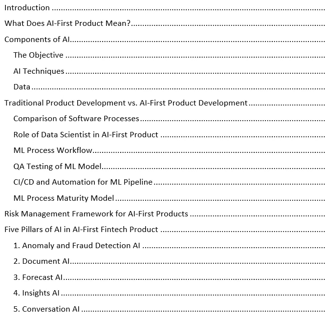

# 介绍

世界各地的公司围绕人工智能的兴奋和喋喋不休已经达到了一个临界点——今天听起来对人工智能感到兴奋是不够的。公司正在将人工智能部署在商业战略的中心，以从竞争对手那里获得优势，并为客户提供更多价值。下图说明了人工智能在各个行业的影响。

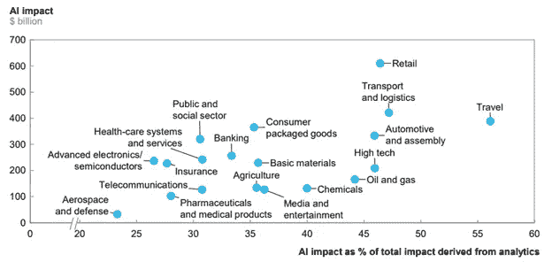

Source: McKinsey

然而，构建基于人工智能的产品或解决方案比构建传统(非人工智能)产品更具挑战性。在本文中，我将分享在构建 [Tera 平台](https://tera.cloud/)时所使用的流程和框架。Tera 是一个基于人工智能的统一金融平台，用于企业管理银行、信用卡、支付和借贷。

# AI-First 产品是什么意思？

David Bessis 在[的这篇](/@davidbessis/building-ai-first-products-90d503ccd43a)文章中很好地解释了人工智能优先的概念，文章中的下图很好地说明了人工智能优先的方法。人工智能优先的方法利用人工智能作为产品设计过程的起点。AI-first 产品以数据和机器学习算法为核心，构建颠覆性的产品体验。

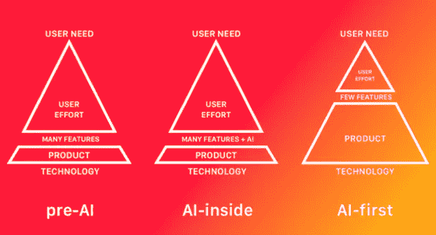

Source: David Bessis on medium.com

# 人工智能的组件

## 目标

知道你希望人工智能完成什么是人工智能优先产品中最重要的方面。

## 人工智能技术

最终，人工智能的价值不在于模型本身，而在于组织驾驭它们的能力。广泛的 ML 方法可用于构建应用程序，包括但不限于分类、聚类、异常检测、动态编程和统计，以及用户行为建模、社交网络分析和协作过滤。为手头的问题类型选择正确的人工智能技术是迈向成功的第一步。下图说明了人工智能技术在各个行业中的相关性。

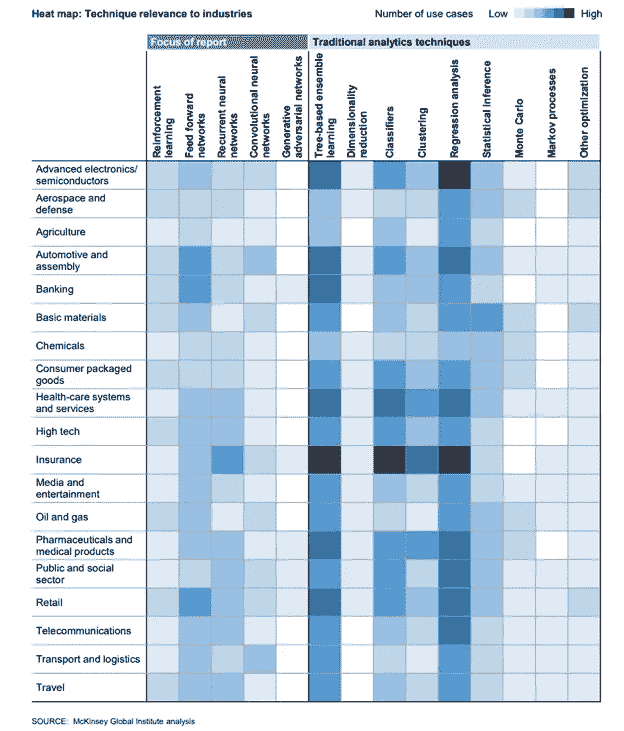

Source: McKinsey

## 数据

收集质量数据是拥有人工智能优先产品的最大动力。由于许多机器学习技术都围绕着从大型数据集学习，以 ML 为中心的项目的成功通常在很大程度上取决于数据的可用性、质量和管理。此外，还有不同的数据类型，包括结构化/半结构化数据、时间序列数据、文本、图像、音频、视频。下图说明了数据类型与用例的相关性。

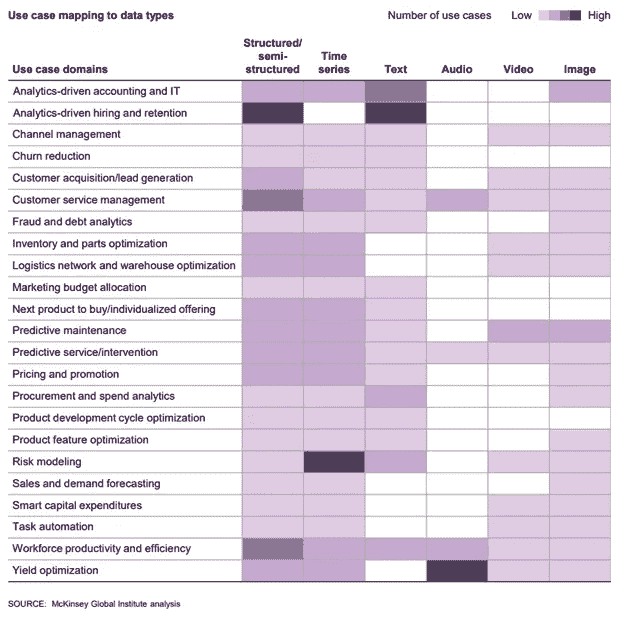

Source: McKinsey

下面的文氏图说明了对于一个人工智能优先的产品来说，将人工智能的所有组成部分分类的重要性

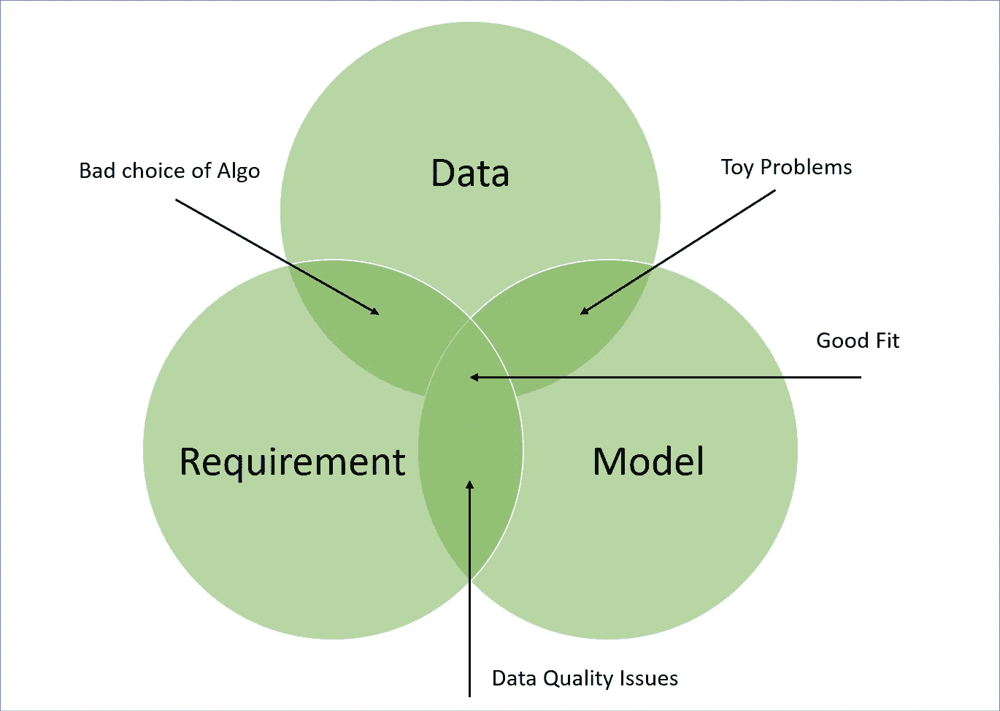

# 传统产品开发与人工智能优先的产品开发

## 软件过程的比较

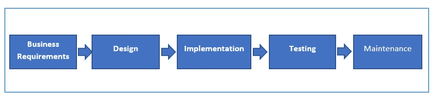

Traditional Software Process

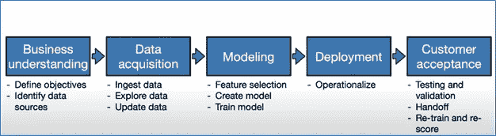

ML Software Process

以下是 AI-first 产品的关键方面，这些方面使其从根本上不同于以前的软件应用领域:

1.  传统的软件工程方法，如瀑布和敏捷，不适用于基于 AI/ML 的软件开发。当项目的阶段划分完全是基于关键程度和实现成本对大量的功能积压进行优先排序时，敏捷非常有用。
2.  与其他类型的软件工程相比，发现、管理和管理机器学习应用程序所需的数据要复杂和困难得多
3.  模型定制和模型重用需要的技能与软件团队中常见的技能非常不同
4.  与传统的软件组件相比，人工智能组件作为不同的模块更难处理——模型可能以复杂的方式“纠缠”在一起，并经历非单调的错误行为

## 数据科学家在 AI-First 产品中的角色

机器学习涉及许多与数据相关的活动。在高层次上，它涉及 a)收集 b)分析和 c)使用和传播数据。下表总结了每个类别下的单个任务。

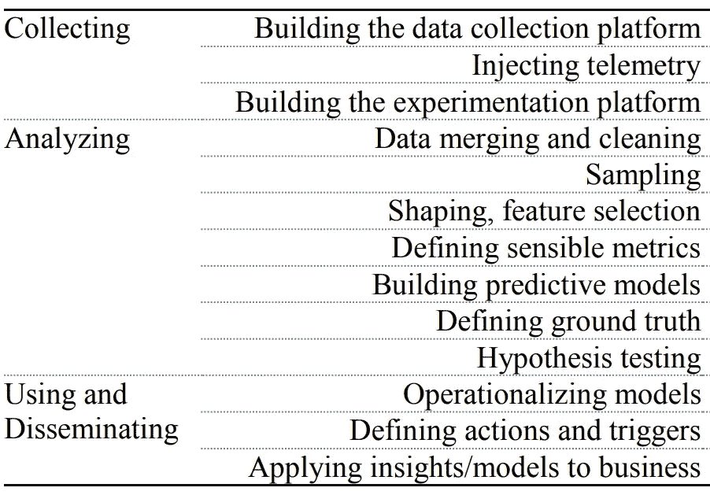

ML 团队成员在执行这些任务时使用了几种定量和统计技术。在传统的产品开发世界中，你有 UI、后端、全栈、数据库、基于测试技能集的资源的组合。鉴于 ML 工作的性质涉及数据和量化技术，因此需要专门的技能集-数据科学。数据科学家在人工智能优先的产品中发挥着关键作用。

## ML 流程工作流

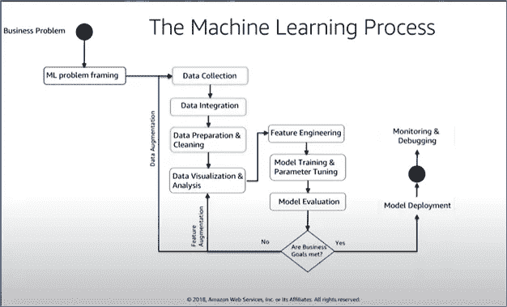

## **ML 模型的质量保证测试**

以下是需要测试/质量保证的机器学习模型的一些方面:

*   **数据质量**—QA 的角色是将测试机制落实到位，以验证用于培训的数据是否经过净化。
*   **特性质量**
*   **最大似然算法的质量—** 将最大似然数据集分成训练测试桶是一种常见的做法。根据数据集的使用情形和可用性，可以是 80–20(80%的数据保留用于训练模型，20%的数据保留用于测试模型)或 70–30。使用更小的数据集可能会产生*模型风险*(我将在本文后面介绍)。

## ML 管道的 CI/CD 和自动化

自动化是 AI-first 产品开发的一个重要方面。自动化使团队能够更有效地执行数据处理、转换和标记，以便 ML 模型可以使用它。效率的提高使团队能够加快实验速度，并在实验新模型时使用实时数据。下面是基于 AWS 堆栈构建的 ML 管道的参考架构。

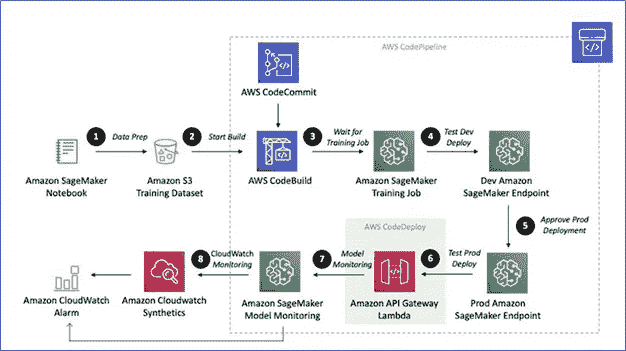

ML Pipeline

## ML 过程成熟度模型

几十年来，公司依赖能力成熟度模型(CMM)作为评估组织软件开发过程的基准。微软在[这篇](https://www.microsoft.com/en-us/research/uploads/prod/2019/03/amershi-icse-2019_Software_Engineering_for_Machine_Learning.pdf)研究论文中提出了一种新的定制机器学习过程成熟度模型，用于评估软件团队在构建人工智能优先产品方面的卓越进展

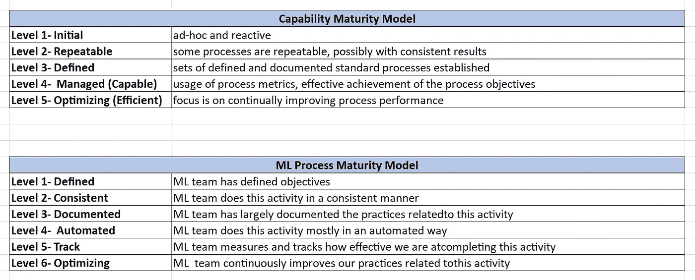

# 人工智能优先产品的风险管理框架

人工智能模型的使用带来了*模型风险*，这是基于不正确或误用的模型输出和报告的决策的潜在不利后果。尤其是在金融服务领域模型中，风险可能会导致财务损失、糟糕的业务和战略决策，或者损害银行的声誉。

美联储和 OCC 货币监理署在[sr11–7](https://www.federalreserve.gov/supervisionreg/srletters/sr1107a1.pdf)中提出的风险框架可以作为构建 AI-first FinTech 产品的参考。

模型风险的产生主要有两个原因:

1.  当对照其设计目标和预期的业务用途来看时，模型可能有根本性的错误并产生不准确的输出
2.  模型可能被错误或不恰当地使用，或者对其局限性和假设有误解。随着模型越来越复杂，输入和假设的不确定性越来越高，使用范围越来越广，潜在影响越来越大，模型风险也会随之增加。

以下是来自**SR11–7**的主要亮点:

1.  ***模型开发、实现和使用—*** 遵循模型设计、开发、实现和使用的各个方面的最佳实践，包括—模型底层的设计、理论和逻辑；稳健的模型方法和处理组件；严格评估数据质量和相关性；和适当的文件
2.  ***模型验证—*** *m* 模型验证是一组过程和活动，旨在验证模型按照预期执行，符合其设计目标和业务用途。综合验证的关键要素包括:a) *评估概念的合理性，b)持续监控，c)结果分析*。
3.  ***治理、策略和控制—*** 强有力的治理通过定义相关风险管理活动的策略、实施这些策略的程序、资源的分配以及用于测试策略和程序是否按规定执行的机制，为风险管理职能提供明确的支持和结构。强有力的治理还包括模型开发和验证的文档记录，该文档记录足够详细，以使不熟悉模型的各方能够理解模型如何运行，以及模型的局限性和关键假设。

# 人工智能的五大支柱-第一金融科技产品

## 1.异常和欺诈检测人工智能

## 2.文件 AI

## 3.预测人工智能

## 4.洞察 AI

## 5.对话人工智能

在我的下一篇文章中会有更多关于这五个方面的内容。敬请关注。