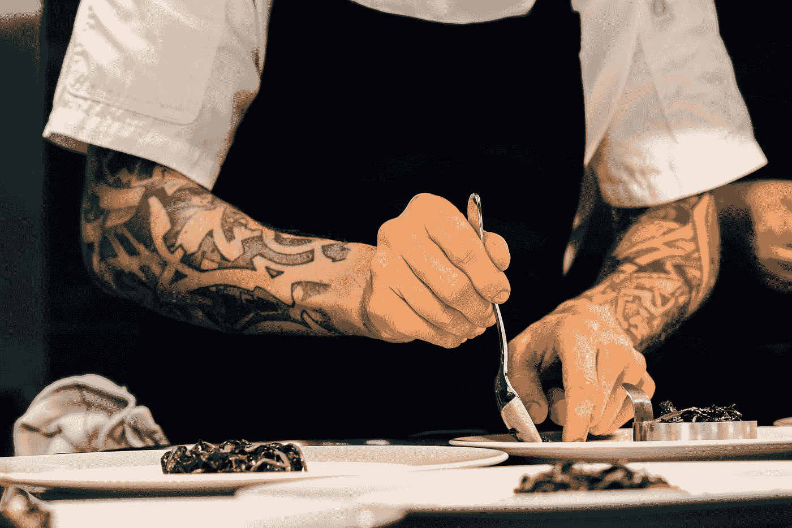

# 人工智能在食品行业的应用:创造成功的口味和产品

> 原文：<https://medium.com/geekculture/ai-for-food-business-creating-winning-tastes-and-products-dd69e160d13b?source=collection_archive---------12----------------------->

## 想象一个人工智能厨师

Photo by [Sebastian Coman Photography](https://unsplash.com/@sebastiancoman?utm_source=medium&utm_medium=referral) on [Unsplash](https://unsplash.com?utm_source=medium&utm_medium=referral)

如果人工智能能够[预测](https://www.hpe.com/us/en/what-is/predictive-analytics.html)从网络安全到零售的所有行业中决策的可能事件或潜在后果，它能否创造新的口味组合并预测人们对新食品的反应？

根据研究人员的说法，当然可以。

# 问题是: