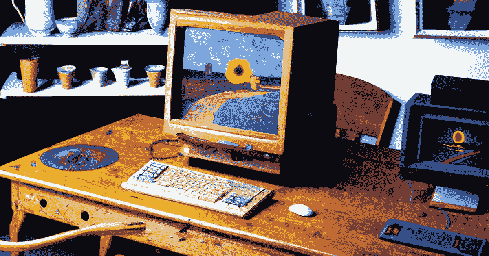
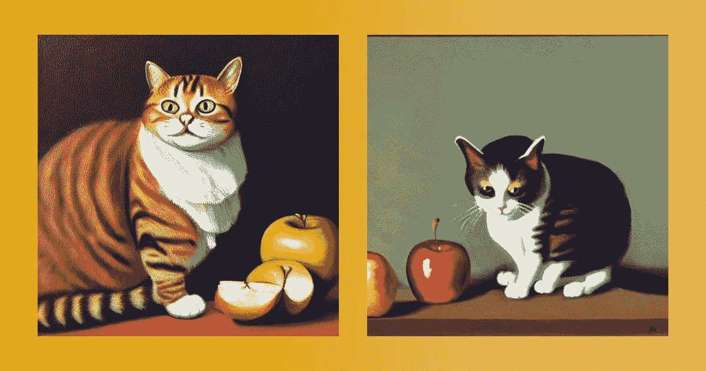
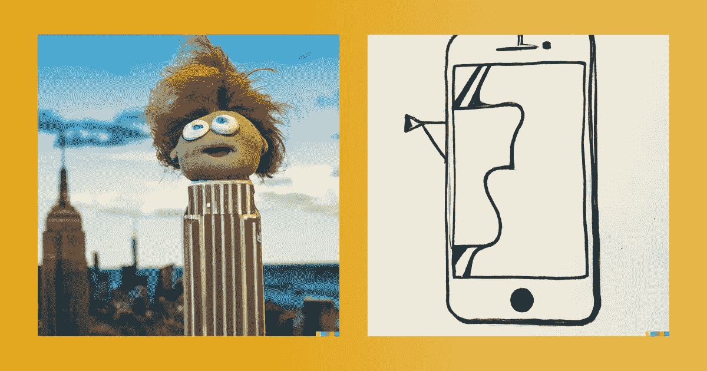

# 人工智能生成的艺术是一件非常非常重要的事情

> 原文：<https://medium.com/geekculture/ai-generated-art-is-a-really-really-big-deal-b17d41dec219?source=collection_archive---------9----------------------->

## 而且只会越来越快

Via DALL-E 2

这里有一个大胆的声明:在我的一生中，我从未见过像现在人工智能生成的艺术所发生的那样不可思议的事情。

我仍然认为自己很年轻，但在我在这里的几十年里，我见证了互联网从一个书呆子般的新奇事物到社会的连接结构，计算机图形从最初的任天堂娱乐系统到逼真的故事片，以及世界上所有的知识被组织、连接和塞进我们的口袋。当你现在通过长远的眼光来看待这些事情时，所有这些事情都令人兴奋不已，甚至在那一刻，这一过程中的许多步骤都令人印象深刻。

但是现在人工智能正在发生的事情是以天为单位，而不是以年为单位。在这个迅速发展的前沿，每周都有新的、迄今无法想象的东西出现。

人工智能生成的艺术就是它在罐子上写的东西:由一个复杂的软件创建的图像。在这个领域的前沿有许多竞争项目，但它们或多或少都以相同的方式工作:人工智能在成千上万张参考图像上接受训练，学习看起来像“苹果”或“猫”的东西意味着什么，或者当某样东西是“油画”或“GoPro 镜头”时意味着什么

在所有这些训练和编程之后，该软件可以对用户的提示做出反应，就像“一只猫吃苹果的油画”，并吐出类似这样的内容:

Both renders via Stable Diffusion

已经很酷了。但是当你对它感到有点奇怪时，真正有趣的东西就来了，比如“像提线木偶一样建造的帝国大厦”，或者“巴勃罗·毕加索画的 iPhone”

Both renders via DALL-E 2

如果这一切都停止在这里，用愚蠢的文字和风格字符串生成时髦的图像，这已经是不可思议的了。但这仅仅是开始。在过去的几个月里，我们看到了大量的创新和实验:

我们才刚刚开始，我们已经在努力解决人工智能艺术的伦理问题。这些工具的一个令人毛骨悚然的早期用例，就像技术史上的许多事情一样，涉及到被称为“深度假货”的非自愿色情图像。风格独特的艺术家抱怨说，这些平台催生了一种高科技抄袭形式。相关的，当知识产权是一些代码而不是人类创造者的产品时，关于谁拥有什么的争论才刚刚开始。

这一领域的创新步伐正在加快，我们可以开始看到它的发展方向。有了合适的工具和人才，已经有可能创造出如此逼真的虚拟数字媒体，以至于普通人无法将它与真实区分开来。现在，这些工具很难使用，人才短缺。但是很快，很快，这些障碍就会消失，当我们到达一个任何人都可以创造任何东西的世界时，那些善意的和那些有更邪恶目的的人，我们相信我们所见所闻的能力将随之消失。

本世纪决定性的劳动力和经济问题将是当我们越来越多的生活实现自动化时会发生什么——从无人驾驶汽车到算法银行家。这个时期决定性的社会和文化问题可能是，当同样生动的技术火花挑战我们所认为的艺术，并最终挑战真理时，会发生什么。

# 自己去玩玩看

目前有许多项目正在做着令人着迷的事情。你会看到在 Twitter 和其他地方分享的最受欢迎的工具是 [Craiyon](https://www.craiyon.com/) ，正式名称为 DALL-E Mini——这是一个受该领域最大的玩家 [OpenAI 的 DALL-E 2](https://openai.com/dall-e-2/) 启发而快速开发的工具，它需要更多的资源，需要邀请。类似的平台 [MidJourney](https://www.midjourney.com/home/) 对 beta 开放，可以通过 Discord 实例使用，也可以让你实时看到其他人的世代。为了让最大的玩家也能加入进来，Stable Diffusion 最近引起了很大的反响，可以在这里下载到你自己的电脑上运行。

[‍](https://huggingface.co/spaces/stabilityai/stable-diffusion) 这些工具都有自己的特点，你可能需要尝试一下，找到能给你最好结果的提示类型。但是一旦你这样做了，你会被一些东西震撼，套用 f .斯科特.菲茨杰拉德的话，与我们的惊奇能力相当。

*最初发表于*[*【https://www.benguttmann.com】*](https://www.benguttmann.com/blog/ai-generated-art-is-a-really-really-big-deal)*。*