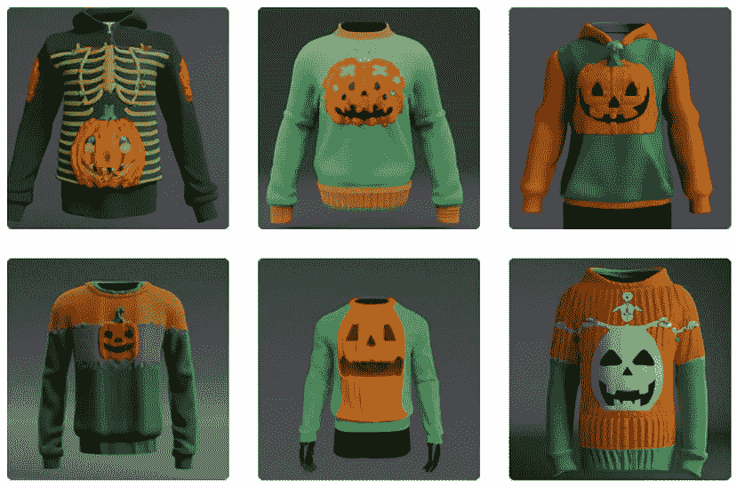

# 人工智能生成的时尚是 DIY 设计的下一波浪潮

> 原文：<https://medium.com/geekculture/ai-generated-fashion-is-the-next-wave-of-diy-design-d16d6f232456?source=collection_archive---------9----------------------->

AI 会设计你下一件丑丑的节日毛衣吗？

虽然听起来很奇怪，但机器学习的最新进展使之成为可能。CALA 是一个“时尚操作系统”，帮助设计师设计草图、原型和生产新产品。它是第一个实现 OpenAI 的 DALL E API 的服务。