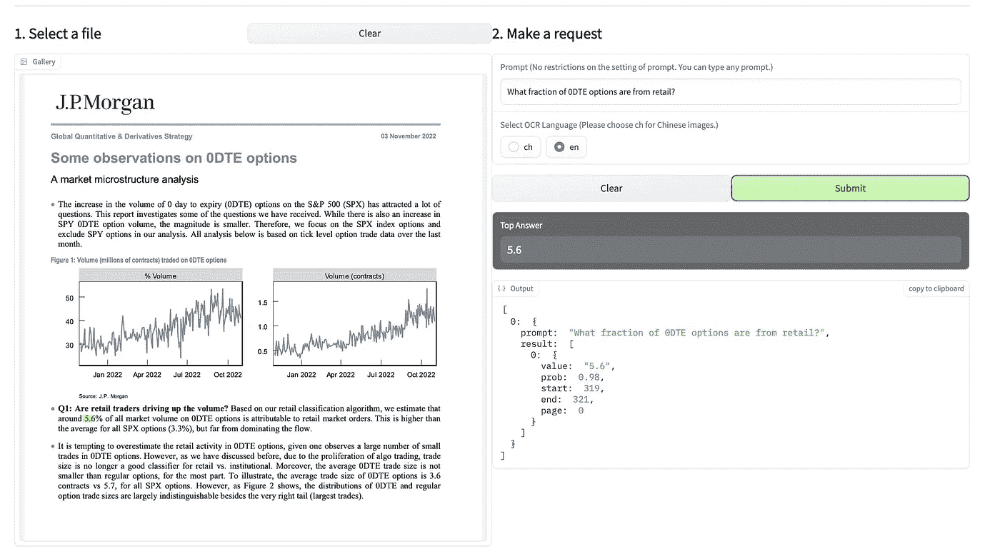
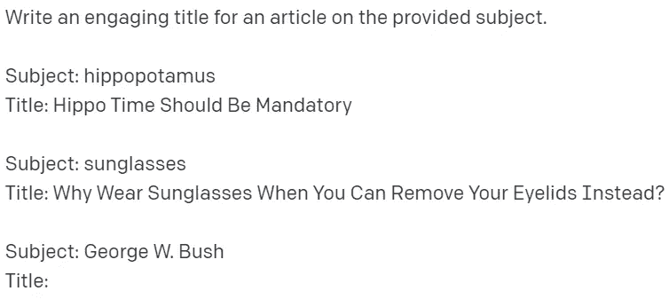
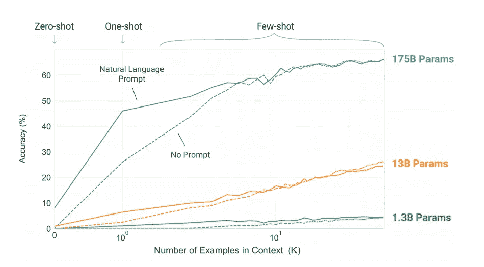

# 人工智能生成的库存照片将取代 Shutterstock & Getty

> 原文：<https://medium.com/geekculture/ai-generated-stock-photos-set-to-dethrone-shutterstock-getty-329b8c05c914?source=collection_archive---------0----------------------->

Source: [Sharif Shameem](https://twitter.com/sharifshameem/status/1593393961980162048/photo/1), Aperture Lexica

## 另外:一个简洁的提示技巧可以显著提高语言模型的性能。

W 欢迎来到 [**风口浪尖**](https://nicksaraev.com/#/portal/signup) :用*简单*英语讲解的前沿 AI 新闻(及其含义)。

在本周的杂志中:

*   人工智能生成的库存摄影成熟到废黜摄影爱好者&替代品
*   轻松回答 pdf 和图片上的问题可以节省数百万美元
*   一个提高语言模型性能的聪明的提示技巧

让我们开始吧。

# 直接从 pdf 中提取、分类和回答问题—只需几秒钟

数百万实习生、受薪员工和高管受雇于全球各大公司，他们的首要工作职责是从 pdf 文件中提取或总结信息。

这个行业，更准确地说是数据分析和提取，是一个千亿美元的市场。

这也是非常自动化的，未来的公司已经在实施先进的提取工具，比竞争对手多做几个数量级。

[DocQuery](https://huggingface.co/spaces/impira/docquery) 只是一个例子。这是一个人工智能工具，可以在几秒钟内读取 pdf 文件&并自动提取数据——包括关键文本、问题，甚至调查中的数据。

它的操作基于自然语言界面，使用直观，*而且是免费的*:这个模型[托管在 HuggingFace](https://huggingface.co/spaces/impira/docquery) 上，你可以下载&并随意扩展。

# 我们如何利用这一点呢？

像这样的模型被搁置了，因为人们普遍缺乏对如何将它们集成到业务流程中的理解。

但是应用程序是无穷无尽的。

例如，大型企业可以使用 DocQuery 来:

*   从财务 pdf 中自动生成要点摘要:指标、要点、数字等。
*   按类型对文档进行分类(如发票、合同、法律文书)，以便于转发给正确的部门。
*   通过提取关键文本和图形，灵活地重新格式化 pdf，然后将它们重新排列成一个新模板。
*   从客户调查中提取数据，生成可操作的见解。

对于一个有经验的专业人员来说，这些任务中的任何一项都可能需要一个小时或更长时间才能完成。但是通过在管道中添加灵活的数据提取，您可以在几秒钟内获得相同的结果。

例如，我实现了一个(非常)简单的系统，在 [1SecondCopy](https://1secondcopy.com/) 签订合同，这为我节省了 60–90 分钟/周。

我们有时一天会接到三四份合同。它们通常是保密协议、工作协议等等。自然，解析法律术语需要相当多的时间。

但是对于 DocQuery，我只是简单地问一个问题，比如“支付多少钱？”或者“付款条件是什么？”几秒钟就能得到答案。

请记住，我们是一个非常小的创业公司，这种方法可以为您的中小型企业节省数百万美元。

# 人工智能生成的库存摄影很快将取代摄影爱好者和替代品

[Pixel Vibe](https://pixelvibe.com/) 是一个新的人工智能生成的股票摄影平台。而它的用户体验*摧毁了* Shutterstock、&其他传统股票媒体。

你不需要挑选特定的搜索词，或者花几个小时从一个平台跳到另一个平台，你只需点击一张图片&它就会弹出数百个相似的图片供你选择。

最终，你会集中在你脑海中的照片上——甚至不需要输入搜索短语。

这只是人工智能图像工具可能性的又一步。随着稳定的传播，现在的质量在许多方面与真正的 DSLR 摄影难以区分，股票媒体行业将很快陷入困境。

# 我们如何利用这一点呢？

不到 36 小时前，Pixel Vibe 在产品搜索上发布。不要误解我的意思，UX 肯定比传统的股票网站好得多，但这并不能说明什么。

对于合适的公司来说，这个空间已经非常成熟，可以萌芽并扰乱竞争。股票媒体公司已经因 DALL-E 2 和稳定扩散而出血(它们开始出血只是时间问题)。

下一代平台能够生成——然后智能地搜索——如下图所示的图像，可以很容易地将这种损失转化为成功的商业模式。

那么，如果你想在实践中这样做呢？

*   使用或训练一个类似于 [Lexica 的光圈](https://lexica.art/)的模型。我会饶了你的细节，但如果你选择训练自己，你会叉稳定扩散和微调 DSLR 照片。
*   抓取 [Shutterstock](https://www.shutterstock.com/images) 或 [Getty](https://www.gettyimages.ca/) 创建关键词列表。100K 以上的关键词最佳。
*   现在你有了一个关键词列表，生成一个风格短语列表:镜头类型、光圈和其他摄影术语。想想类似*适马 30 毫米 f1.4* 、*微距、散景、*等短语。
*   通过使用不同风格的短语迭代每个关键字，生成一百万或更多的图像。例如，如果一个关键字是*街头微笑的女人*，那么单个代可能是*街头微笑的女人，sigma 30mm f1.4* 。另一个可能是*微笑的女人街，佳能 50mm f1.8* (如果你好奇，这正是我如何创造了[1 秒画](https://1secondpainting.com/))。
*   像 AWS 一样存储图像、它们的文本嵌入和它们的图像嵌入。或者，您可以跳过文本/图像嵌入步骤，通过另一个为每个图像生成标题或标签的模型来运行您的图像(为了更快的搜索)。
*   你现在有一个类似的后端，有更多的图像。你需要做的就是在前端提高客户 UX——通过产生更快的结果，创造更好的设计，等等。
*   最后，走网飞路线，收取可承受的月费。在普通人手边有最先进的图像生成器的未来，基于图像的模型是行不通的。

我们说话这会儿可能有人在做这个。而首先利用这一点的人将会看到巨大的好处。

# 使用这种快速工程技术改进语言模型性能

少量提示是一种策略，在这种策略中，你提供几个例子来说明你希望你的语言模型做什么，然后它使用上下文来引导正确的结果。

一个愚蠢的标题生成用例:

性能几乎总是随着提供的示例数量单调增长。这很有意义——如果你给模型更多的上下文，为什么它不能给你一个更好的答案呢？

但是很难确切地知道提供什么样的例子。*特别是*如果你的提示是动态的，总是在变化，就像你把它和一个应用程序集成在一起。

另一个因素是提示的标记长度——在单个查询中发送的标记越多，由于[自我关注](https://arxiv.org/abs/1706.03762)的数学原理，模型的性能通常会变得越低。

因此，包含一组既简短又相关的例子对你最有利。如果这样做，模型性能会提高，因为上下文得到了改进，长度也变短了。这就是黑客的用武之地。

# 怎么才能利用呢？

@mathemagic1an 在 Twitter 上发布的诀窍是**将你的例子的文本嵌入与你的提示进行比较，然后选择最相关的集合**(通过余弦相似度)。

如果你不熟悉机器学习背后的数学，这听起来可能很复杂。但是要分解它:

*   文本嵌入是文本的[数字表示。例如，短语“Google 很棒”可以表示为一个大型的多维矩阵。](https://www.tensorflow.org/text/guide/word_embeddings)
*   首先，您需要计算提示(单独)和示例(单独)的文本嵌入。
*   然后，使用距离度量**余弦相似度**来比较文本嵌入，计算它们之间的差异。
*   最后，你可以选择数字上最接近的嵌入(即具有最大的余弦相似性)并将它们作为少数镜头的例子添加进来。
*   现在，您有了一个与上下文相关的语言模型的“基础”,这将在您提示时带来更好的性能。

像这样有创意的方法一直在被发现和实现。这也是我如此热爱机器学习的原因之一。

这是一个总结！

喜欢这个吗？考虑和你认识的人分享。如果你读这篇文章是因为你认识的某个人发给你的，请点击[这里注册](https://nicksaraev.com/#/portal/signup)获取下一期简讯。

下周见。

尼克