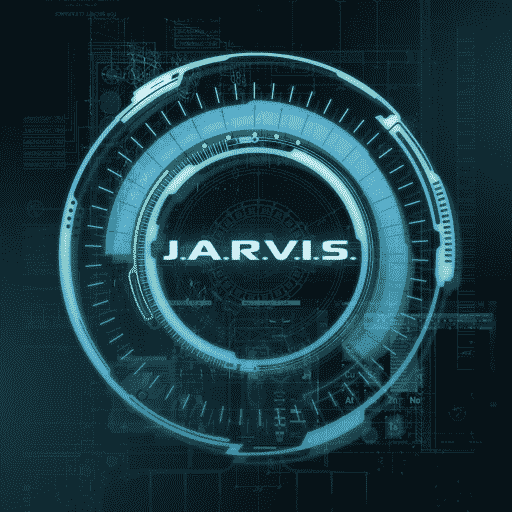
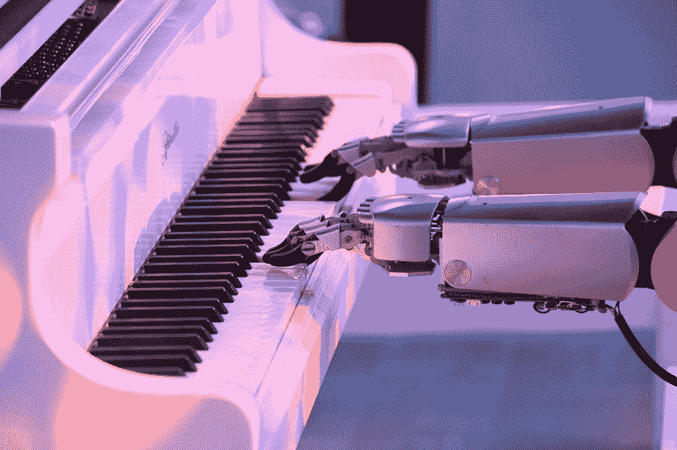
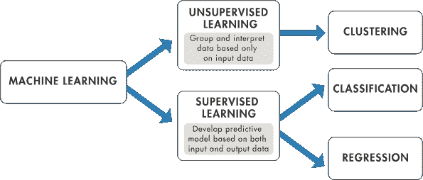
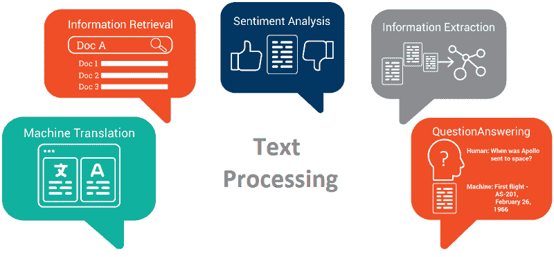
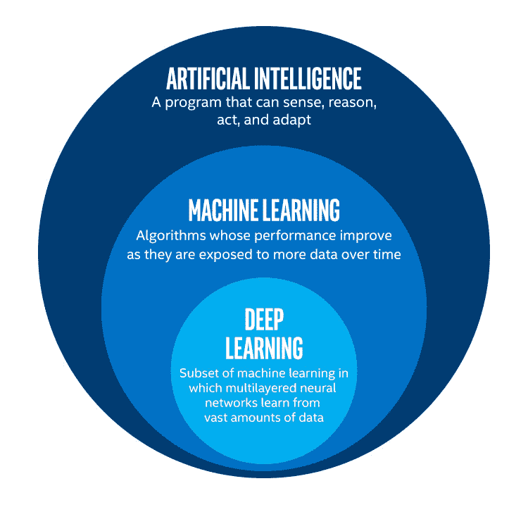
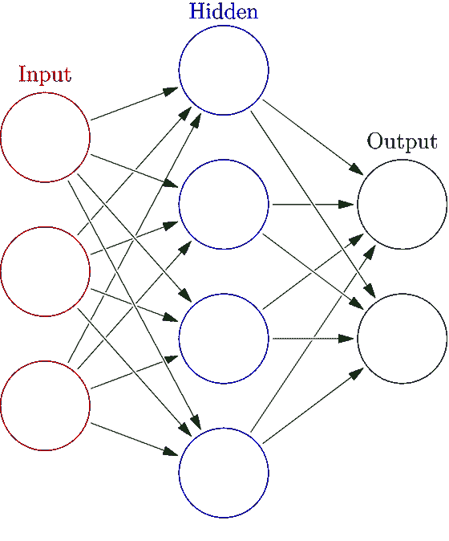
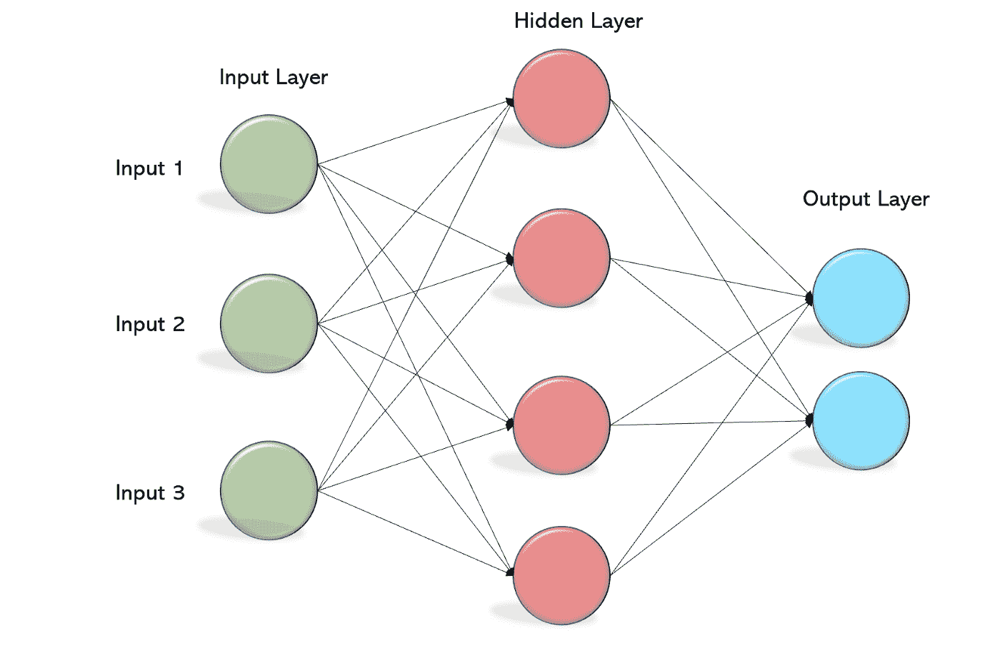

# 好吧，那这是什么？

> 原文：<https://medium.com/geekculture/ai-ght-whats-all-this-then-f2888c8ef263?source=collection_archive---------8----------------------->

## STEM 中的宝石:人工智能综合介绍

贾维斯，请拉一些快速文章教我关于 AI…贾维斯？贾维斯。

哦，等等，我的错，我忘了在漫威之外你不是真实的。请原谅，我只是要去角落里抽泣，而 Siri 告诉我，她“不太明白”，在一个无休止的，折磨人的循环。

如果你是地球上唯一一个从未看过 MCU 电影的人，而你*又不太明白，那绝对没关系(但我希望你很快转向更令人兴奋的摇滚)！我在跟你开玩笑，概要是这样的: [J.A.R.V.I.S.](https://en.wikipedia.org/wiki/J.A.R.V.I.S.) 是亿万富翁天才托尼·斯塔克(Tony Stark)创造的一个虚构的人工智能系统，本质上是一个虚拟助手，可以做任何事情，从根据大量数据进行预测到模仿人类语言(偶尔还会讲笑话)，我们很快就会看到这比看起来更难！*

现在，你们中的一些人可能会想 WTF ( **W** ell，**T**what ' s**F**Anta stic)，但我不知道这有什么关系？耐心点，小蚱蜢。如果你还没有猜到，今天我们将学习人工智能，即人工智能(这就是我们亲爱的 J.A.R.V.I.S .)！

# **什么是 AI？**

让我们进入正题:人工智能到底是什么？嗯，这么想吧:就像人工香料被设计用来模仿自然成分一样，人工智能也被设计用来模仿人类智能。简而言之，人工智能就是要弄清楚如何让机器变得如此智能，以至于它们可以在没有我们广泛帮助的情况下解决问题。

现在，从好莱坞到科幻，各种媒体对人工智能有一点误解——它经常被认为是可怕的未来威胁。但是，现实是，人工智能已经在这里，存在于我们周围——它只是没有雄辩地说或试图消灭我们……还没有；).它为搜索引擎提供动力，推荐你的下一个网飞盛宴，并且正在彻底改变科学和医疗保健:放射科医生可以使用它来检测肿瘤的精确形状和体积，天文学家使用人工智能来寻找遥远太阳系的系外行星。它甚至被用于免费上诉停车罚单，并在短短几个月内推翻了超过 300 万美元的罚款！我刚开始学开车，帮我报名吧。(对于那些好奇的人来说，它被称为 DoNotPay，现在已经变成了“机器人律师”！)

人工智能可以实现的可能性是无限的，从防止欺诈到应对气候变化，再到增强我们的数字媒体体验。事实上，已经有一些人工智能生成的音乐与人类创作的歌曲难以区分！

因此，当前的人工智能可以完成特定的动作，如预订会议，管理在线购物建议，驾驶汽车——无论它被告知做什么。它在分析大量数据以完成这些具体任务方面非常出色，但 AI 不太擅长将这些技能转移到其他任务，一次性学习东西，或掌握抽象概念——这些都是人类智能的一部分。此外，它没有自我意识，实际上无法像人类一样思考。这些人工智能也不是严格意义上的创意，尽管亚马逊 Alexa 的歌曲 [**《云中雨(当我的 Wi-Fi 离开我)】**](https://youtu.be/roJptM1qYrQ) 是一部音乐杰作。

## **更智能的机器？**

那么，如果一台机器可以完成所有这些任务，锻炼创造力，等等，会怎么样呢？这就是我们进入科幻领域的地方——这种更高级的智能被称为**人工通用智能(AGI)** ，即机器可以理解、学习和执行任何人类可以完成的任务。接下来是更广泛的智能类型:**人工超级智能(ASI)，**比*地球上所有集体思维*都聪明的机器。那是相当恐怖的(这很合适，因为恐怖季节刚刚结束)！但是不用担心——AGI 和 ASI 目前都不存在，大多数人认为还有很长的路要走。

我们到底是如何创造 AI 的？你之前可能听说过的主要工具和方法有机器学习、深度学习、强化学习、自然语言处理。这是一大堆有点吓人的词，目前没有多大意义——所以让我们来揭开它们的神秘面纱吧！

# **机器看，机器做？**

你有没有困惑过，为什么新闻总是像数据这样，数据那样？或者想知道为什么每个人都如此关注数据隐私？当然，你不希望你的社会安全号码被泄露，但也许你个人认为*你不会介意别人看到你的基本信息，因为这可以节省你下载约会应用程序的时间？没有吗？？…好了，继续！*

数据如此重要的原因是因为****我们收集的数据越多，我们就能制造出越智能的机器——这正是**机器学习(ML)** 所做的。机器从庞大的数据集中学习，并使用它们的知识来应对它们从未见过的情况！因此，这是一个非常直观的步骤，即更多的数据可以更好地训练算法/机器，从而产生更准确的输出。****

****这与旧方法有何不同？传统的方法是向你的算法展示一个固定的数据集，并对每个数据集准确地告诉它们如何响应。但是通过机器学习，机器有能力学习并产生新的行为，而这些行为不是明确编程的…如果你仔细想想，这与人类的智能非常相似！我们被教授特定的技能，然后能够在不熟悉的情况下运用这些知识。因此，机器学习是人工智能的一个重要方法是有意义的。****

****好了，这只是现在的一大堆话题，让我们来看一些细节和例子吧！****

## ******监督与非监督学习******

****让我们假设我们的机器最近听了比利·周的《钢琴人》,现在急切地想要我们教它如何弹钢琴。我们可能不能把它单独留在一个放着一堆乐谱的房间里——它不知道该拿它们怎么办！相反，我们会从教它每个音符的正确手指位置开始——这叫做**监督学习**！一般来说，监督学习用带有标记点的数据集训练机器，并告诉它正确的反应/决策是什么。在这次训练后，我们给机器新的、不熟悉的数据来响应，我们祈祷它有足够的训练来自己做出好的决定(有点像我父母送我去大学时会做的)。因此，对于我们的钢琴演奏机器，我们可以给它不同的乐谱或不同的节奏，甚至可能是不同的乐器(即使机器一心想着钢琴)，然后看看它会做什么！****

********

****当你已经知道你试图预测的结果的标记数据时，应该使用监督学习。假设我想弄清楚我的电子邮件是真的还是垃圾邮件。(我*希望*继续帮助你，尼日尼亚王子，但是我的钱快用完了，还没有看到利润！)要做到这一点，我会使用一种特定类型的监督学习:**分类。**分类技术用于将数据分类，如语音/书写识别或医学成像。因此，如果你想快速地将大量数据组织成离散的组，分类是你的救星！(…我知道，但是你试着想出一个和分类押韵的好词。)一个监督学习的真实世界应用，你问？临床医生可以使用患者的数据(如年龄、体重、血压、病史等。)来预测他们是否会在一年内心脏病发作——非常重要的事情。你能想象现实中的人整理所有这些数据，试图准确地为数千名患者做出预测吗？机器学习的力量就在于此。****

****现在，如果我想预测我最好的朋友回复短信的时间(显然没有预测心脏病发作重要，但目前太长了)，该怎么办？这个真的不能归为一类:(…但是别怕，**回归**来了！分类是为了预测离散的情况，而回归技术预测连续的反应——如股票价格或温度变化。(地球母亲不会喜欢那个的。)如果你的数据是连续的，而你试图预测的反应是实数，那就是回归或再回归。❤****

****好吧，我们已经讨论了监督学习，但如果我完全诚实的话…我懒得给我的数据贴标签，也懒得教机器如何处理这些数据。那会让我变成坏人吗？当然不是，这让我成为了一名出色的(也是华丽的)ML 工程师！就像我们有监督学习一样，我们也有**无监督学习**。在这种类型的机器学习中，给机器/算法的训练数据是未标记和未排序的，我们让它弄清楚它想要如何标记数据并得出自己的推论。这个过程显然可能比监督学习难得多——就像我递给一个婴儿一堆随机的书，然后看看会发生什么(但如果马蒂尔达可以自学阅读，你也可以贝贝)。然而，无监督学习可以揭示数据中隐藏的模式和结构，而人类可能无法注意到这些模式和结构。最受欢迎的无监督学习类型是**聚类**，即算法将其训练数据分组到相似的类别中。聚类技术目前正被用于像基因序列分析和物体识别这样的事情！****

## ******这么多技巧！我用哪一个？******

****如果你正在经历一段艰难的时间来选择使用哪种 ML 算法，不要担心！(皮特保罗已经去过那里，做过那件事。)即使是非常聪明和有经验的数据科学家也可能遇到这种问题——有时你只需要使用良好的老式试错法来找到符合你目的的最佳算法！然而，这并不意味着随机选择一个——这种疯狂是有一定方法的。一个好的第一步是考虑你正在处理什么样的数据！****

********

****如果你想训练你的机器根据你的(标签化的)数据做出特定的预测，那就去进行监督学习吧！一些例子包括从其数据(如平方英尺、房间数量等)预测房价。)，预测天气情况，或者识别一个图像是猫还是狗(非常重要)。****

****如果您希望您的机器探索未标记的数据，并得出推论/找到模式，无监督学习是您的 gal！您可以在推荐系统(将兴趣相似的用户分组)中使用这种技术，或者检测欺诈！****

****为了提供机器学习如何改变世界的更大图景，它正被用于图像处理(如脸书的自动标记)、无人驾驶汽车和医疗保健(预测患者病情恶化、检测眼病等)。它还用于分析文本，从垃圾邮件过滤到提取相关信息，再到情感分析(如识别积极、消极或中立的观点)，这正被用来尝试和打击网络欺凌！我可以继续下去，继续下去，继续下去…但是别担心，我不会对你咆哮的。****

********

****尽管机器学习已经成为一种神奇的工具，但它还没有强大到足以模仿人类智能来处理更复杂的数据。不，我们该怎么办？！？！！？！好吧，休息一下，伙计。不要忘记，世界上一些最聪明的人正在研究这些问题！由于机器学习是不够的，激烈的时代需要激烈的潜水:我们将深入到… **深度学习！******

********

# ******Se-AI 的深蓝学习******

****在 20 世纪中期，许多人都在头脑风暴，研究模仿人工智能的最佳方式是什么。我不知道他们认为答案是模仿我们*自己的*大脑，这是难以置信的天才还是难以置信的虚荣。具体来说，人们开始尝试为人脑创建一个数学模型！****

****假设我们想教一个婴儿如何识别一只猫。现在，这个婴儿什么都不知道，所以她随意指着各种各样的物体，说，“猫。”幸运的是，我们可以告诉她，“不，那不是猫，”或者“是的，那是猫！”如果她做对了。慢慢地，但肯定地，婴儿会了解如何根据他们的特征来识别一只猫，即使是不同类型和品种的猫。不知不觉地，这个婴儿正在通过构建一个层次来缩小一个抽象概念(一只猫),在这个层次中，每一层抽象都受到前一层知识的影响。很奇怪吧。****

****基本上，深度学习采用了这个简单的概念，即将抽象输入到多层神经元中，这些神经元根据哪些神经元“激发”产生输出，从原始数据中逐步提取越来越多的特定特征。这些人工神经元层就是我们所说的**神经网络**——我们大脑的主要简化版本。****

********

****深度学习的“深”部分是指神经网络中的层的深度。随着层数的增加，神经网络学习越来越多抽象概念的能力也在增加——因为这就像增加了一定程度的特异性。****

****让我们想一个例子来说明这一点:10 年前，你有没有惊叹过你的照片应用程序在你的 emo 阶段识别你的脸的能力？那是深度学习在努力工作！为了学习如何识别人脸，神经网络的第一层从一些示例图像中提取像素，传递这些信息，然后下一层学习像素如何形成边缘的概念。然后，它们将这些边缘知识传递到下一层，然后下一层学习人脸的概念，如此循环，直到神经网络算法识别出特定的特征，从而识别出特定的人脸！****

****虽然我们不会深入这些神奇工具背后的数学(因为这超出了本文的范围)，但让我们快速讨论一下最常见的神经网络类型！**多层感知器(MLPs)** ，也称为前馈神经网络，由输入层、隐藏层和输出层组成。这些模型经过大量数据的训练，是翻译软件、计算机视觉(机器如何分析视觉数字输入)、自然语言处理(我们一会儿会谈到)等事物的关键！****

********

****深度学习也经常使用**卷积神经网络****【CNN】**，与前馈网络非常相似。不同的是，CNN 层中的每个神经元都接收来自前一层特定区域的输入，而不是其他任何东西——这个区域被称为**感受野**。CNN 利用线性代数(尤其是矩阵乘法)，通常用于视觉数据，如图像/模式识别和计算机视觉。****

****在这两种类型的网络中，信号只需通过各层一次。但是如果它经历了不止一次呢？**递归神经网络(RNNs)** 有反馈回路，通常应用于具有时间序列数据的事物，如预测销售或查看股票市场。****

****为了让深度学习有效，它必须准确。但为了让它准确，它需要大量的数据和处理能力来训练这些数据——这并不总是容易获得的。然而，由于深度学习可以直接从未标记和非结构化的数据(这是我们的大部分数据)中创建输出和区分模式，因此它是一个非常强大的工具。****

****好了，我认为我们已经在深度学习的海洋中潜得够深了，在我们被压力压垮之前，让我们换个话题吧！****

## ******不给糖就捣蛋学习******

****该死的。它们聪明可爱，但也可能很淘气，具有破坏性。训练他们的最好方法是什么？T-R-E-A-T-S。(我把它拼出来是因为否则我会召集 1 英里半径内的所有狗。)虽然简单，但基本策略是定义一个交互式奖励系统，通过不断的反馈，帮助你的狗通过试错来学习。****

********

****这正是**强化学习(RL)** 是什么，但对机器来说！强化学习与机器学习和深度学习都有关，但它使用奖励和惩罚作为反馈来教会机器(而不是仅仅告诉它正确的反应会是什么)。这种技术在机器人或教代理(机器)如何玩视频游戏时最有效，目标是最大化代理的总报酬。****

****我们不会真正进入强化学习的细节，但 RL 最著名的成就之一是谷歌 DeepMind 的 AlphaGo 成为第一个在极具挑战性的围棋比赛中击败世界冠军 Lee Sedol 的计算机程序，在这场比赛中，棋盘上可能的位置数量大于宇宙中的原子数量。****

********

****强化学习继续被用来教人工智能如何玩电脑游戏，在工业自动化中(像[麻省理工学院的迷你机器人猎豹](https://news.mit.edu/2021/one-giant-leap-mini-cheetah-1020))，以及股票和医疗保健中的优化！****

# ******ABC 真的那么容易吗？******

****好吧，看起来我们已经通过机器学习和深度学习用人工智能做了一些非常酷的事情……为什么我们还没有像 J.A.R.V.I.S .这样先进的东西呢？嗯，我们没有意识到这一点，但与他人进行简单、有机的对话需要做很多事情，教一台机器如何复制它真的很难。人工智能的一个分支，致力于赋予计算机理解人类语言、文本和交流的能力，被称为**自然语言处理(NLP)** 。(这种理解叫做**自然语言理解(NLU)**——这些 AI 人真的很爱他们的首字母缩写词，嗯！)****

****什么让你发笑？我不知道你怎么样，但是我的幽默感完全被打破了——最随意的事情都会让我发笑。幽默一点也不直截了当，它在很大程度上取决于上下文、参考资料、环境以及许许多多其他东西(比如内部笑话)，这也说明了为什么 NLU 如此难以实现。因此，虽然我非常想在 SNL 上看到一个人工智能单口喜剧演员，但这很可能不会很快发生。:(****

****教授对短信的理解同样具有挑战性。我妈妈跟不上(尽管她会说她是一个非常酷的妈妈)，那么一台机器怎么可能有希望解析互联网文化的所有奇思妙想呢？！举个例子，砸键盘。看起来很简单，对吧？不对。****

********

****键盘敲击声可以用来解释震惊/兴奋和其他在很大程度上取决于上下文的情绪，但不仅如此，它还必须看起来正确。例如，AGDFJKAHG 看起来很好，但 YOUIUUIUUYO 看起来并不正确，并且没有给予需要给予的东西。****

********

****如果这种区别对你没有意义，我有一些不幸的消息要告诉你…你老了。不过没关系！这只是表明让这样的事情对机器有意义是多么困难。(想想你和 Siri 或 Alexa 的所有奇怪对话。)****

****因此，如果机器能够为人类迈出这一小步，但在人类交流中却是机器类的巨大飞跃，它们将会比传统的人类技能更聪明，更有能力，比如批判性思维，建立联系，甚至可能写一些有意义的文章/故事！这一进步将把人工通用智能(我们之前讨论过)带入可能的领域**，世界末日将会降临…** 我的意思是我们会有新朋友！****

# ****好吧，那未来呢？****

****如果我们从这篇长长的文章中学到了什么，那就是人工智能不是机器人试图接管世界，而是人类试图理解和复制我们自己的智能，以使生活更容易，并在几分钟内完成需要我们几年才能完成的事情。****

****人工智能甚至被用来像人类一样容易地分析艺术，*创造*艺术(如诗歌和绘画)，甚至证明数学定理！它加速了所有领域的研究，如 DeepMind 的 AlphaFold 2，它可以在几个小时内预测蛋白质的三维结构——这长期以来一直是生物学的一个巨大挑战。****

****虽然人工智能能够极大地改善世界，但我们必须认真考虑它对所有人的潜在影响——而不仅仅是创造它的特权人士。****

## ******道德与否******

****随着世界开始拥抱人工智能并大规模采用它，人工智能系统中的偏见可能会不成比例地影响某些群体。例如，有一个应用系统歧视妇女和那些有非欧洲名字的人，一个刑事司法算法将黑人被告误标为“高风险”的频率是白人被告的两倍。关于社会希望如何使用人工智能的问题必须得到解决，同时继续识别和消除人工智能中的人类偏见。我们中参与塑造人工智能发展的人越多，特别是女性和 BIPOC，我们就有更好的机会与人工智能一起发展一个更好、更公平的未来。****

****最后，如果还有什么我希望你学到的，那就是 AI 把数据当早餐吃。为了变得更加智能，它需要大量的数据，以便能够更准确地找到各种不同情况下的模式——比如在 Spotify 上培养你的日常混音，在网飞上为你找到推荐。****

****这意味着人工智能的未来依赖于数据隐私。如果它没有数据来教它，AI 就无法变得更聪明。所以，所有用户和人们都必须知道，如果公司想要将他们的个人数据用于人工智能，他们的个人数据将是安全和受保护的。因此，企业必须承诺并负责创造安全可靠的产品。****

****为了继续解决人工智能未来的这些问题，全球人工智能伙伴关系于 2020 年启动，以确保人工智能的发展考虑到民主价值观和人权，并培养公众对它的信任。****

****但是，有趣的是，人工智能是基于这样一种假设，即人类的智能可以被理解并精确量化到可以在机器中复制的程度，这就产生了一些争议，即我们是否可以制造出与人类无法区分的人工智能。这就引出了一个问题:“是什么让我们成为人类？”人工智能会有感觉的能力，并因此遭受痛苦吗？…伙计，我没时间再来一次生存危机了。****

****就是这样，伙计们！你现在已经准备好成为科技界的百万富翁了…但是不要引用我的话。****

****我有最后一个问题要问你:你愿意做我的人工智能朋友吗？因为我可以成为你的数据；)<3****

****Until next time! If you found this interesting, make sure to check out the next column! If you have any questions or comments, please email me at apoorvapwrites@gmail.com.****

## ******号外！号外！阅读所有相关内容！******

****如果你发现自己想要最终建立自己的小 J.A.R.V.I.S .，这里有一些链接供你进一步探索，看看其他人在做什么很酷的事情！疯狂去吧。****

**** [## DALL E:从文本中创建图像

### DALL E 是 GPT-3 的一个 120 亿参数版本，经过训练，可以使用以下数据集从文本描述中生成图像

openai.com](https://openai.com/blog/dall-e/) 

[开放 AI](https://openai.com/) (AI 研究实验室)

[DeepMind 实验室](https://deepmind.com/blog/article/open-sourcing-deepmind-lab)(人工智能研究开源平台):

马尔默项目(建立在《我的世界》之上的支持人工智能研究的实验平台)

[顶级商业人工智能平台(2020)](https://towardsdatascience.com/top-artificial-intelligence-platforms-for-2020-80570c65c1b4)

更多关于[自然语言处理](/@ageitgey/natural-language-processing-is-fun-9a0bff37854e)

强化学习问题:[https://gym.openai.com/envs/#classic_control](https://gym.openai.com/envs/#classic_control)

[uda city:py torch 深度学习简介](https://www.udacity.com/course/deep-learning-pytorch--ud188)

用这个[简讯](https://aiweekly.co/)跟上最新的人工智能新闻！

要成为第一个听到我所有新文章、最近事件和最新项目的人，请务必订阅我的简讯: [**信？我几乎不认识她！**](http://apoorvapanidapu.substack.com/)

*这个* [*专栏*](https://apoorvapanidapu.medium.com/list/gems-in-stem-e5f24767d315) *，STEM 中的宝石，是一个了解各种 STEM 主题的地方，我觉得这些主题很精彩，我希望也会让你兴奋！它总是会被写得相当容易理解，所以你不必担心没有背景知识。然而，它偶尔会在接近尾声时变得更高级。感谢阅读！*****